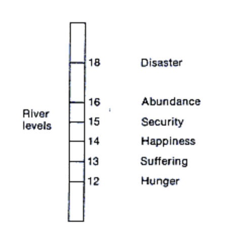

# 第二章 早期自然资本管理的技术与实践

在人类文明的长河中,我们的祖先展现了令人惊叹的智慧,创造了一系列管理和利用自然资源的方法。这些方法不是试图征服自然,而是通过深入观察和长期实践,形成了一套顺应自然规律的"被动管理"技术。本章将深入探讨这些早期的自然资本管理实践,重点关注历法、养生、水利工程、建筑和传统医学等领域。

通过考察这些古老的智慧,我们将看到早期人类如何巧妙地将自然规律融入日常生活和生产活动中。从玛雅人精确的天文历法,到中国的二十四节气系统;从印度的阿育吠陀医学,到埃及的金字塔建筑;从中国的都江堰水利工程,到中东的地下水道系统。这些成就不仅体现了古人对自然的深刻理解,更展示了人类与自然和谐共处的生态智慧。

这些古老的技术和实践,虽然看似简单,却蕴含着深刻的生态哲学。它们不仅有效地服务了当时人类的生活和生产需求,更为我们今天应对环境挑战提供了宝贵的启示。让我们一起回溯历史,领略先人的智慧,思考人与自然和谐共生之道。

## 古代自然观和生态哲学思想
发源于古代中国的道家思想就认为，人作为天地之气化生的产物，其一举一动都受到天地的影响，因此，人必须顺应天地之道，才能达到“天人合一”的境界。

“天人合一”思想是一种将自然界和人、人类社会视为不可分割整体的哲学观，强调人类与自然界应和谐共生，尊重自然规律。这一思想深深植根于中国的道家、儒家和阴阳五行学说中，是中国传统文化的重要组成部分。

"天人合一"思想对中国古代建筑设计产生了深远的影响，这一点在传统建筑如四合院、寺庙等的布局和选址上表现得尤为明显。这些建筑不仅追求功能性和美观，更注重与周围环境的和谐共存，体现了古人对自然的敬畏和智慧运用。

以四合院为例，其设计充分体现了"天人合一"的理念。四合院的布局通常是南北向，主房坐北朝南，这样可以最大限度地利用冬季的阳光，同时避免夏季的炎热。院落中心的天井不仅提供了自然采光和通风，还象征着天地之间的联系。四合院的封闭式结构既保护了居住者的隐私，又创造了一个微型的生态系统，调节院内的温度和湿度。

在寺庙建筑中，"天人合一"思想的影响更为明显。中国古代寺庙的选址通常遵循"藏风聚气"的原则，常建在山腰或山脚下，背靠青山，面向平原或水域。这种布局不仅符合风水理念，也有利于保护建筑免受恶劣天气的侵袭。例如，著名的少林寺就坐落在嵩山脚下，既利用了山势的屏障作用，又与周围的自然环境融为一体。

寺庙的内部布局也体现了对自然的尊重。以佛教寺庙为例，其轴线通常是南北向，主要建筑依次排列，形成一条视觉中轴线。这种布局不仅符合中国传统的礼制观念，也与太阳东升西落的自然规律相呼应。寺庙中常见的园林设计，如假山、水池等，则是对自然景观的微缩和模仿，旨在创造一个与自然和谐共存的修行环境。

在建筑材料的选择上，古人也充分考虑了与自然环境的协调。例如，在南方多雨潮湿的地区，建筑多使用木材，并采用高台建筑的形式，以防潮湿；而在北方干燥的地区，则多用砖石等材料，以保温隔热。这种因地制宜的做法不仅体现了对当地气候和资源的尊重，也确保了建筑与周围环境的和谐统一。

总的来说，"天人合一"思想指导下的中国古代建筑设计，体现了一种深刻的生态智慧。这种智慧不仅关注建筑本身的功能和美观，更强调建筑与自然环境的和谐共处。在当今面临严峻环境挑战的背景下，这种古老的智慧为现代建筑设计提供了宝贵的启示，指引我们在追求现代化的同时，不忘与自然和谐共存。

在世界其他古代文明中，我们同样能够找到与中国"天人合一"思想相呼应的生态智慧。这些思想虽然产生于不同的文化背景，却都体现了人类对自然的敬畏和对和谐共处的追求。古希腊哲学家们对自然界的深刻思考为西方自然科学的发展奠定了基础。赫拉克利特的"万物流变"观点揭示了自然界永恒变化的本质，而亚里士多德将自然界视为有机整体的思想则强调了事物之间的相互联系。这些观点不仅推动了科学探索，也体现了对自然规律的尊重。

在印度次大陆，印度教和佛教的生态观念同样深刻。印度教将河流、山川等自然元素神化，如恒河女神的崇拜，反映了人们对自然力量的敬畏。佛教则通过"众生平等"的理念，将人与其他生命形式置于同等地位，提倡不伤害生命的原则。这种思想对生态保护具有深远的影响，启发我们重新思考人类在自然界中的位置。

跨越大洋来到北美大陆，原住民的"大地母亲"观念令人惊叹。他们将地球视为一个有生命的整体，人类仅是其中的一个组成部分。这种观念引导他们与自然和谐相处，只取所需而不过度索取。在现代环保理念兴起的今天，这种古老的智慧正被重新认识和重视，为我们应对生态危机提供了宝贵的思路。

古埃及文明的自然崇拜同样引人入胜。他们将自然力量神化，创造了如太阳神拉、尼罗河神哈比等众多神祇。尼罗河的周期性泛滥被视为神灵的恩赐，这种信仰不仅体现了对自然力量的敬畏，也促使人们更好地适应和利用自然规律，形成了独特的农业文明。

在美洲的另一端，玛雅文明以其复杂精妙的宇宙观震撼世人。他们认为宇宙是循环往复的，人类与自然界、天体运行密不可分。这种思想体现在他们精确到令现代科学家都惊叹不已的历法系统中，不仅指导着农业生产和日常生活，更展现了对自然规律的深刻洞察。

纵观这些古代文明的生态智慧，我们不禁感叹人类先祖的远见卓识。尽管表现形式各异，但它们都传达了对自然的尊重和顺应。这些思想强调人与自然的和谐共处，认识到人类是更大自然系统中不可分割的一部分。在今天，面对日益严峻的生态危机，这些古老的智慧之光依然闪耀，为我们构建可持续发展的未来提供了宝贵的启示和指引。

回顾人类古代的生态智慧，我们可以清晰地看到一条贯穿其中的金线：尽管不同文明在具体表现形式上存在差异，但它们都有一个共同的核心理念，那就是寻求与自然和谐共处。无论是中国的"天人合一"，还是印度的众生平等，抑或是北美原住民的大地母亲观，都体现了人类对自然的敬畏和对生态平衡的追求。这种共同的智慧，超越了地域和文化的界限，成为人类文明的宝贵财富。在当今全球化的时代，这种古老而普世的生态观念，为我们应对现代环境挑战提供了深刻的启示和指导。

## 早期管理自然资本的关键技术和实践

在古代文明的发展过程中，人类面临着一个巨大的挑战：如何在缺乏现代科学技术的情况下，有效地管理和利用自然资源。面对这一挑战，我们的祖先展现出了惊人的智慧和创造力。他们通过细致的观察和长期的实践，逐渐形成了一套"被动管理"的技术和方法，这些方法不是试图征服自然，而是深入了解、认识并顺应自然规律。这种顺应自然的智慧主要体现在三个关键领域：历法、传统医学和水利土木工程。

历法是古代文明的核心技术，它不仅用于指导农业生产，还深刻影响了宗教仪式、社会治理和人们的日常生活。古代玛雅人创造了复杂而精确的历法系统，包括260天的卓尔金历和365天的哈布历。这个系统不仅能够准确预测天文现象，还与农业生产、宗教仪式和社会生活紧密结合。玛雅人通过这个系统来决定农作物的种植和收获时间，安排重要的社会活动，甚至预测未来。同样，中国的二十四节气也展现了古人对自然规律的深刻理解。这个系统将一年划分为24个时段，每个节气都与特定的自然现象和农事活动相对应。例如，"立春"标志着春天的开始，"芒种"提醒农民开始播种，"霜降"则预示着寒冷季节的到来。通过遵循这些节气，古代中国人能够更好地适应自然的变化，优化农业生产。

传统医学，如中国的中医和印度的阿育吠陀医学，是古代文明对人体与自然关系认识的结晶。这些医学体系不仅仅关注疾病的治疗，更强调人与自然的和谐，以及预防疾病的重要性。中医的"天人合一"理念认为，人体是自然界的一个缩影，人的健康状态与自然环境密切相关。中医根据四季变化调整养生方法，如春养肝、夏养心、秋养肺、冬养肾，体现了对自然规律的尊重和利用。通过这种方式，中医不仅治疗疾病，更注重通过调节人体与自然的关系来维护健康。印度的阿育吠陀医学同样强调人与自然的和谐。它将人体的体质与自然元素（土、火、水、空气、以太）联系起来，通过调和这些元素来实现身心健康。这种方法不仅关注个体的健康，还强调了人与环境的整体平衡。

水利土木工程是古代文明管理自然资源的另一个重要领域。这些工程不仅展示了古人的技术智慧，更体现了他们对自然规律的深刻理解和尊重。中国古代的都江堰水利工程是这方面的杰出代表。建于公元前256年的都江堰，至今仍在发挥着重要作用。它的设计巧妙地利用了自然河道的特点，通过分水鱼嘴、飞沙堰和宝瓶口等结构，实现了分流洪水和引水灌溉的双重功能。与现代的大坝不同，都江堰允许河水自由流动，保护了河流生态系统，是古代生态智慧的典范。

在建筑和风水方面，早期人类同样展现了对自然的深刻理解和巧妙运用。古代文明在建筑设计中融入了对自然环境的考量，不仅追求功能性和美观，更注重与周围环境的和谐共存。这种智慧在中国的风水理论中得到了集中体现。

风水是中国传统文化中与"天人合一"思想相关的一部分。在建筑设计中，古人遵循风水原则，选择适宜的地势和朝向，以实现人与自然的和谐。例如，故宫的选址和布局充分考虑了周围山川河流的地理特点，旨在达到"天人合一"的理想状态，促进居住者的健康和繁荣。
古代建筑师们深谙"因地制宜"之道。在山区，他们会利用地形建造悬崖上的寺庙或居所，如著名的悬空寺；在水乡，他们会设计水上建筑，如江南的水乡古镇。这些建筑不仅适应了当地的自然环境，还成为了独特的文化景观。

在材料选择上，古人也表现出了对自然的尊重和智慧。他们善于利用当地可得的材料，如木材、石材、土坯等，这不仅降低了运输成本，也确保了建筑与周围环境的和谐统一。例如，在中国北方干燥地区，人们使用夯土技术建造房屋，这种方法不仅适应了当地气候，还具有良好的保温性能。
古代建筑还常常融入了对自然现象的观察和利用。比如，中国传统的四合院设计，通过合理的布局来调节院落内的微气候，夏季凉爽冬季温暖。埃及的金字塔则利用了精确的天文知识，其设计与天体运行密切相关。

风水理论不仅影响了单体建筑的设计，还指导了整个城市的规划。中国古代城市的选址和布局常常遵循"背山面水"的原则，既利用了自然地形的优势，又创造了良好的生活环境。这种规划理念在今天看来，仍然具有重要的生态价值。可以看到古人在建筑设计中所体现的生态智慧。他们努力使建筑与自然环境和谐共存，这种理念在当今的可持续建筑设计中得到了新的诠释和应用。

现代建筑设计正在重新审视和吸收这些古老的智慧。绿色建筑、生态城市等概念的兴起，在某种程度上可以看作是对古代建筑智慧的回归和发展。通过结合现代科技和古代智慧，我们有可能创造出更加可持续、更加宜居的建筑和城市环境。

总的来说，早期人类在建筑和风水方面的成就，体现了他们对自然的敬畏和智慧运用。这些古老的实践为我们提供了宝贵的启示，指引我们在现代化进程中不忘与自然和谐共处。在面对气候变化和环境问题的今天，重新审视和借鉴这些古老的智慧，对于创造可持续的未来具有重要意义。

在探讨了早期人类在水利工程、建筑和风水等领域对自然资本管理的智慧后，我们不禁对古代文明在这方面的成就产生了浓厚的兴趣。接下来，让我们更深入地探索这些领域的具体实践和技术，以便更全面地理解我们的祖先是如何巧妙地管理和利用自然资源的。

我们将详细介绍几个典型的例子，包括古代玛雅文明的精确历法系统、中国的二十四节气、埃及人对尼罗河泛滥的管理，以及传统医学如中医和阿育吠陀医学中体现的生态智慧。这些例子不仅展示了古代人类在观察和理解自然规律方面的惊人能力，还揭示了他们如何将这些知识应用于日常生活和社会发展中。

通过这些具体的案例，我们将看到古代文明是如何在没有现代科技的支持下，仅凭细致的观察和代代相传的经验，创造出令人惊叹的自然资本管理系统。这些古老的智慧不仅在当时发挥了重要作用，即使在今天，仍然为我们应对现代环境挑战提供了宝贵的启示。

让我们一起踏上这段探索之旅，重新认识我们的祖先留下的宝贵遗产，并思考如何将这些智慧应用于当今世界面临的生态和环境问题。这不仅是对过去的回顾，更是对未来的展望，因为只有理解和尊重自然，我们才能真正实现可持续发展。

## 古代历法：自然计算系统

古代历法，如玛雅历法，可以被视为人类最早的"自然计算机"。这些复杂而精确的系统，在某种程度上，与现代的大型计算机在功能上有着惊人的相似之处。就像今天的超级计算机通过复杂的算法和海量数据来预测天气模式或进行保险精算一样，古代历法也在尝试解码和预测自然的复杂模式。

这些古老的时间系统不仅仅是简单的日期记录工具，而是对自然周期的深度计算和模拟。通过长期细致的观察和数据积累，古人创造了能够精确追踪天体运动、预测季节变化、甚至预报天气的复杂系统。这种对自然规律的量化和预测，本质上与现代科技的核心理念是一致的。

古代历法的创造者们，就像现代的数据科学家和气象学家一样，致力于从看似混沌的自然现象中寻找规律和模式。他们的工作不仅体现了人类对自然的深刻理解，也展示了古人惊人的数学和天文学造诣。这种将自然现象数字化、模型化的尝试，可以说是现代科学方法的早期雏形。

因此，我们可以将古代历法视为一种原始但极其精妙的"自然计算系统"。它们不仅帮助古人更好地理解和适应自然环境，还为人类文明的发展奠定了重要基础。这种智慧的结晶，在本质上与现代科技的追求并无二致，都是人类试图通过精确计算来掌握自然规律的体现。

### 古代玛雅历法

在古代文明的璀璨星河中，玛雅历法如同一颗耀眼的明珠，闪烁着智慧的光芒。这个精妙绝伦的时间系统不仅是玛雅文明的核心组成部分，更是人类对自然规律深刻理解的杰出代表。

玛雅人以其敏锐的观察力和非凡的智慧，不仅精确测量了太阳年、月相和金星运行等复杂的天文现象，还将这些自然规律与日常生活和农业生产紧密结合，创造出了一个令现代科学家都惊叹不已的历法体系。

玛雅历法的核心包括两个相互交织的系统：260天的卓尔金历和365天的哈布历。卓尔金历是一个神秘而复杂的系统，由20个日名和13个数字巧妙组合，形成一个260天的循环。这个看似奇特的周期实际上与人类怀孕期的长度惊人地吻合，反映了玛雅人对生命周期的深刻洞察。

*这张图片展示了玛雅260天历法，通常称为卓尔金历（Tzolk'in）。卓尔金历是玛雅文明中一个重要的历法系统，由20个日名和13个数字循环组成，共260天。以下是解读图片内容的基本信息：
 - 外圈的20个日名：外圈表示玛雅历法中的20个不同的日名，如“1 Quej”、“2 K'anil”等。这些日名依次循环，表示玛雅历法中的每一天。
 - 内圈的13个数字：从内圈开始，有13个数字，这些数字表示每个日名的轮次。每个数字从1到13循环，并与外圈的日名组合，形成唯一的日期。例如，“1 Quej”之后是“2 K'anil”，再到“3 Tol”，依此类推。
 
数字和日名的组合：20个日名和13个数字的组合形成260天的循环（20日名 × 13数字 = 260天）。这也是玛雅历法最基础的部分，卓尔金历用于确定重要的宗教日子、占卜和仪式。

如何读取：
- 从内向外：你可以从中心的数字开始，向外走到日名，得到一个完整的日期。例如，最中心的“1”与最外层的“Quej”相结合，形成“1 Quej”。
- 然后数字2与“K'anil”相结合，形成“2 K'anil”，接着是“3 Tol”等。

这个系统帮助玛雅人决定重要的宗教和农业活动日期，并且与他们的宇宙观和天文学密切相关。*

哈布历（Haab'）是基于太阳年的历法，类似于现代的公历，由18个20天的月份（即360天）和5个额外的“危险日”（Uayeb）组成。哈布历的每一天由“月份名 + 天数”的方式表示。
推算方法：每个月有20天，推算时直接从1数到20，然后进入下一个月份。例如：
Pop 1 到 Pop 20
接着 Wo 1 到 Wo 20
依此类推，直到18个月结束，最后是Uayeb的5天。

玛雅历法最有趣的部分是历轮（Calendar Round），这是卓尔金历和哈布历的组合。由于卓尔金历是260天，哈布历是365天，它们的最小公倍数为18,980天，即52年。因此，一个特定的日期组合（如“1 Imix 4 Pop”）每52年才会重复一次。

除了上述两个周期，玛雅人还使用长纪历（Long Count）来记录更长的时间段。长纪历以基数20的进位制记录时间，单位包括：
- 1 Kin = 1天
- 1 Winal = 20天（1月）
- 1 Tun = 18 Winal = 360天（相当于一年）
- 1 Katun = 20 Tun = 7,200天
- 1 Baktun = 20 Katun = 144,000天
长纪历用于记录从纪元开始（公元前3114年8月11日）起的时间。因此，可以通过长纪日期推算距离纪元开始的天数。

要推算玛雅历的某一天，你可以使用以下步骤：
- 卓尔金历：查找当天在260天周期中的位置。例如，今天可能是“4 Kan”。
- 哈布历：查找当天在365天周期中的位置。例如，今天可能是“10 Pop”。
- 历轮：将卓尔金历与哈布历结合在一起，生成一个独特的日期（例如“4 Kan 10 Pop”）。
- 长纪历：如果需要精确到数千年的时间，可以使用长纪历的计时方法。

卓尔金历主要用于占卜和决定重大事件的吉凶，在玛雅社会的宗教和文化生活中扮演着至关重要的角色。与之并行的哈布历则更接近我们熟知的太阳历，由18个20天的月份和5个额外的日子组成，总计365天。这个系统直接关联着农业周期，指导着玛雅人的耕种和收获活动。

玛雅历法的精确度之高，即使在今天看来仍然令人叹为观止。他们计算的太阳年长度为365.242天，与现代天文学测定的365.242198天仅相差0.000198天，这种精确度在没有现代精密仪器的古代简直是不可思议的。更令人惊讶的是，玛雅人还能够精确预测日食和月食，他们的金星周期表比欧洲人的计算要精确得多，误差仅为两小时。这种天文观测和数学计算的精确性，直到近代才被科学家们超越。

玛雅历法不仅仅是一个计时工具，它更是玛雅人宇宙观和生活哲学的体现。通过这个复杂的系统，玛雅人将天文现象与日常生活、农业生产、宗教仪式和社会治理紧密结合。

他们相信时间是循环往复的，而不是线性的，这种观念深刻影响了他们的世界观和生活方式。玛雅人通过观察天象和使用历法来调整生活节奏，特别是在农业方面，他们能够准确预测雨季的到来，决定最佳的种植和收获时间，有效规避自然灾害带来的风险，确保粮食生产的稳定。

玛雅历法的神奇之处还在于它的预测能力。玛雅人创造了一个被称为"长计数"的系统，可以精确记录和预测跨越数千年的时间。这个系统不仅用于记录历史事件，还被用来预言未来。玛雅人相信宇宙运行遵循着特定的周期，通过研究这些周期，他们试图预测未来的事件。虽然这些预言常常被神秘化和误解，但它们反映了玛雅人对时间和宇宙规律的深邃思考。

玛雅历法的设计凝聚了对自然界的深刻理解，它不仅帮助古代玛雅人在日常生活和农业生产中顺应自然，还加强了社会的凝聚力。通过这种方式，玛雅文明实现了与自然的和谐共存，确保了社会的可持续发展。时至今日，玛雅历法仍然是人类智慧的璀璨明珠，它不仅展示了古代文明的辉煌成就，也为我们提供了理解时间、自然和宇宙的独特视角。在这个科技高度发达的时代，玛雅历法依然启发我们思考人与自然的关系，提醒我们尊重和顺应自然规律的重要性。

### 中国的二十四节气

中国的二十四节气体系是古代智慧的结晶，展现了中国先民对自然规律的深刻理解，体现了人与自然和谐共处的哲学思想。这一独特的时间系统起源于黄河流域的农业社会，是古代中国人民通过长期观察太阳运动和气候变化而总结出来的宝贵经验。

它将一年精确地划分为二十四个节气，每个节气大约持续15天，巧妙地对应着一年中不同的气候特点和农业活动。

*二十四节气的划分
二十四节气是以12个月为基础，每月有两个节气。具体可分为以下四大类：
- 季节节气：如立春、立夏、立秋、立冬，反映季节交替。
- 气候节气：如大寒、小暑、大暑等，反映气温的变化。
- 物候节气：如惊蛰、清明、霜降等，反映自然现象和物候的变化。
- 农事节气：如芒种、小满、谷雨等，与农业生产密切相关。

这些节气形成了**“四季八节”**的格局，标志着季节的开始和结束，指导了古代社会的农耕生产和日常生活。

二十四节气的核心功能是为农耕社会提供时间指导。古代中国是典型的农耕文明，农作物的生长周期与气候变化密不可分，而气候预报工具的缺乏使得人们更加依赖通过观察自然现象来预测天气。因此，二十四节气不仅是时间单位，更是农业生产的指南针。

例如：
- 立春：春耕的开始，标志着农民开始准备耕作和播种。
- 雨水：预示着降雨量的增加，适合灌溉田地。
- 小满：表示农作物的籽粒开始灌浆，但尚未成熟，农民需加强田间管理。
- 芒种：象征着农忙时节，意味着需要播种晚稻，并且进行夏收。
这些节气帮助农民合理安排耕种、浇灌、施肥、收割等农业活动，确保生产的稳定性。它们是古代生产活动与自然相协调的智慧体现。

二十四节气最早见于《淮南子·天文训》，经过几代人的实践和完善，逐渐发展成为指导农业生产和日常生活的重要依据。这个系统的核心在于其对自然变化的精准把握。例如，"立春"标志着春天的开始，万物复苏，农民们开始为春耕做准备；"芒种"时节，麦类作物成熟，同时也是播种其他作物的最佳时期；"霜降"则预示着寒冷的冬季即将来临，提醒人们要做好防寒准备。

二十四节气的影响深深地嵌入了中国人的生活习俗和文化传统中。每个节气都有其独特的风俗和节日，成为中国传统文化的重要组成部分。在"清明"时节，人们祭祖扫墓，缅怀先人；"端午"期间，赛龙舟、吃粽子的习俗不仅纪念了屈原，也成为凝聚民族情感的重要纽带；而在"冬至"，人们会聚在一起吃饺子或汤圆，寓意团圆和幸福。这些与节气相关的习俗不仅丰富了人们的精神生活，也加强了社会的凝聚力。

二十四节气体系的精髓在于它体现了古代中国人对自然规律的深刻理解和尊重。我们的先祖认识到，人类的生存和发展与自然环境密不可分，必须顺应自然的节律。他们通过仔细观察太阳的运行、气温的变化、动植物的生长规律，总结出了一套与自然和谐共处的生活方式。这种对自然的敬畏和尊重，体现在诸多方面：不滥伐森林，不过度捕猎，不污染水源等。这些做法在当时可能只是出于朴素的生存智慧，但在今天看来，却是维持生态系统稳定和可持续性的关键。

从现代科学的角度来看，二十四节气也是一项重要的天文和气象成就。它以太阳黄经为依据，精确地反映了地球在绕太阳运行过程中的位置变化，与现代天文学的计算结果高度吻合。这种精确性令人惊叹，体现了古代中国人在天文观测和时间计算方面的高度智慧。

尽管现代气象预报技术不断进步，二十四节气作为一种经验总结的气候规律，在很多情况下依然具有现实意义。气象专家指出，二十四节气的气候预测逻辑与现代气象学中的统计学方法相似，都是基于对大数据的分析，从而归纳出气象模式。

除了农业和气象，二十四节气还深深融入了中国人的文化生活。中医学中也广泛运用了二十四节气的理念，强调根据季节变化调整饮食、作息和养生方法。例如，夏季养心、冬季养肾等养生理论，强调人与自然和谐相处，顺应气候和节气变化调理身体。

2016年，二十四节气被联合国教科文组织列入人类非物质文化遗产代表作名录，这不仅是对中国传统文化的肯定，也表明这一古老的智慧正在为全世界所接受和欣赏。在面临全球气候变化和生态危机的今天，二十四节气所蕴含的生态智慧和可持续发展理念显得尤为珍贵。它提醒我们重新审视人与自然的关系，在追求经济发展的同时，也要尊重自然规律，维护生态平衡。

二十四节气不仅是一个时间系统，更是一种生活哲学，一种与自然和谐共处的智慧。在这个快节奏的现代社会，它提醒我们放慢脚步，感受自然的变化，珍惜每个季节带来的独特馈赠。通过学习和传承这一古老的智慧，我们可以在现代生活中找到一种平衡，既享受科技进步带来的便利，又不忘与自然保持亲密的联系。

### 二十四节气与玛雅历法在农业生产中的应用

二十四节气和玛雅历法不仅是时间计算系统，更是古代农业生产的重要指导。它们通过精确观察自然变化，为农民提供了种植和收获的最佳时机，从而优化农业生产。

在中国，二十四节气与多种农作物的种植和收获密切相关，尤其对稻麦轮作系统影响深远：

1. 稻米种植：
   - 立春（2月3日左右）：开始育秧
   - 清明（4月4日左右）：插秧
   - 芒种（6月5日左右）：南方开始播种晚稻
   - 立秋（8月7日左右）：早稻收获
   - 霜降（10月23日左右）：晚稻收获

2. 小麦种植：
   - 白露（9月7日左右）：开始播种冬小麦
   - 立冬（11月7日左右）：冬小麦播种截止
   - 小满（5月20日左右）：小麦开始灌浆
   - 芒种（6月5日左右）：小麦收获

这种稻麦轮作系统充分利用了土地资源，提高了粮食产量。农民通过遵循节气指导，可以在一年内实现两季收成，既种植水稻又种植小麦。

玛雅历法同样在农业生产中发挥着重要作用，尤其是对玉米这一主要作物的种植：

1. 玉米种植周期：
   - Yax K'in月（约3月中旬）：开始播种玉米
   - Yaxk'in月（约5月）：玉米生长期，进行田间管理
   - Kank'in月（约10月）：玉米收获季节

玛雅人通过观察金星周期和雨季的到来，来决定玉米的最佳种植时间。他们的历法系统能够准确预测雨季的开始，这对于依赖雨水灌溉的玉米种植至关重要。

此外，玛雅历法还指导了其他作物的种植：
- 豆类：通常在玉米种植后不久进行间作
- 南瓜：与玉米、豆类形成"三姐妹"种植模式
- 辣椒和可可：作为重要的经济作物，其种植和收获也遵循历法指导

这些古老的农业智慧展示了人类如何通过细致观察和长期积累，将天文知识与农业生产紧密结合，实现了与自然的和谐共处，确保了粮食生产的可持续性。在现代农业中，这些传统知识仍然具有重要的参考价值，特别是在应对气候变化和发展可持续农业方面。

### 二十四节气在气象预测的应用
二十四节气不仅是一种时间划分系统，更是古代中国人智慧的结晶，它在气象预测和农业生产中发挥着至关重要的作用。这套系统通过精确观察太阳运行和自然变化，为农民提供了一个可靠的指南，大大提高了农作物的丰收概率。古人通过长期观察发现，每个节气都有其特定的气候特征和自然现象，这些特征与农作物的生长周期密切相关。

以春季为例，立春标志着万物复苏的开始。农民们知道，这时候土壤开始解冻，正是准备春耕的最佳时机。他们会根据立春前后的天气变化来判断整个春季的气候走向。如果立春时节温暖湿润，预示着春季雨水充沛，适合早稻种植；如果天气干燥寒冷，则可能需要调整种植计划，选择抗旱作物。

雨水节气则直接关系到春耕的开始。古人总结出"雨水前后，沉雨绵绵"的规律。农民们会密切关注这个时期的降水情况，如果雨水充足，就可以开始播种春小麦和油菜；如果雨水不足，则需要采取蓄水保墒的措施，确保种子能够顺利发芽。

惊蛰时节，天气逐渐转暖，土壤温度升高，各种昆虫开始苏醒。农民们知道，这是病虫害防治的关键时期。他们会根据惊蛰前后的温度变化来预测害虫的活动规律，提前做好防治准备。同时，惊蛰也是播种多种作物的好时机，如春玉米、春豆等。

清明节气不仅是祭祖的日子，也是农事活动的重要时间点。"清明断雪，谷雨断霜"，这个古老的谚语准确地预测了气温的变化趋势。农民们知道，清明过后，寒潮的威胁基本消除，可以放心地进行大规模的春耕活动。同时，清明前后的降水情况也是预测全年降水量的重要依据。

谷雨节气更是直接与农业生产挂钩。"谷雨前后，种瓜点豆"，这个时节雨水充沛，温度适宜，是种植多种作物的最佳时机。农民们会根据谷雨期间的降水量来调整灌溉计划，确保作物获得适量的水分。

夏季的节气同样蕴含着丰富的气象信息。小满意味着夏熟作物开始灌浆，此时的降水对于作物产量至关重要。农民们会密切关注小满期间的天气变化，如果出现连续高温少雨的情况，就需要及时采取灌溉措施。芒种则是夏收冬种的重要时节，古人根据芒种前后的气温变化来判断夏季的整体走向，为夏季农事活动做好准备。

立秋虽然在公历上仍处于炎热的夏季，但它预示着秋季的到来。农民们知道，立秋后的温度变化对秋季作物的生长至关重要。如果立秋后温度下降过快，可能需要采取措施保护尚未成熟的作物。同时，立秋也是判断秋季降水的重要依据，这对于种植冬小麦等秋播作物有重要指导意义。

寒露和霜降这两个节气则直接关系到秋收的时机。古人总结出"寒露麦，霜降豆"的种植经验，指导农民在适当的时候播种冬小麦和收获大豆。农民们会根据这两个节气前后的温度变化来判断霜冻的可能性，及时采取措施保护尚未收获的作物。

冬季的节气虽然农事活动较少，但对来年的农业生产仍有重要影响。例如，大雪节气的降雪情况直接关系到来年的土壤墒情。农民们会根据大雪期间的降雪量来预测来年的旱涝情况，为春耕做好准备。同时，冬至前后的气温变化也是预测来年气候的重要依据。

通过这种方式，二十四节气将天文观测、气象预报和农业生产紧密结合，形成了一个完整的农业指导系统。这个系统不仅帮助古代农民更好地把握农时，提高了农作物的产量，还培养了人们对自然规律的敏锐观察力。在现代科技高度发达的今天，二十四节气的智慧仍然给我们以启示，提醒我们要尊重自然规律，与自然和谐共处。这种古老的智慧，在我们面对气候变化等全球性挑战时，显得尤为珍贵。

### 二十四节气与玛雅历法的相同与不同
中国的二十四节气和玛雅历法虽然产生于不同的文明，但它们都展现了古代人类对自然规律的深刻洞察和智慧运用。这两个时间系统在本质上都是通过观察天象和自然变化来指导人类活动，但在具体实施和文化意义上却有着显著的差异。

首先，两者的共同点在于它们都是基于对太阳运动的观察而制定的。二十四节气以太阳在黄道上的位置为基础，每15度为一个节气；玛雅历法则包含了260天的宗教历（卓尔金历）和365天的太阳历（哈布历）。这两个系统都体现了古代人类对天文现象的精确观测能力，以及将这些观测结果应用于实际生活的智慧。

其次，两种历法系统都与农业生产密切相关。二十四节气直接指导着中国农民的耕作活动，每个节气都对应特定的农事；玛雅历法同样用于确定播种、收获等农业活动的最佳时机。这反映了古代农业社会对自然节律的依赖，以及人类如何通过观察自然来优化生产活动。

然而，这两个系统也存在显著差异。二十四节气更加注重季节性变化和气候特征，它将一年划分为更细致的时间段，每个节气都有明确的气候和物候特征。相比之下，玛雅历法更加复杂，它不仅用于农业生产，还深深融入了玛雅人的宗教信仰和占卜活动中。玛雅的260天历法被认为与人类怀孕期的长度相关，体现了他们对生命周期的独特理解。

在文化影响方面，二十四节气深深融入了中国的传统文化，影响了中医养生、民俗节日等多个方面。它更多地体现了一种实用性的生活智慧。玛雅历法则更多地与宗教仪式和预言活动相关，反映了玛雅文明对宇宙秩序的神秘理解。

在精确度方面，两者都展现了惊人的准确性。二十四节气的划分与现代天文学计算结果高度吻合，而玛雅人对金星周期的计算甚至比欧洲人更为精确。这种精确性在没有现代精密仪器的古代是令人惊叹的。

值得注意的是，二十四节气作为一种活态文化遗产，至今仍在中国社会中发挥着实际作用，并已被列入联合国非物质文化遗产名录。而玛雅历法虽然不再被广泛使用，但它所体现的天文知识和文化智慧仍然是研究古代文明的重要资料。

总的来说，中国的二十四节气和玛雅历法都是古代人类智慧的结晶，它们从不同角度诠释了人类如何理解和适应自然规律。这两个系统的存在告诉我们，不同文明可能会发展出不同的方法来认知和利用自然，但核心都是追求与自然的和谐共处。在当今面临全球气候变化和生态危机的背景下，这些古老智慧所蕴含的生态观念和可持续发展思想，为我们提供了宝贵的启示。

## 古代水利工程与建筑：顺应自然的智慧

古代文明在水利工程和建筑方面展现了深刻的智慧，体现了人类如何巧妙地顺应和利用自然规律。

以中国的都江堰水利工程为例，它通过巧妙的设计实现了分流洪水和引水灌溉的双重功能，而不是简单地阻挡河流。这种设计不仅有效地减少了水患，还为农业提供了稳定的灌溉用水，同时保持了河流的自然生态。

在建筑领域，古人运用风水理念，根据地形、气候和自然环境来选择建筑位置和设计布局。例如，中国古代宫殿的选址和规划往往考虑周围的山川河流，以达到与自然和谐共处的目的。这些做法体现了古人对自然的尊重和理解，强调的是与自然协调共存，而非征服自然。通过这些方法，古代文明成功地在保护环境的同时，实现了社会的可持续发展。

### 都江堰水利工程

在古代中国水利工程的璀璨历史长河中，都江堰如同一颗璀璨的明珠，闪耀着智慧的光芒。这项位于四川成都岷江上的水利工程，不仅是古代中国水利管理的杰作，更是人类与自然和谐共处的典范。都江堰的建造始于公元前256年，由李冰父子主持完成，至今仍在发挥着巨大的作用，见证了中华文明的悠久历史和深厚智慧。

都江堰的设计理念体现了古人对自然规律的深刻理解和巧妙运用。与现代水利工程常用的大坝技术不同，都江堰的设计巧妙地利用了自然河流的水力特性。它通过一系列独特的结构，如分水鱼嘴、飞沙堰和宝瓶口等，实现了分流洪水和引水灌溉的双重功能。分水鱼嘴如同一把巨大的"剪刀"，将岷江的水流一分为二，内江水流入灌溉系统，外江水流继续向下游奔腾；飞沙堰则通过抬高内江水位，确保灌溉用水充足；宝瓶口的设计则巧妙地控制了进入内江的水量，防止洪水期间灌区遭受水患。这种设计不仅有效地减少了水患，还为成都平原提供了稳定的农业灌溉用水，奠定了"天府之国"的繁荣基础。

都江堰的生态智慧更是令人叹为观止。在现代水利工程中，大坝的修建常常会对河流生态系统造成严重破坏，如阻断鱼类的洄游通道，改变河流的自然流态等。而都江堰的设计却巧妙地避免了这些问题。它的结构允许河水自由流动，保持了河流的自然状态，使得鱼类等水生生物能够自由迁徙。这种设计不仅维护了河流生态系统的健康，还保证了水质的清洁，为农业灌溉提供了优质水源。都江堰的生态智慧体现了古人"天人合一"的哲学思想，强调人与自然的和谐共处，而不是对自然的征服和改造。

都江堰的成功不仅在于其卓越的工程设计，更在于其体现的可持续发展理念。这项工程在两千多年的历史长河中，经历了无数次洪水的考验，却始终发挥着重要作用。它不需要现代水利工程那样频繁的维护和更新，也不会因为淤积而失去功能。这种持久的效能正是源于其顺应自然、利用自然的设计理念。都江堰的成功告诉我们，真正的智慧不在于征服自然，而在于理解自然、顺应自然。

都江堰的影响远远超出了水利工程的范畴。它的成功为成都平原带来了长期的稳定和繁荣，促进了农业生产的发展，支撑了区域经济的繁荣。同时，都江堰也成为了中国古代科技和工程智慧的象征，影响了后世无数的水利工程。今天，都江堰不仅是一项仍在发挥作用的水利工程，也是一处重要的文化遗产和旅游胜地，吸引着来自世界各地的游客前来参观学习。

在当今这个面临严峻环境挑战的时代，都江堰的智慧显得尤为珍贵。它提醒我们，在追求经济发展和技术进步的同时，也要尊重自然规律，维护生态平衡。都江堰的成功经验启示我们，可持续发展不仅是一个现代概念，更是古人留给我们的宝贵遗产。通过学习和传承都江堰所体现的生态智慧，我们可以为解决当前的环境问题找到新的思路和方法。

都江堰是古代工程智慧的结晶，是人与自然和谐共处的典范。它不仅成功地解决了农业用水和洪水治理问题，还在很大程度上维护了生态系统的稳定。在这个科技高度发达的时代，都江堰仍然启发我们思考人与自然的关系，提醒我们尊重和顺应自然规律的重要性。它的存在，是对现代社会的一种无声诉说，告诉我们真正的智慧在于与自然和谐共处，而不是盲目地改造自然。

### 古埃及和印度的水利工程
古埃及和印度的水利工程，与中国的都江堰水利工程一样，都展现了古代人类对自然资源的智慧管理。这些文明在面对各自独特的自然环境时，发展出了富有创造性的解决方案，体现了人类与自然和谐共处的智慧。

在古埃及，尼罗河的年度泛滥是整个文明的生命线。与都江堰利用分水鱼嘴控制水流不同，埃及人选择了顺应和预测尼罗河泛滥的方法。他们建立了"尼罗米尔"水位观测系统，这与都江堰的水位观测有异曲同工之妙。通过长期观测和记录，埃及人能够预测泛滥的时间和规模，从而合理安排农事活动。这种预测系统的精确度令人惊叹，体现了古埃及人对自然规律的深刻理解。

此外，埃及人还开发了复杂的灌溉系统，包括运河、堤坝和水库。这些工程虽然在规模和技术上可能不及都江堰那么先进，但同样体现了对水资源的精细管理。特别值得注意的是，埃及人将尼罗河的泛滥视为神灵的恩赐，这种宗教信仰进一步强化了人们对自然的尊重和感恩之心，与中国古代"天人合一"的思想有异曲同工之妙。

印度的情况则更为独特。面对季风气候带来的显著干湿季节变化，古印度人发展出了一套适应性极强的农业系统。虽然他们没有像都江堰那样的大型水利工程，但他们通过对季风规律的深入理解，巧妙地安排农业生产周期。这种对自然规律的把握，与中国古代二十四节气系统有相似之处。

为了更好地利用季风带来的水资源，印度人开发了梯田、水库和蓄水池等农业技术。这些措施虽然在规模上可能不及都江堰，但同样体现了对自然资源的有效管理和利用。特别是梯田技术，不仅有效利用了有限的水资源，还防止了水土流失，显示了古印度人的生态智慧。

值得注意的是，无论是埃及的尼罗河崇拜还是印度的季风信仰，都将自然现象与宗教紧密结合。这种将自然力量神化的做法，虽然在形式上与中国的"天人合一"思想不同，但本质上都体现了对自然的敬畏和尊重。这种思想在古代社会中起到了重要的生态保护作用，防止了对自然资源的过度开发和破坏。

总的来说，古埃及和印度的水资源管理虽然在具体方法上与都江堰有所不同，但都体现了古代文明对自然规律的深刻理解和智慧运用。这些文明都认识到了顺应自然、合理利用自然资源的重要性，而不是试图征服自然。他们的经验告诉我们，真正的智慧在于理解和适应自然，而不是盲目地改造自然。在当今面临严峻环境挑战的时代，这些古老文明的智慧仍然具有重要的启示意义，提醒我们在追求发展的同时，也要尊重自然规律，维护生态平衡。

### 罗马帝国的引水系统和古巴比伦的灌溉技术
除了古埃及和印度的水利工程，罗马帝国的引水系统和古巴比伦的灌溉技术同样展现了古代文明对水资源管理的智慧。

罗马帝国的引水渠系统是古代工程学的一大奇迹，它不仅满足了城市居民的用水需求，还推动了罗马文明的繁荣发展。这个庞大的系统包括地下管道、地上渠道和宏伟的高架桥，将远处山区的清洁水源源源不断地输送到城市。罗马人巧妙地利用地形落差，通过精确的坡度计算，实现了水的自然流动，无需任何机械动力。这种设计不仅节省了能源，还保证了水质的清洁。随着时间的推移，罗马人不断改进他们的引水技术，如使用更耐用的材料、改善水压控制等，这些进步使得一些罗马时期的引水渠直到今天仍在使用。

然而，罗马引水系统的建设也对当地生态产生了一定影响。大规模的引水改变了一些地区的水文环境，影响了当地的植被分布和野生动物栖息地。尽管如此，罗马人也尝试通过一些措施来减少负面影响，如在引水渠周围种植树木以防止水土流失，这些做法体现了他们对环境保护的初步意识。

与此同时，在美索不达米亚平原上，古巴比伦人发展出了独特的灌溉技术。他们充分利用底格里斯河和幼发拉底河的季节性泛滥，开发出了复杂的运河和水渠网络。巴比伦人的灌溉系统不仅仅是简单的引水，而是一个精心设计的水资源管理系统。他们建造了大型水库来储存洪水期的多余水量，并在干旱季节使用。此外，巴比伦人还发明了水闸和堤坝等先进的水利设施，可以根据需要控制水流。这种灌溉系统的设计理念与中国的都江堰有异曲同工之妙，都体现了古人对自然规律的深刻理解。

随着时间的推移，巴比伦的灌溉技术不断发展。他们开始使用更先进的材料来建造水利设施，如沥青来防水。同时，他们也逐渐认识到过度灌溉可能导致土壤盐碱化的问题，因此开始采取措施控制灌溉量，这显示了他们对可持续农业的初步认识。巴比伦的灌溉系统为美索不达米亚平原带来了丰收，支撑了这个古老文明的繁荣，但也不可避免地改变了当地的生态环境。大规模的灌溉使得原本干旱的地区变得湿润，改变了植被分布，也影响了一些野生动物的栖息地。

这些古代文明的水利工程，无论是罗马的引水系统还是巴比伦的灌溉技术，都体现了人类智慧与自然力量的互动。它们不仅是工程学的杰作，更是古人对自然规律深刻理解的体现。这些古老的智慧启示我们，在追求发展的同时，也要尊重自然规律，寻求与自然的和谐共处。在当今面临水资源短缺和环境污染等严峻挑战的时代，这些古代文明的经验无疑具有重要的借鉴意义。

### 建筑与风水
古代建筑和风水学是中国传统文化中"天人合一"思想的具体体现，它们深刻反映了古人对自然环境的尊重和智慧运用。这种思想认为人类是自然的一部分，应该与自然和谐共处，而不是试图征服或改造自然。在建筑设计和选址中，这种理念得到了充分的体现。

风水学，又称堪舆学，是一门研究人与环境关系的古老学问。它强调选择有利的地理环境来营造人类的居住和活动空间，以达到趋吉避凶、和谐共生的目的。在古代建筑中，风水原则被广泛应用于从皇宫到普通民居的各类建筑中。

以北京故宫为例，其选址和布局充分体现了风水学的精髓。故宫坐北朝南，背靠景山，面对天安门广场，左有东华门，右有西华门，形成了"左青龙，右白虎，前朱雀，后玄武"的理想格局。这种布局不仅符合中国传统的宇宙观，也充分利用了自然地形，创造出一个既庄严宏伟又与自然和谐共处的建筑群。

在民间建筑中，四合院的设计也是风水思想的典型体现。四合院通常坐北朝南，以充分利用阳光，同时避免冬季寒风的直接侵袭。院落中的树木和水景不仅美化环境，还能调节微气候，创造出舒适宜人的生活空间。这种设计充分考虑了自然因素，体现了人与自然和谐共处的理念。

古代建筑师们还十分注重建筑材料的选择和使用。他们倾向于使用当地可得的天然材料，如木材、石材、土坯等。这不仅降低了运输成本，也确保了建筑与周围环境的和谐统一。例如，在中国北方干燥地区，人们使用夯土技术建造房屋，这种方法不仅适应了当地气候，还具有良好的保温性能。

此外，古代建筑还常常融入了对自然现象的观察和利用。例如，中国传统园林的设计就是"天人合一"思想的集中体现。园林设计师们通过巧妙的布局和景观设计，在有限的空间内创造出"咫尺山林"的效果，让人仿佛置身自然之中。他们利用山水、植物、建筑等元素，创造出动静结合、虚实相生的空间，体现了对自然美的追求和对宇宙和谐的理解。

在城市规划层面，"天人合一"的思想同样得到了体现。中国古代城市的选址和布局常常遵循"背山面水"的原则，既利用了自然地形的优势，又创造了良好的生活环境。例如，杭州的选址就充分利用了西湖的自然景观，形成了"上有天堂，下有苏杭"的美誉。

值得注意的是，虽然风水学中包含了一些难以用现代科学解释的神秘元素，但其核心理念 - 即选择有利的自然环境，创造和谐的人居空间 - 在今天看来仍然具有重要的生态和环境价值。现代的绿色建筑和可持续城市设计在某种程度上可以看作是对这种古老智慧的继承和发展。

"天人合一"思想在古代建筑和风水学中的应用，体现了我们祖先对自然的敬畏和智慧。他们努力使建筑与自然环境和谐共存，这种理念在当今面临严峻环境挑战的世界中显得尤为珍贵。通过学习和借鉴这些古老的智慧，我们可以为创造更加可持续、更加宜居的现代建筑和城市环境提供新的思路。

在当代，随着环境问题的日益严峻，"天人合一"的思想再次受到重视。现代建筑设计正在重新审视和吸收这些古老的智慧。绿色建筑、生态城市等概念的兴起，在某种程度上可以看作是对古代建筑智慧的回归和发展。通过结合现代科技和古代智慧，我们有可能创造出更加可持续、更加宜居的建筑和城市环境，实现真正的人与自然和谐共处。

## 传统医学：古代文明的智慧结晶

传统医学体系，尤其是中国的中医和印度的阿育吠陀医学，是古代文明智慧的璀璨结晶。这些医学体系不仅仅专注于疾病的治疗，更重要的是，它们强调了人与自然和谐共处的重要性，以及预防疾病的核心地位。通过深入研究这些传统医学体系，我们可以获得一个全新的视角来理解健康与自然之间的密切关系。

### 中医
黄帝内经》是中医理论的奠基之作，其中蕴含的"天人合一"思想深刻影响了中医学的发展。这部古老的医学经典详细阐述了人体与自然界的密切关系，为我们理解中医如何与自然融合提供了丰富的洞见。

《黄帝内经》中的《素问·四气调神大论》指出："春三月，此谓发陈，天地俱生，万物以荣，夜卧早起，广步于庭，被发缓形，以使志生，生而勿杀，予而勿夺，赏而勿罚，此春气之应，养生之道也。"这段文字生动描绘了春季的特征，并提出了相应的养生之道。它强调人应该顺应春天万物生长的特性，早睡早起，适当运动，保持乐观开放的心态。这种建议不仅仅是简单的生活指导，更体现了中医对自然规律的深刻理解和对人体生理节律的精准把握。
同样，《素问·四气调神大论》对其他季节也有相应的养生建议。例如，夏季应"夜卧早起，无厌于日，使志无怒"，秋季则要"早卧早起，与鸡俱兴，使志安宁，以缓秋刑"，冬季建议"早卧晚起，必待日光"。这些建议都是基于对自然界季节变化规律的观察，以及对人体生理特点的深入理解。

《黄帝内经》还提出了"五运六气"的理论，将自然界的五行（木、火、土、金、水）与六气（风、寒、暑、湿、燥、火）相结合，解释了自然界的变化规律及其对人体健康的影响。例如，《素问·六节藏象论》中说："东方生风，风生木，木生酸，酸生肝，肝生筋，筋生心。"这种理论将自然界的方位、气候、五行、人体脏腑、味道等多个方面联系起来，形成了一个完整的生态系统观。

在疾病的预防和治疗方面，《黄帝内经》也强调了顺应自然的重要性。《素问·四气调神大论》中说："是故圣人不治已病治未病，不治已乱治未乱，此之谓也。"这句话强调了预防的重要性，认为应该在疾病发生之前就采取措施，而不是等到疾病发生后再进行治疗。这种观念与现代医学中的预防医学理念不谋而合。

《黄帝内经》还详细讨论了不同体质的人应如何根据自然环境的变化来调节自己的生活方式。例如，《素问·异法方宜论》中说："故东方之域，天地之所始生也，鱼盐之地，海滨傍水，其民食鱼而嗜咸，皆安其处，美其食。"这段话指出，生活在东方沿海地区的人们习惯食用鱼和咸味食物，这与当地的自然环境是相适应的。这种观点体现了中医对地理环境、饮食习惯和人体健康之间关系的深刻认识。

总的来说，《黄帝内经》中的养生和医学理念深深植根于对自然规律的观察和理解。它不仅仅是一部医学著作，更是一部阐述人与自然和谐共处之道的哲学著作。通过遵循自然规律，调节生活方式，中医学旨在实现人体内外的平衡，从而达到健康长寿的目标。这种思想在当今社会仍然具有重要的指导意义，提醒我们在追求现代化的同时，也要尊重自然，保持与自然的和谐关系。

除《黄帝内经》外，中医的其他经典著作如《伤寒论》、《金匮要略》等也蕴含了丰富的顺应自然的智慧。这些著作进一步发展和细化了中医理论，为我们提供了更多关于如何与自然和谐相处的具体指导。

《伤寒论》是东汉末年张仲景所著的一部中医经典，被誉为"方书之祖"。这部著作不仅详细描述了外感病的诊断和治疗，更体现了对自然规律的深刻理解。《伤寒论》中的"六经辨证"理论将疾病的发展过程与自然界的变化相联系，体现了中医"天人合一"的思想。

例如，《伤寒论》中提出："太阳之为病，脉浮，头项强痛而恶寒。"这里的"太阳"不仅指人体的某个部位，也暗示了疾病与自然界寒邪侵袭的关系。张仲景认为，人体的生理活动与自然界的变化密切相关，疾病的发生和发展也遵循着类似的规律。

《伤寒论》还强调了"因时制宜"的治疗原则。例如，在论述汗法时，张仲景指出："发汗不可再发汗，汗多亡阳，阳虚者不可发汗。"这不仅体现了对人体生理状态的精准把握，也反映了对自然规律的尊重。过度发汗会导致阳气耗损，就如同自然界中过度消耗资源会导致生态失衡一样。

《金匮要略》是张仲景的另一部重要著作，主要论述内科杂病的诊断和治疗。这部著作同样体现了顺应自然的思想。例如，在讨论妇科疾病时，《金匮要略》强调了女性生理周期与自然界阴阳变化的关系，提出了"调经"的治疗原则，即通过调节人体内部的阴阳平衡来达到治疗的目的。

此外，《金匮要略》中的"脏腑辨证"理论将人体内部器官的功能与自然界的五行相对应，如"肝属木"、"心属火"等。这种理论不仅为疾病诊断提供了理论基础，也体现了中医对人体与自然界关系的整体性认识。

这些中医经典著作共同构建了一个完整的、以顺应自然为核心的医学体系。它们不仅仅是医学著作，更是古代中国人对自然规律的深刻洞察和智慧结晶。这些著作教导我们，健康不仅仅是身体的状态，更是人与自然和谐共处的结果。通过遵循自然规律，调节生活方式，我们可以达到身心健康的理想状态。

### 阿育吠陀医学

印度的阿育吠陀医学，作为世界上最古老的医学体系之一，与中医一样，深深植根于人与自然和谐共处的理念。"Ayurveda"一词源自梵语，意为"生命的科学"或"长寿的智慧"，这个名称本身就体现了阿育吠陀医学对生命整体性的关注。

阿育吠陀医学的核心理念是"平衡"。这种平衡不仅指人体内部各系统的平衡，还包括人与自然环境之间的平衡。阿育吠陀认为，健康不仅仅是没有疾病，而是身体、心灵和精神的完美和谐状态。这种和谐状态的实现，需要个体与周围环境保持平衡。

在阿育吠陀医学中，宇宙万物，包括人体，都由五大元素（Pancha Mahabhutas）构成：地（Prithvi）、水（Jala）、火（Agni）、风（Vayu）和空（Akasha）。这五大元素在人体中以不同的比例组合，形成了三种基本的生理能量，即三种体质类型（Doshas）：

1. Vata（风）：由空气和以太元素组成，控制身体的运动和神经系统。
2. Pitta（火）：由火和水元素组成，控制新陈代谢和消化系统。
3. Kapha（水）：由地和水元素组成，负责身体结构和液体平衡。

每个人都有独特的Dosha组合，这决定了个体的体质特点、性格特征，甚至疾病倾向。阿育吠陀医生通过详细的问诊和体格检查，确定患者的体质类型，然后根据个体特点和自然元素之间的关系，制定个性化的治疗和保健方案。

阿育吠陀医学强调预防胜于治疗。它提倡通过日常生活的调理来维持健康，包括：

1. 饮食调理（Ahara）：根据个人体质和季节变化调整饮食。
2. 生活方式（Vihara）：包括适当的睡眠、运动和日常习惯。
3. 行为规范（Achara）：强调道德行为和心理健康的重要性。
4. 季节性调理（Ritucharya）：根据季节变化调整生活方式。

在治疗方面，阿育吠陀医学采用全面的方法，包括草药治疗、按摩疗法、瑜伽和冥想等。这些治疗方法旨在恢复身体的自然平衡，而不仅仅是消除症状。

阿育吠陀医学的一个重要特点是它强调个体与自然环境的密切联系。例如，它认为不同的季节会影响人体的Dosha平衡，因此建议根据季节变化调整饮食和生活习惯。同样，它也认为不同地理环境会影响人体健康，因此在选择治疗方法时会考虑患者所处的自然环境。

总的来说，阿育吠陀医学提供了一种全面的健康观念和生活方式指导。它教导我们，真正的健康来自于与自然的和谐共处，以及身体、心灵和精神的平衡。通过遵循自然规律，调整生活方式，我们可以预防疾病，维持健康，实现长寿。

在当今这个快节奏、高压力的现代社会中，阿育吠陀医学的智慧显得尤为珍贵。它提醒我们重新审视自己的生活方式，关注与自然的联系，寻求身心的平衡。通过结合阿育吠陀的古老智慧和现代医学的先进技术，我们有可能创造出一种更加全面、更加可持续的健康模式，不仅能够有效预防和治疗疾病，还能提高生活质量，促进社会的可持续发展。

这些传统医学体系展示了古人如何通过深入理解自然界的变化规律及其与人体的互动关系，制定出有效的健康维护和疾病预防方法。它们的共同特征是强调顺应自然，并将人类的健康与环境紧密联系在一起。这种观念在当今社会显得尤为重要。在现代医学高度专业化和技术化的背景下，我们往往忽视了人与自然的整体关系，过分依赖药物和手术来治疗疾病，而忽视了预防和日常保健的重要性。

传统医学的智慧提醒我们，健康不仅仅是身体没有疾病，更是一种与自然和谐共处的状态。它鼓励我们重新审视自己的生活方式，关注日常的饮食起居，注意身心的平衡，并与自然环境保持和谐。这种全面的健康观念，不仅有利于个人健康，也有助于构建更加可持续的社会。

### 医学中的自然智慧：药食同源
古老的医学智慧，如中医的"药食同源"理念和阿育吠陀医学的草药疗法，正在以新的方式影响着现代的生态医学实践。

中医的"药食同源"理念源于对自然和人体的整体观察。这一理念认为，食物和药物本质上是相通的，都来自大自然，都能影响人体的健康状态。在现代社会，这一古老的智慧正在有机农业和慢性病管理中找到新的应用。

在有机农业中，"药食同源"的理念启发了一种新的种植方式。农民们不再仅仅关注作物的产量，而是更加注重作物的营养价值和药用价值。例如，在中国的一些地区，农民们开始在稻田中种植莲子和茨实等传统中药材。这种做法不仅增加了农民的收入，还提高了土地的利用效率，同时也为消费者提供了更多具有健康效益的食品选择。

更有趣的是，一些农民开始尝试将中医的五行理论应用到种植中。他们根据作物的属性和生长特性，合理安排种植顺序和搭配，以达到土地养护和作物互利的效果。这种方法不仅提高了作物的品质，还减少了化学肥料和农药的使用，有利于生态环境的保护。

在慢性病管理方面，"药食同源"的理念正在改变人们的健康管理方式。越来越多的人开始意识到，日常饮食对健康的重要性不亚于药物治疗。一些医院和健康管理机构开始推广"食疗"概念，根据患者的体质和病情，制定个性化的饮食方案。例如，对于糖尿病患者，医生可能会推荐一些具有降糖作用的食材，如苦瓜、山药等；对于高血压患者，则可能推荐一些有助于降压的食物，如芹菜、木耳等。

这种将食物视为药物的方法，不仅有助于疾病的预防和控制，还能减少药物使用，降低医疗成本。更重要的是，它鼓励人们主动参与到自己的健康管理中，培养健康的生活方式。这种方法的效果已经得到了一些研究的支持。例如，一项针对2型糖尿病患者的研究发现，采用中医食疗方案的患者，其血糖控制效果优于单纯使用西药的患者，而且副作用更少。

与此同时，阿育吠陀医学的草药疗法也在现代生态健康疗法中发挥着重要作用。阿育吠陀医学强调使用天然草药来治疗疾病和维护健康，这种方法正在被现代医学重新审视和应用。

在现代生态健康疗法中，阿育吠陀的草药知识被用来开发新的天然药物和保健品。例如，姜黄素作为一种强大的抗炎和抗氧化剂，正在被广泛研究其在预防和治疗各种慢性疾病中的潜力。另一个例子是印度醋栗（Amla），它富含维生素C和其他抗氧化物质，正被用于开发各种健康产品。

更有意思的是，阿育吠陀的整体健康观正在影响现代的健康管理方式。阿育吠陀认为，健康不仅仅是没有疾病，而是身体、心灵和精神的平衡状态。这种观念正在被一些前沿的健康管理中心采纳。这些中心不仅提供常规的医疗服务，还融入了瑜伽、冥想、草药疗法等阿育吠陀元素，旨在实现全面的健康管理。

例如，在印度的一些现代化医院中，病人可以选择结合现代医学和阿育吠陀疗法的治疗方案。对于一些慢性病患者，医生可能会在常规治疗的基础上，推荐一些阿育吠陀的草药制剂或者生活方式调整建议。这种结合方式不仅能够提高治疗效果，还能减少药物的副作用，提高患者的生活质量。

在面对全球性健康挑战的今天，传统医学的智慧为我们提供了宝贵的启示。它告诉我们，真正的健康不仅需要先进的医疗技术，更需要我们重新建立与自然的和谐关系。通过结合现代医学的精确性和传统医学的整体观，我们有可能创造出一种更加全面、更加可持续的健康模式。这种模式不仅能够有效预防和治疗疾病，还能够提高人们的生活质量，促进社会的可持续发展。

总之，传统医学所蕴含的智慧，不仅是古代文明的瑰宝，也是我们应对当前健康挑战的重要资源。通过学习和传承这些古老的智慧，我们可以为构建一个更健康、更和谐的未来开辟新的道路。

在当今这个面临严峻环境和健康挑战的时代，重新审视和借鉴这些传统医学的智慧，对于创造可持续的未来具有重要意义。它提醒我们，在追求科技进步和经济发展的同时，也要尊重自然规律，维护生态平衡，从而实现人类社会的真正可持续发展。

## 古代文明的自然资本管理

古代文明在自然资本管理方面展现了令人惊叹的智慧和技术。通过对历法、建筑、水利工程、养生和医学等领域的深入探索，我们可以看到早期人类如何巧妙地利用和管理自然资源，以实现可持续发展。

在历法方面，中国的二十四节气体系是一个杰出的例子。这个精密的时间系统不仅仅是简单的日期标记，而是融合了天文观测、气候变化和农业生产的综合知识体系。通过将一年划分为24个节气，古人能够准确预测季节变化，指导农业生产活动。这种方法实质上是对自然周期的深刻理解和巧妙利用，使得农业生产能够最大限度地适应自然规律，提高资源利用效率。同时，二十四节气还影响了中国传统文化的方方面面，从饮食习惯到民俗活动，都体现了与自然节律的和谐统一。

古代建筑技术同样体现了对自然资本的智慧管理。以中国传统建筑为例，其设计和布局充分考虑了地理环境、气候特点和自然资源的可持续利用。比如，北方的四合院利用厚重的墙体和紧凑的布局来保暖，而南方的庭院则强调通风和遮阳。这些设计不仅提高了居住舒适度，还大大减少了能源消耗。此外，古代建筑广泛使用本地可再生材料，如木材和竹子，既减少了运输成本，又确保了建筑的可持续性。

水利工程是古代自然资本管理的另一个重要领域。中国古代的都江堰和大运河等水利工程，展示了古人如何巧妙地利用自然地形和水文特点来实现水资源的有效管理。都江堰通过分水、引水和泄洪等设计，不仅解决了灌溉问题，还有效控制了洪水，实现了生态平衡。这种顺应自然、因势利导的方法，最大限度地减少了对自然环境的破坏，同时提高了水资源的利用效率。

在养生和医学领域，古代文明同样展现了对自然规律的深刻理解和尊重。中医的整体观念和阴阳五行理论，强调人与自然的和谐统一，提倡通过调节生活方式来维护健康。《黄帝内经》中"上古天真论"所描述的理想生活状态，体现了古人对自然规律的敬畏和对健康生活的追求。同样，印度的阿育吠陀医学也强调个体与自然环境的平衡，通过饮食调理、生活方式调整和季节性调理等方法来维护健康。这些传统医学体系不仅关注疾病的治疗，更注重预防和全面的健康管理，体现了一种可持续的健康观念。

这些古代技术和实践方法的共同特点是，它们都建立在对自然规律的深刻理解之上，强调顺应自然而不是征服自然。通过精确观察和长期积累的经验，古人发展出了一套与自然和谐共处的生存智慧。这种智慧不仅体现在具体的技术和方法上，更反映了一种尊重自然、可持续利用资源的哲学思想。

古代的自然资本管理方法虽然在形式上可能显得简单或原始，但其核心理念却具有深远的现代意义。在当今面临严峻环境挑战的背景下，这些古老的智慧为我们提供了宝贵的启示。它们提醒我们，真正的可持续发展不是通过高科技来征服自然，而是要学会与自然和谐共处，在利用自然资源的同时也要尊重和保护自然。

通过回顾和分析这些古代实践，我们可以得到一些重要的启示：首先，自然资本管理需要建立在对自然系统深入理解的基础上；其次，有效的管理策略往往是顺应自然规律，而不是试图改变它；再次，可持续的解决方案通常需要考虑长期效益，而不是追求短期利益；最后，真正有效的自然资本管理应该是全面的，涉及社会生活的各个方面，从农业生产到日常起居。

这些古代智慧不仅有助于我们重新思考当前的环境问题和资源管理策略，也为我们探索更加可持续的发展模式提供了有价值的参考。在科技高度发达的今天，我们应该如何将这些古老的智慧与现代科技和管理方法相结合，创造出更加有效和可持续的自然资本管理模式，是我们需要深入思考和探索的重要课题。

## 古代智慧的现代启示
在回顾了古代文明的自然资本管理智慧后，我们不禁要问：这些古老的智慧对当今世界有何启示？它们如何帮助我们应对现代社会面临的环境挑战？

首先，古代文明的自然资本管理方法强调了对自然规律的深入理解和尊重。无论是二十四节气系统、传统建筑设计，还是古代水利工程，都体现了"知天知地"的智慧。这提醒我们，在制定环境政策和资源管理策略时，必须建立在对生态系统深入理解的基础之上。现代科技虽然给了我们改造自然的强大能力，但如果缺乏对自然系统的全面认知，我们的行为可能会带来意想不到的负面后果。

其次，古人的方法通常采取"顺势而为"的策略，而非试图彻底改变自然。这种方法不仅更加节能高效，而且能够维持生态系统的平衡。比如，都江堰水利工程巧妙利用地形特点，通过最小的人工干预实现了最大的效益。这启示我们，在面对环境问题时，应该更多地考虑如何利用和增强自然系统的自我修复能力，而不是过度依赖人工干预。

第三，古代的自然资本管理通常具有长期性和整体性。无论是农业生产还是城市规划，都考虑到了长远的可持续性。这与现代社会常见的短期行为形成鲜明对比。在当前全球面临气候变化、生物多样性丧失等长期性挑战的背景下，我们更需要这种长远的眼光。

此外，古代文明的做法往往将自然资本管理融入日常生活的方方面面，从饮食起居到文化习俗。这种全面的方法提醒我们，有效的环境保护和资源管理不能仅仅依靠技术手段，还需要从生活方式和文化价值观等方面进行全面的调整。

最后，古代的智慧强调了人与自然的和谐共处。这种理念在当今社会显得尤为珍贵。在追求经济发展和技术进步的同时，我们不应忘记人类终究是自然的一部分，我们的福祉与地球的健康息息相关。

然而，我们也要认识到，简单地照搬古代方法是不够的。我们面临的挑战比古人更加复杂，人口规模、资源需求和环境压力都远超古代。因此，我们需要将古代智慧与现代科技和管理方法相结合，创造出更加有效和可持续的自然资本管理模式。

例如，我们可以利用现代遥感技术和大数据分析，更精确地监测和预测生态系统的变化，从而制定更有针对性的保护措施。我们可以借鉴传统建筑的节能理念，结合现代材料科学和建筑技术，设计出更加环保和舒适的建筑。在农业领域，我们可以将传统的农业智慧与现代精准农业技术相结合，实现更高效、更可持续的粮食生产。

在健康领域，我们可以将传统医学的整体健康观与现代医学的精确诊疗相结合，发展出更加全面的健康管理模式。这不仅有利于个人健康，也能减轻医疗系统的压力，促进公共卫生的可持续发展。

总的来说，古代文明的自然资本管理智慧为我们提供了宝贵的思路和灵感。它提醒我们，真正的可持续发展不是征服自然，而是与自然和谐共处。在面对当前的环境挑战时，我们需要汲取这些古老智慧的精华，结合现代科技和管理方法，构建一个更加可持续的未来。这需要我们在政策制定、技术创新、教育改革等多个层面做出努力，也需要每个人在日常生活中做出改变。只有这样，我们才能真正实现人与自然的和谐共生，为子孙后代留下一个健康、美丽的地球家园。

下一章将深入探讨现代社会在自然资本管理中面临的具体挑战和机遇，分析政策、技术和社会层面的应对策略，为实现人与自然的和谐共生提供更全面的解决方案。

