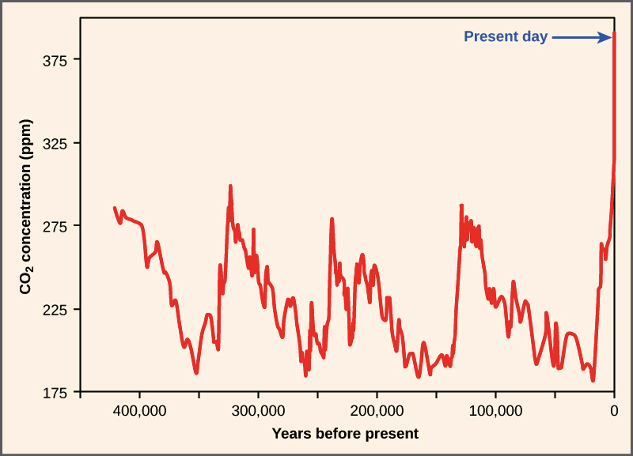
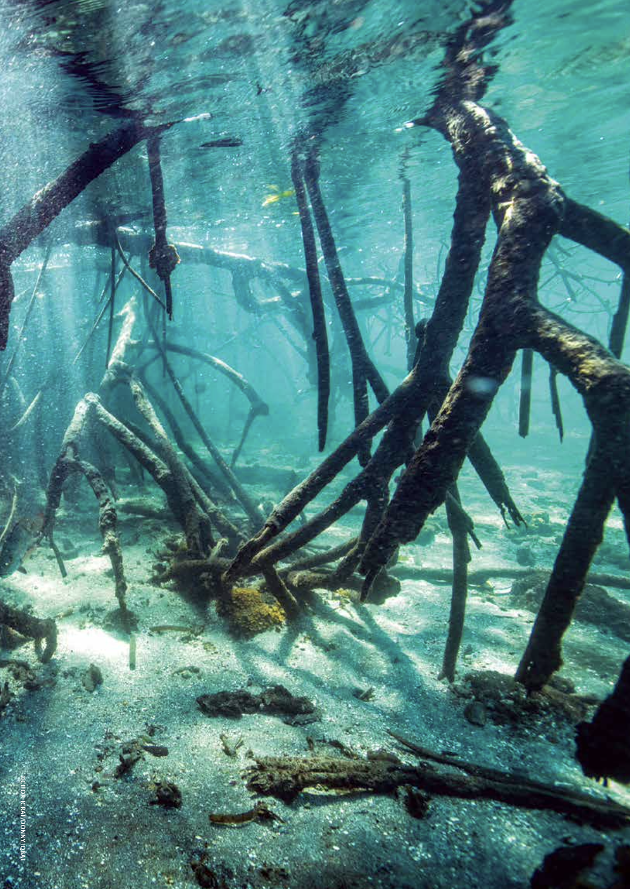

# 第三章 现代自然资本管理的演进与挑战

工业革命无疑是人类历史上一个重要的转折点，它不仅彻底改变了生产方式，还极大地促进了经济增长和人口膨胀。以英国为例，其人均GDP（以1990年国际元计）从1700年的1,250美元增长到1870年的3,190美元，增长了155%。同期，英国人口从约890万增加到2,630万，增长了近200%。这种前所未有的增长速度在其他工业化国家也有类似表现。

然而，这种快速增长模式建立在对自然资源的大规模开发和利用之上。以煤炭为例，英国的煤炭产量从1700年的约270万吨激增到1850年的约6,000万吨，增长了惊人的2,122%。森林资源也遭受了严重破坏，英国的森林覆盖率从中世纪的约15%下降到19世纪初的不到5%。这种资源开发的规模和速度是前所未有的。

随着工业化进程的推进，环境问题日益凸显。水污染、空气污染、土地退化等问题开始在工业化地区大规模出现。1858年伦敦的"大恶臭事件"就是一个典型例子，泰晤士河因严重污染而散发出令人作呕的气味，迫使议会暂时停会。空气污染也日益严重，1952年伦敦烟雾事件导致数千人死亡，成为环境灾难的标志性事件。

这种发展模式很快就显露出其不可持续性。生态系统的退化、资源的枯竭、环境污染的加剧，都在警示人们：地球的承载能力正在接近极限。美国生态学家加勒特·哈丁在1968年发表的著名论文《公地的悲剧》中指出，在有限的资源系统中，个体的理性行为会导致整体的非理性结果，这一观点深刻揭示了无节制开发模式的内在矛盾。

面对日益严峻的环境问题，人们开始感到焦虑和不安。1962年，美国海洋生物学家蕾切尔·卡森出版了《寂静的春天》，这本书以生动的笔触描绘了农药滥用导致的生态灾难，唤醒了公众的环保意识。书中描绘的"没有鸟鸣的春天"成为一个强烈的警示符号，提醒人们反思工业化带来的环境代价。

正是在这样的大背景下，现代自然资本的理念开始萌芽并逐渐发展。人们意识到，自然不仅仅是可以无限开发的资源，更是人类赖以生存的基础。1970年代开始，一些经济学家开始尝试将自然资源和生态系统服务纳入经济核算体系。例如，美国经济学家罗伯特·科斯特安萨等人在1997年发表的研究估算，全球生态系统服务的年价值约为33万亿美元，远超当时的全球GDP总和。这种将自然视为资本的观念，为重新评估经济发展模式提供了新的视角。

与此同时，新的环境保护技术也在不断涌现。污水处理、烟气脱硫、可再生能源等技术的发展，为减少环境污染、提高资源利用效率提供了可能。例如，丹麦从1970年代开始大力发展风能，到2019年风电已占其电力供应的47%，成为全球风电利用的典范。

各国政府也开始采取行动，制定环境保护政策和法规。1970年，美国成立了环境保护署（EPA），并颁布了《清洁空气法》和《清洁水法》。其他发达国家也相继出台了类似的环境立法。国际社会也开始就环境问题展开合作，1972年的斯德哥尔摩人类环境会议被视为全球环境治理的开端。

1972年的斯德哥尔摩人类环境会议标志着全球环境治理的开端，它首次将环境问题提升到国际政治议程。这次会议通过了《人类环境宣言》，确立了人类与环境和谐相处的基本原则，并促成了联合国环境规划署的成立。随后的几十年里，国际社会在应对气候变化和保护生物多样性方面取得了一系列重要进展。

1987年，《关于消耗臭氧层物质的蒙特利尔议定书》的签署是国际环境合作的一个里程碑。该议定书旨在逐步淘汰破坏臭氧层的物质，被认为是最成功的国际环境条约之一。到2009年，议定书所管制的近100种臭氧消耗物质已经被全面淘汰，臭氧层有望在本世纪中叶恢复到1980年的水平。

1992年在巴西里约热内卢举行的联合国环境与发展大会（地球峰会）是另一个转折点。会议通过了《气候变化框架公约》和《生物多样性公约》，为全球应对气候变化和保护生物多样性奠定了基础。《气候变化框架公约》的目标是将大气中温室气体的浓度稳定在防止气候系统受到危险的人为干扰的水平上。《生物多样性公约》则致力于保护生物多样性、可持续利用其组成部分，以及公平合理分享由利用遗传资源而产生的惠益。

1997年，《京都议定书》的签署是全球应对气候变化的重要一步。该议定书首次为发达国家设定了具有法律约束力的温室气体减排目标。尽管美国最终未能批准该议定书，但它仍然推动了全球范围内的减排行动和碳交易市场的发展。

2010年，《生物多样性公约》第十次缔约方大会在日本名古屋举行，通过了具有里程碑意义的《名古屋议定书》。该议定书旨在确保遗传资源利用所产生的惠益得到公平合理的分享，这被视为发展中国家和发达国家之间的一个重要妥协。

2015年是全球环境治理的又一个重要年份。在巴黎举行的联合国气候变化大会上，近200个国家一致通过了《巴黎协定》。这份具有法律约束力的全球气候协议设定了将全球平均气温升幅控制在工业化前水平以上低于2℃的长期目标，并努力将气温升幅限制在1.5℃以内。同年，联合国还通过了17个可持续发展目标，其中包括气候行动和保护陆地生物等与环境直接相关的目标。

近年来，随着气候变化影响的加剧，国际社会的行动也在加速。2021年在英国格拉斯哥举行的第26届联合国气候变化大会（COP26）上，与会国同意逐步减少煤炭使用，这是联合国气候会议首次明确提出减少化石燃料使用。2022年在加拿大蒙特利尔举行的联合国生物多样性大会（COP15）上，近200个国家同意到2030年保护地球30%的陆地和海洋，这被称为"保护自然的巴黎时刻"。

尽管这些国际条约和会议取得了重要进展，但全球环境问题仍然严峻。气候变化导致的极端天气事件频发，生物多样性持续丧失，塑料污染等新问题也不断涌现。这表明，国际社会在环境保护和可持续发展方面还有很长的路要走，需要更多的决心、创新和合作来应对这些全球性挑战。

工业革命开启的快速增长模式，虽然带来了空前的物质繁荣，但也使我们迅速逼近地球生态系统的承载极限。这一过程中暴露出的环境问题，促使我们不得不重新思考发展模式，并开始探索将自然视为宝贵资本的新理念。这种转变虽然艰难，但却是实现可持续发展的必由之路。未来，如何在保护生态环境的前提下实现经济增长，将继续是人类社会面临的重大课题。

## 工业革命：增长的经济和失衡的生态

### 煤炭的广泛使用
18世纪末至19世纪初，工业革命在英国兴起，随后迅速蔓延至欧洲和北美。这一时期，蒸汽机的发明和机械化生产的推广，使得煤炭和石油等化石燃料的需求量急剧增加。煤炭为蒸汽机提供了强大的动力，石油则为机械润滑和照明提供了新的能源。这些自然资源的广泛使用，极大地提升了生产效率，推动了工业、交通和城市化的发展，带来了生产力的飞跃和经济的快速增长。然而，对自然资源的过度开采也开始对环境造成不可忽视的影响。

这一划时代的变革彻底改变了人类社会的生产方式和生活方式。英国作为工业革命的发源地，率先实现了从农业社会向工业社会的转型。根据历史数据，英国的工业产值占国民生产总值的比重从1760年的约23%上升到1840年的约34%，充分体现了工业化进程的快速推进。以纺织业为例，1764年詹姆斯·哈格里夫斯发明了珍妮纺纱机，使得一名工人可以同时操作多个纱锭，大大提高了纺纱效率。到1785年，埃德蒙·卡特赖特发明的动力织布机进一步推动了纺织业的机械化。这些技术创新使得英国的棉纺织品产量从1760年的约280万磅增加到1840年的约3.66亿磅，增长了130多倍。

蒸汽机的发明和改进是推动工业革命的关键因素之一。1769年，詹姆斯·瓦特对纽科门蒸汽机进行了改进，大大提高了其效率。瓦特蒸汽机的燃料效率是纽科门蒸汽机的三倍，这意味着同样的煤炭消耗可以产生更多的动力输出。到1800年，瓦特蒸汽机的功率已经达到了20马力，而到1850年，某些蒸汽机的功率甚至超过了1000马力。蒸汽机的应用范围迅速扩大，从最初的抽水泵到纺织厂的动力源，再到交通运输领域。1804年，理查德·特雷维西克制造了世界上第一台蒸汽机车，开启了铁路运输的新纪元。到1850年，英国的铁路里程已经达到6,084英里，运输效率大幅提升。例如，1830年开通的利物浦-曼彻斯特铁路，将两地之间的货物运输时间从原来的36小时缩短到不到4小时。

蒸汽机的广泛应用直接推动了煤炭需求的激增。英国的煤炭产量从1700年的约270万吨增加到1800年的约1000万吨，到1850年更是飙升至约6200万吨。这一惊人的增长反映了工业化对能源的巨大需求。以英国约克郡的一个典型煤矿为例，其年产量从1750年的约5,000吨增加到1850年的超过100,000吨。矿井的深度也从最初的不到100英尺逐渐增加到500英尺以上，有些甚至达到1000英尺。这种深度的增加不仅提高了开采难度，也增加了矿工的安全风险。

煤炭的广泛使用不仅为工业提供了动力，也改变了城市的面貌。以伦敦为例，1700年时该市的煤炭消耗量约为35万吨，到1800年增至100万吨，1850年更是达到350万吨。

煤炭的大规模开发利用很快扩展到了全球其他地区。在欧洲大陆，比利时和德国率先跟随英国的脚步。比利时的煤炭产量从1830年的约200万吨增加到1860年的约900万吨，增长了3.5倍。德国的鲁尔区在19世纪中期迅速崛起为欧洲大陆最重要的煤炭产区之一，其产量从1850年的约180万吨激增到1900年的约6000万吨，增长了超过30倍。

在北美，美国的煤炭开发也呈现爆发式增长。宾夕法尼亚州的无烟煤开采从1820年的约365吨迅速增加到1860年的约850万吨，增长了惊人的23,000多倍。到19世纪末，美国已成为世界上最大的煤炭生产国。加拿大的煤炭产业也在19世纪中期开始快速发展，尤其是在新斯科舍省和不列颠哥伦比亚省。

亚洲地区，日本在明治维新后迅速推进工业化，煤炭开发成为重点。九州的筑丰煤田从1875年开始大规模开采，到1900年日本的煤炭产量已达到约700万吨。中国虽然拥有丰富的煤炭资源，但大规模开发要到19世纪末20世纪初才开始，主要集中在东北和华北地区。

在南半球，澳大利亚的煤炭开发始于19世纪初，新南威尔士州的纽卡斯尔地区成为主要产煤区。到1900年，澳大利亚的年产量已超过600万吨。南非的煤炭开发则与金矿开采密切相关，19世纪70年代开始在德兰士瓦地区大规模开采，为当地的金矿业提供能源支持。

尽管工业革命以来人类社会经历了巨大的变革，但煤炭作为主要能源的地位在许多国家仍然保持稳固。直到今日，煤炭依然是全球能源结构中的重要组成部分，特别是在一些快速发展的新兴经济体中。

以中国为例，作为世界上最大的煤炭生产国和消费国，煤炭在其能源结构中占据主导地位。根据中国国家统计局的数据，2020年煤炭消费量占中国能源消费总量的56.8%。尽管这一比例较2010年的69.2%有所下降，但煤炭仍然是中国最主要的能源来源。

印度作为另一个人口大国和新兴经济体，同样高度依赖煤炭。2020年，煤炭在印度一次能源消费中的占比约为55%。印度政府预计，即使到2030年，煤炭仍将占其电力生产的48%左右。

在一些发达国家中，虽然煤炭使用呈现下降趋势，但其重要性仍不容忽视。例如，在美国，尽管天然气和可再生能源的份额不断增加，但煤炭在2020年仍然占电力生产的19.3%。在德国，尽管正在实施能源转型计划，但2020年煤炭仍占一次能源消费的15.8%。

煤炭之所以能够在许多国家保持其重要地位，主要有以下几个原因：

1. 资源丰富：许多国家拥有丰富的煤炭资源，开采成本相对较低。
2. 技术成熟：煤炭发电技术成熟，基础设施完善，短期内难以完全替代。
3. 能源安全：相比石油和天然气，煤炭的地理分布更均匀，有利于保障能源安全。
4. 经济因素：在一些地区，煤炭仍然是最经济的能源选择。

然而，煤炭的持续使用也面临着越来越大的挑战。气候变化问题日益严峻，国际社会对减少温室气体排放的呼声越来越高。许多国家已经制定了逐步减少煤炭使用的计划，并大力发展可再生能源。例如，英国已经宣布将在2024年彻底淘汰燃煤发电。

未来，随着清洁能源技术的进步和成本的降低，以及全球应对气候变化行动的加强，煤炭在全球能源结构中的地位可能会逐步下降。但在短期内，特别是在一些发展中国家，煤炭仍将继续扮演重要角色。如何在保障能源供应和经济发展的同时，逐步减少对煤炭的依赖，实现能源结构的清洁化转型，将是许多国家面临的重大挑战。

### 石油开发的兴起
虽然石油在工业革命初期的作用不如煤炭显著，但它很快成为另一种重要的能源和工业原料。1859年，埃德温·德雷克在美国宾夕法尼亚州的泰特斯维尔钻探出第一口商业性石油井，标志着现代石油工业的诞生。这口油井的日产量约为20桶，虽然看似不多，但它开启了石油大规模开发的先河。

到1870年，美国的石油产量已经达到约430万桶，1900年更是增长到约848万桶。石油最初主要用于照明和润滑，取代了之前广泛使用的鲸油。例如，1859年美国的鲸油消费量约为18万桶，到1896年已降至4万桶，而同期煤油（石油提炼物）的消费量则从约25万加仑增加到约800万加仑。

随着内燃机的发明和汽车工业的兴起，石油的需求进一步扩大。1885年，卡尔·本茨制造出第一辆实用的汽油驱动汽车，而1908年亨利·福特推出的T型车更是推动了汽车的普及。这导致汽油需求激增，促使石油公司加大勘探和开采力度。同时，石油化工业也开始蓬勃发展，石油不仅被用作燃料，还成为生产塑料、合成纤维、药品等众多产品的重要原料。

石油工业的发展也带来了地缘政治的变化。美国很快成为世界最大的石油生产国，但其他国家也迅速跟进。1901年，英国在伊朗发现大型油田，促使英国政府收购英格鲁-伊朗石油公司（后来的BP）的多数股权。1938年，沙特阿拉伯发现石油，为中东地区日后成为全球石油中心奠定了基础。这些发现不仅改变了全球能源格局，也深刻影响了国际关系和经济发展。

然而，石油开发也带来了环境问题。早期的石油开采往往缺乏有效的环境保护措施，导致土壤和水源污染。同时，石油燃烧产生的温室气体排放问题在当时尚未引起广泛关注，但这为日后全球气候变化埋下了隐患。尽管如此，石油作为一种高效、便携的能源，在推动工业化、改善生活质量方面发挥了巨大作用，成为20世纪经济发展的重要驱动力之一。

石油工业的快速发展与汽车和石化行业的崛起密切相关。20世纪初，汽车工业的兴起为石油需求带来了巨大推动。1908年，亨利·福特推出的T型车开创了汽车大规模生产的先河。到1927年，全球汽车保有量已达到2,700万辆，其中美国占了2,300万辆。这一数字在1950年进一步增长到7,000万辆，到1970年更是飙升至2.5亿辆。汽车数量的激增直接推动了汽油需求的爆发式增长。

同时，石油化工业的发展为石油开辟了新的应用领域。20世纪30年代，石油基合成材料如尼龙的发明开启了石化工业的新纪元。二战期间，合成橡胶的大规模生产进一步推动了石化工业的发展。战后，塑料制品的普及使得石油在日常生活中无处不在。以美国为例，石化产品在国民生产总值中的占比从1930年的0.3%上升到1970年的1.9%。

这些因素共同推动石油开发利用进入高速车道。全球原油产量从1950年的每天520万桶增长到1970年的每天4,860万桶，20年间增长了834%。中东地区在这一过程中扮演了关键角色，其原油产量占全球的比重从1950年的17%上升到1970年的41%。

石油美元的概念进一步强化了石油在全球经济中的地位。1945年，美国与沙特阿拉伯达成协议，以美元作为石油交易的结算货币，这一做法随后被其他主要石油出口国采纳。这意味着全球对石油的需求直接转化为对美元的需求，强化了美元的国际地位，同时也使得石油价格波动对全球经济的影响更加深远。

尽管近年来可再生能源发展迅速，但石油依然是全球主要的能源来源。根据国际能源署(IEA)的数据，2020年石油在全球一次能源消费中的占比仍高达31%，仅次于煤炭。在交通运输领域，石油更是占据主导地位，约占该领域能源消费的92%。预计在未来相当长的一段时间内，石油仍将继续在全球能源结构中发挥重要作用。

### 工业化对自然资源的影响
工业革命带来的大规模资源开采对自然环境造成了深远影响。以森林资源为例，英国的森林覆盖率从中世纪的约15%下降到19世纪初的不到5%。这种砍伐主要是为了获取木材作为燃料和建筑材料，以及为农业和城市扩张腾出空间。森林砍伐不仅发生在英国，欧洲大陆和北美也面临类似问题。例如，美国东北部的森林覆盖率从殖民时期的90%以上下降到19世纪中期的不足50%。森林减少导致了生物多样性丧失、水土流失加剧，以及局部气候变化。

矿产开采也导致了严重的土地破坏。以英国康沃尔郡的锡矿开采为例，到19世纪中期，该地区已有超过2000个废弃的矿坑，覆盖面积超过100平方公里。这些废弃矿区不仅破坏了自然景观，还造成了水土流失和地下水污染等问题。类似的情况在其他矿产资源丰富的地区也普遍存在。例如，美国宾夕法尼亚州的煤矿开采导致了大面积的地表塌陷和酸性矿井排水问题，影响了当地的生态系统和居民健康。

水资源污染也日益严重。以英国的泰晤士河为例，1858年夏天，由于工业废水和生活污水的大量排放，河水散发出令人作呕的恶臭，被称为"大恶臭事件"。这一事件最终促使政府投资建设了现代化的下水道系统。水污染问题并不局限于英国，欧洲大陆和北美的许多工业城市都面临类似挑战。例如，美国芝加哥河在19世纪末期因污染严重而被称为"世界上最臭的河流之一"，促使当地政府在1900年实施了一项大规模的河流改道工程。

空气污染也成为工业化城市的一大问题。煤炭作为主要能源的广泛使用导致了严重的烟雾污染。伦敦的"雾都"之名就源于此，1952年的伦敦烟雾事件导致数千人死亡，最终促使英国政府出台了《清洁空气法案》。类似的空气污染问题在其他工业城市也普遍存在，如美国的匹兹堡和德国的鲁尔区。

工业化还加速了物种灭绝和生态系统退化。北美的乘客鸽就是一个典型例子，这种曾经数量庞大的鸟类因栖息地破坏和过度捕猎而于1914年灭绝。同样，欧洲的欧洲野牛也因栖息地丧失和狩猎而濒临灭绝，直到20世纪初才开始恢复。

然而，工业革命带来的环境问题也促进了环境保护意识的觉醒。19世纪后期，美国开始建立国家公园系统，1872年的黄石国家公园成为世界上第一个国家公园。在英国，工业污染引发的公共卫生问题推动了城市规划和公共卫生法规的发展。这些早期的环保努力为现代环境保护运动奠定了基础，尽管其影响在当时还相对有限。

### 自然资源开发利用驱动的经济增长
工业革命通过引入以蒸汽机为代表的新生产力，并充分开发自然资源，实现了前所未有的经济增长和社会繁荣。这一时期，人类对自然资源的开发利用达到了新的高度，为经济的快速发展提供了基础。以英国为例，其人均GDP（以1990年国际元计）从1700年的1,250美元增长到1870年的3,190美元，增长了155%。这一增长率远超前几个世纪，充分体现了工业化带来的生产力飞跃。

自然资源的开发在这一过程中扮演了关键角色。以煤炭为例，英国的煤炭产量从1700年的约270万吨激增到1850年的约6,000万吨，增长了2,122%。这一巨大增长不仅为工业提供了动力，还推动了冶金、化工等相关产业的发展。同时，铁矿石的开采量也从18世纪初的每年约1.2万吨增加到19世纪中期的约300万吨，为机器制造和基础设施建设提供了重要原材料。

工业化还推动了城市化进程，形成了新的经济社会发展模式。英国的城市人口比例从1800年的约33%上升到1850年的50%。以曼彻斯特为例，其人口从1801年的75,000人激增到1851年的303,000人，增长了304%。这种快速的城市化虽然带来了就业机会，但也导致了城市贫民窟的出现和公共卫生问题的恶化，反映了工业化发展模式的双面性。

交通运输的革命性变革进一步促进了资源开发和经济发展。铁路网的扩张使得资源运输更加便捷高效。英国的铁路里程从1830年的仅98公里增加到1850年的9,797公里，增长了近100倍。这不仅加速了资源的流通，还刺激了钢铁、煤炭等相关产业的发展。海上运输方面，蒸汽船的出现大大缩短了航行时间。1819年，"萨凡纳号"成为第一艘横渡大西洋的蒸汽船，用时29天。到1838年，"大不列颠号"将这一时间缩短到15天。这种效率的提升极大地促进了国际贸易的发展，英国的对外贸易总额（进出口之和）从1800年的约5,700万英镑增加到1850年的约1.72亿英镑，增长了202%。

然而，这种以大规模开发自然资源为基础的工业化经济社会发展模式也为后续的过度开发埋下了隐患。以森林资源为例，英国的森林覆盖率从中世纪的约15%下降到19世纪初的不到5%。类似地，北美的森林覆盖率也从殖民时期的90%以上下降到19世纪中期的不足50%。矿产资源的过度开采也导致了严重的环境问题。例如，英国康沃尔郡的锡矿开采到19世纪中期已造成超过2,000个废弃矿坑，覆盖面积超过100平方公里。

这种发展模式虽然在短期内带来了巨大的经济增长，但也导致了资源枯竭、环境污染和生态破坏等长期问题。例如，伦敦的空气污染问题日益严重，1952年的大雾导致数千人死亡。水污染也成为一大挑战，1858年泰晤士河的"大恶臭事件"就是一个典型例子。这些问题最终促使人们开始反思工业化发展模式，为后来的环境保护运动和可持续发展理念奠定了基础。

总的来说，工业革命时期通过新技术和自然资源的开发，实现了前所未有的经济增长和社会变革。然而，这种发展模式也带来了严重的环境和社会问题，为人类如何平衡经济发展与环境保护提出了长期的挑战。

### 生态危机初现端倪
工业革命时期的自然资源大规模开采无疑推动了生产力的飞跃和经济的快速增长，彻底改变了人类社会的面貌。这一时期，蒸汽机的广泛应用和机械化生产的推广使得煤炭、铁矿石等资源的需求量激增。以英国为例，煤炭产量从18世纪初的约270万吨飙升至19世纪中期的6200多万吨，增长了近23倍。这种惊人的增长不仅为工业提供了充足的能源，也推动了采矿技术的进步和相关产业的发展。

然而，这一进程也伴随着对自然环境的巨大压力和破坏。大规模的资源开采导致了森林砍伐、土地退化和生态系统破坏。英国的森林覆盖率从中世纪的约15%急剧下降到19世纪初的不到5%，主要是为了获取木材作为燃料和建筑材料，以及为农业和城市扩张腾出空间。矿区周围的环境遭受严重破坏，以英国康沃尔郡为例，到19世纪中期，该地区已有超过2000个废弃的矿坑，覆盖面积超过100平方公里，造成了严重的水土流失和地下水污染。

工业化带来的环境污染问题也日益严重。工厂排放的烟尘和有害气体导致空气质量急剧恶化，特别是在工业城市中。伦敦就因为大量燃烧煤炭而常年笼罩在浓重的烟雾中，"雾都"的称号由此而来。1952年的伦敦烟雾事件更是导致了约4000人直接死亡，成为环境污染危害的典型案例。水污染同样触目惊心，工业废水和生活污水未经处理直接排入河流，导致水体富营养化和生物大量死亡。1858年泰晤士河的"大恶臭事件"就是一个著名的例子，河水散发的恶臭甚至影响到了议会的正常运作，最终促使政府投资建设了现代化的下水道系统。

土壤污染也逐渐显现，重金属和化学废弃物的累积导致土壤肥力下降，农作物产量和质量受到影响。以美国为例，20世纪初期大量使用的含铅汽油导致城市周边土壤中的铅含量显著增加，对人体健康造成了长期的潜在威胁。然而，这些环境问题在当时并未引起足够的重视，环境保护意识尚未形成，人们更多关注的是经济增长和技术进步带来的直接利益。

随着工业化的深入，对化石燃料的依赖不断加深。到20世纪中期，石油已经成为全球最重要的能源来源之一。然而，1973年和1979年爆发的两次石油危机，使人们猛然意识到不可再生资源的有限性和对单一能源依赖的风险。第一次石油危机期间，原油价格在短短几个月内从每桶3美元左右飙升到近12美元，涨幅近300%。这种剧烈的价格波动引发了全球经济的震荡，发达国家的经济增长率普遍下降，通货膨胀率飙升，失业率上升。

石油危机不仅暴露了能源安全问题，也促使各国开始重新思考能源战略和资源利用方式。美国在危机后成立了能源部，大力推动节能技术和可再生能源的研发。日本和欧洲国家也纷纷调整产业结构，提高能源利用效率。这一时期，太阳能、风能等可再生能源技术开始受到重视，为后来的清洁能源发展奠定了基础。

## 20世纪中期：环境保护的觉醒

### 生态环境破坏与生物多样性下降
20世纪中期，全球正经历着前所未有的工业化和城市化进程。第二次世界大战的结束带来了经济的迅速复苏，各国纷纷投入到工业生产和城市建设的浪潮中。然而，这种繁荣的背后，却是对自然资源的过度消耗和生态环境的严重破坏。

全球工业化和农业扩张的浪潮引发了对木材和耕地的巨大需求，导致了前所未有的大规模森林砍伐。森林，作为地球生态系统的基石，开始以惊人的速度消失。为了满足工业对木材的需求，建筑、造纸和能源等行业大量消耗木材资源。同时，随着人口增长和粮食需求的增加，大片森林被清理用于种植农作物和放牧牲畜。

亚马逊雨林首当其冲，成为这种环境破坏的集中体现。作为全球最大的热带雨林，亚马逊地区拥有地球上约10%的已知物种，是生物多样性的宝库。然而，自20世纪70年代以来，亚马逊雨林的森林覆盖率急剧下降。据巴西国家空间研究所（INPE）数据显示，仅在2020年，亚马逊雨林就损失了约1,100,000公顷的森林面积，约等于一个黎巴嫩的国土面积。主要驱动力包括畜牧业扩张、非法采伐和矿业活动，这些活动不仅破坏了森林生态系统，还导致了土著社区的生存危机。

东南亚的热带森林也面临类似的命运。印尼和马来西亚的雨林因油棕种植园的扩张而遭受严重破坏。根据世界自然基金会（WWF）的报告，自1990年以来，印尼已失去了约25%的森林覆盖率，相当于超过2,400万公顷的森林消失。这不仅导致了苏门答腊虎、婆罗洲猩猩等濒危物种的栖息地丧失，还引发了严重的烟霾问题，影响了整个东南亚地区的空气质量和公众健康。

森林的消失对全球气候系统产生了深远的影响。森林作为重要的碳汇，通过光合作用每年吸收约29%的全球二氧化碳排放。当森林被砍伐或烧毁时，储存在树木和土壤中的碳被释放回大气，加剧了温室效应。据政府间气候变化专门委员会（IPCC）估计，土地利用变化，包括森林砍伐，贡献了全球温室气体排放的约13%。这使得森林砍伐成为仅次于能源部门的第二大温室气体排放源。

此外，森林的减少削弱了生态系统的稳定性。缺乏植被的土地更易受到水土流失和荒漠化的影响，增加了洪水和泥石流等自然灾害的风险。水循环也受到干扰，导致当地和区域性的降雨模式改变，影响农业生产和水资源供应。

社会经济方面，森林资源的丧失对依赖森林生计的社区造成了毁灭性的打击。全球约有16亿人依赖森林获取食物、药材和收入，其中包括众多土著民族。他们的传统生活方式和文化遗产因森林的消失而面临威胁，社会不平等和贫困问题进一步加剧。

大规模的森林砍伐不仅破坏了地球上最珍贵的生态系统，导致生物多样性锐减，而且削弱了全球的碳汇能力，加剧了温室效应。这一系列连锁反应对气候、环境和人类社会构成了严峻的威胁。

湿地，被誉为“地球之肾”，是地球上生物多样性最丰富、生态功能最独特的生态系统之一。然而，在20世纪中期，人类对湿地的破坏达到了前所未有的程度。为了满足农业生产和城市扩张的需求，许多湿地被大规模填埋或改造成农田、工业用地和住宅区。这种对湿地资源的无序开发导致全球湿地面积急剧减少。据《拉姆萨尔公约》秘书处的统计，自1900年以来，全球湿地面积已减少了64%至71%，这一速度远超森林等其他生态系统的消失速度。

湿地的消失对生物多样性造成了严重打击。湿地生态系统为众多水禽、鱼类、两栖动物和无脊椎动物提供了栖息地和繁衍场所。例如，北美的水禽数量在20世纪中叶因湿地消失而锐减，其中一些物种的种群数量下降了50%以上。澳大利亚的袋鼠岛，由于湿地的破坏，两栖动物物种面临着极大的灭绝风险。在中国，丹顶鹤等珍稀鸟类的栖息地因湿地萎缩而受到威胁，导致种群数量不断下降。

湿地不仅是生物多样性的宝库，还是关键的生态服务提供者。湿地具有出色的水质净化功能，通过物理、化学和生物过程去除水体中的污染物。据估计，湿地每年能够去除全球约20%的氮和磷等营养物质，防止水体富营养化。此外，湿地在洪水调节中扮演着不可或缺的角色。它们像海绵一样吸收过量的降水，减少洪水对下游地区的冲击。美国环保署的一项研究显示，湿地每减少1英亩，洪水损失就可能增加数万美元。

然而，湿地的减少使得这些生态服务功能大大减弱，给人类社会带来了诸多负面影响。以1993年的美国密西西比河大洪水为例，湿地的大量消失被认为是加剧洪水灾害的重要原因之一，造成了超过150亿美元的经济损失和50多人的死亡。在亚洲地区，湿地的破坏使得沿海地区更容易受到台风和海啸的侵袭，增加了自然灾害的风险。

此外，湿地还在气候调节和碳储存方面发挥着重要作用。湿地土壤中的有机物质能够长期储存大量的碳，防止其释放到大气中。据《自然》杂志发表的一项研究，全球湿地储存的碳量约占全球土壤碳储存总量的20%至30%。湿地的消失不仅减少了碳储存能力，还可能释放储存在其中的碳，加剧全球气候变暖。

全球人口的迅猛增长和对粮食需求的激增，使得人类对土地的利用达到了前所未有的强度。然而，这种对土地的过度开垦和不合理利用，正在对地球的土壤资源造成深远而持久的伤害。过度放牧使得草原植被被牲畜过度啃食，无法得到足够的恢复时间，导致植被稀疏和土壤裸露。过度耕种则导致土壤中的有机质和养分被迅速消耗，土壤结构被破坏，肥力大幅下降。与此同时，为了获取木材和开辟更多的耕地，大规模的森林砍伐活动使得土地失去了天然的植被覆盖，进一步加剧了土壤的脆弱性。

这些土地利用方式的综合影响，使得土壤变得极易受到风蚀和水蚀的侵害。在缺乏植被保护的情况下，强风可以轻易地吹走表层的肥沃土壤，形成沙尘暴等极端天气现象。水蚀现象同样严重，暴雨冲刷下，表层土壤被大量冲刷进河流和湖泊，导致泥沙淤积和水体富营养化。据联合国粮食及农业组织（FAO）的统计数据，全球每年约有240亿吨的肥沃土壤因水土流失而丧失，相当于每5秒钟就有一足球场大小的耕地变得不再适合农业生产。

土地荒漠化的面积也在不断扩大，成为全球性环境问题之一。根据联合国防治荒漠化公约（UNCCD）的报告，全球约有三分之一的土地受到荒漠化的影响，涉及超过100个国家和地区，威胁着超过25亿人的生计。在非洲的撒哈拉以南地区，荒漠化导致的土地退化使得粮食产量下降了高达50%，引发了严重的粮食危机和社会动荡。中国的西北地区同样面临着荒漠化的严峻挑战，戈壁沙漠正以每年约3,600平方公里的速度向东南方向扩展，对黄土高原和华北平原的生态安全构成了巨大威胁。

土壤退化和荒漠化不仅对生态环境造成了破坏，对全球粮食安全也构成了严峻的挑战。土壤肥力的下降直接导致农作物产量的减少，粮食供应链面临中断的风险。世界银行的一项研究显示，如果不采取有效的治理措施，土壤退化可能导致到2050年全球粮食产量下降多达12%，这对于预计将达到近100亿人口的全球来说，无疑是雪上加霜。

此外，土地退化还加剧了贫困和社会不平等。许多发展中国家的农民依赖土地生存，当土地不再肥沃，他们失去了主要的生计来源，被迫迁移到城市，形成新的社会问题。联合国环境规划署（UNEP）指出，土地退化每年给全球经济带来的损失高达6.3万亿美元，占全球GDP的约10%。

全球范围内栖息地的丧失和环境污染达到了令人震惊的程度，导致许多物种的数量急剧锐减。工业革命所带来的经济繁荣以环境为代价，工业废水和农业化学品未经处理直接排放，污染了河流和湖泊，造成水生生物的大量死亡。例如，在日本的水俣湾，工厂排放的含有甲基汞的废水导致了著名的“水俣病”事件，数千人中毒，生态系统遭受了不可逆转的损害。

农业领域，为了提高产量，农民大量使用合成化肥和农药。这些化学品通过雨水径流进入水体，导致富营养化现象。湖泊和河流中的藻类疯狂繁殖，消耗了大量氧气，形成了“死区”，鱼类和其他水生生物无法生存。根据联合国环境规划署的数据，全球已有超过400个这样的海洋“死区”，总面积超过24.5万平方公里，相当于英国的国土面积。

空气污染也是一大致命问题。工业燃烧化石燃料产生的二氧化硫和氮氧化物等有害气体在大气中与水汽结合，形成酸雨。酸雨的pH值低至4.0甚至更低，对森林和农作物造成了严重破坏。在欧洲，斯堪的纳维亚半岛的大片森林因酸雨而枯死，土壤中的营养元素被大量流失。加拿大和美国东北部的湖泊中，鱼类因水体酸化而大量死亡。研究显示，酸雨已经导致欧洲和北美地区约50%的湖泊和溪流受到不同程度的酸化影响。

生物多样性的急剧下降打破了生态系统的平衡。物种灭绝的速度比自然背景灭绝率高出了100至1000倍。国际自然保护联盟（IUCN）的红色名录显示，截至20世纪末，已有超过12,000种动植物被列为濒危物种。热带雨林的消失使得许多尚未被科学发现的物种在灭绝前就已消失。生态系统服务功能的削弱，例如授粉、水净化和气候调节，直接影响了人类的福祉和生存基础。

这些环境问题进一步威胁人类的生存和发展。渔业资源的枯竭影响了数以亿计依赖鱼类为蛋白质来源的人口。农作物减产导致粮食价格上涨，加剧了全球饥饿和营养不良问题。环境污染还对人类健康造成了严重危害，世界卫生组织估计，每年有超过1200万人因不良环境因素而过早死亡。

同时，生态系统的退化也削弱了其应对自然灾害的能力。湿地的消失减少了洪水的缓冲区域，导致洪水灾害频发且更为严重。森林的减少使得泥石流和山体滑坡的风险增加，给居住在山区和森林边缘的人口带来了生命和财产的威胁。

### 环保运动的兴起
在环境问题日益突显的背景下，20世纪中期的社会各界开始对环境保护产生了强烈的意识。1962年，美国海洋生物学家蕾切尔·卡森出版了具有划时代意义的著作——《寂静的春天》。她以深入浅出的语言揭露了农药DDT对生态环境和人类健康的严重危害，描绘了一个因鸟类灭绝而失去鸣唱的春天。

这本书引发了全球范围内的震动，被誉为现代环境运动的起点。公众开始质疑工业化带来的环境代价，媒体广泛报道环境污染事件，环境保护成为社会热议的话题。人们意识到，经济发展不能以牺牲环境为代价，必须寻找可持续的道路。

受此影响，发达国家逐渐认识到自然资本管理的必要性。美国于1970年成立了环境保护署（EPA），并颁布了《清洁空气法》和《清洁水法》，严格限制污染物的排放。其他国家也相继出台了环保政策和法规，加强环境监管和治理。

环保组织在这一时期迅速崛起。绿色和平组织、世界自然基金会（WWF）等国际环保组织积极开展环境保护宣传和行动。他们通过组织抗议、发布报告、倡导政策变革等方式，推动环境保护成为政府和企业的重要议程。

环保运动在随后的几十年里取得了一系列重要成就，对全球环境政策和公众意识产生了深远影响。其中最显著的成果之一是臭氧层保护。1985年，科学家发现南极上空的臭氧层出现了空洞，这一发现震惊了全世界。在环保组织的大力倡导下，国际社会迅速采取行动。1987年，24个国家签署了《蒙特利尔议定书》，承诺逐步淘汰破坏臭氧层的氯氟烃（CFCs）。这一行动被广泛认为是国际环境合作的典范。截至2019年，臭氧层空洞面积已比2000年缩小了约4百万平方公里，相当于印度的面积。这一成就充分展示了全球环境治理的可能性和有效性。

另一个重要成就是濒危物种保护。1973年，《濒危野生动植物种国际贸易公约》（CITES）的签署标志着国际社会开始共同努力保护生物多样性。在各国政府和环保组织的共同努力下，许多濒危物种得到了有效保护。例如，大熊猫的数量从20世纪80年代的不到1,000只增加到2020年的超过1,800只。非洲象的数量也从1995年的约286,000只增加到2016年的约415,000只。这些成功案例不仅挽救了濒危物种，还提高了公众对生物多样性重要性的认识。

环保运动还推动了可再生能源的发展。20世纪70年代的石油危机促使各国开始重视能源多元化，环保组织则大力倡导清洁能源。这些努力逐渐结出硕果。全球可再生能源装机容量从2000年的754吉瓦增长到2020年的2,799吉瓦，增长了271%。其中，太阳能发电容量增长最为迅速，从2000年的1吉瓦增长到2020年的714吉瓦，增长了71,300%。这一转变不仅减少了温室气体排放，还推动了绿色技术创新和就业增长。

在这些成就背后，非政府组织（NGOs）发挥了至关重要的作用。它们通过多种方式影响环境政策和公众行为，成为推动环境保护的重要力量。

首先，NGOs在提高公众环保意识方面功不可没。以世界自然基金会（WWF）为例，其标志性的"地球一小时"活动自2007年开始，已发展成为全球最大的群众性环保活动。2021年，超过190个国家和地区的数亿人参与了这一活动，通过关灯一小时来表达对气候变化的关注。这种大规模的公众参与不仅直接减少了能源消耗，更重要的是培养了公众的环保意识。

其次，NGOs在环境监测和研究方面发挥了重要作用。绿色和平组织经常组织科考队伍，收集第一手的环境数据。例如，2018年绿色和平组织对南极海域的塑料污染进行了调查，发现即使在这个远离人类活动的地区，也存在大量微塑料污染。这些研究成果为制定环境政策提供了重要依据。

第三，NGOs通过法律手段推动环境保护。美国自然资源保护委员会（NRDC）就是这方面的佼佼者。自1970年成立以来，NRDC已经参与了数百起环境诉讼案件。其中最著名的案例之一是1984年对美国环境保护署（EPA）的诉讼，迫使EPA加强对有毒化学品的管控。这一胜诉为美国的有毒物质管理奠定了重要基础。

第四，NGOs在国际环境谈判中扮演了重要角色。在气候变化谈判中，NGOs不仅作为观察员参与会议，还通过组织边会、发布研究报告等方式影响谈判进程。例如，在2015年巴黎气候大会上，由1,000多个NGOs组成的气候行动网络（CAN）发挥了重要作用，推动各国达成了具有里程碑意义的《巴黎协定》。

最后，NGOs通过直接行动引起公众和政府的关注。绿色和平组织的"彩虹勇士号"船只多次阻止捕鲸船作业，成功引起国际社会对商业捕鲸的关注。这些行动虽然有时具有争议性，但确实有效地将环境问题推到了公众视野的中心。

在NGOs和公众压力的推动下，各国政府逐渐改变了其环境政策，从被动应对转向主动作为。这一转变体现在多个方面：

首先是立法层面的变化。许多国家制定了全面的环境保护法律体系。以美国为例，继1970年的《清洁空气法》和《清洁水法》之后，又相继出台了《濒危物种法》（1973年）、《资源保护和回收法》（1976年）等一系列环境法律。欧盟则在1992年将环境保护纳入《马斯特里赫特条约》，使之成为欧盟的基本政策之一。中国也于1989年颁布了《环境保护法》，并在此后不断完善环境法律体系。

其次是行政管理体制的改革。许多国家成立了专门的环境保护机构。除了前面提到的美国环境保护署，日本于1971年成立了环境厅（2001年升格为环境省），德国于1986年成立了联邦环境、自然保护和核安全部。这些机构的设立标志着环境保护已成为政府工作的重要组成部分。

第三是环境标准的提高。以空气质量为例，美国环境保护署自1971年以来多次收紧空气质量标准。1971年，PM10（直径小于10微米的颗粒物）的年均标准为75微克/立方米，到2012年，PM2.5（直径小于2.5微米的颗粒物）的年均标准已经严格到12微克/立方米。这种标准的提高直接推动了污染治理技术的进步。

第四是经济政策的绿色转型。许多国家开始将环境因素纳入经济决策。例如，欧盟于2005年启动了碳排放交易体系，通过市场机制来控制温室气体排放。中国也于2021年启动了全国碳市场，成为全球最大的碳市场。这些政策不仅有助于减少污染，还推动了绿色技术的创新和应用。

第五是国际合作的加强。环境问题往往跨越国界，需要国际合作来解决。1992年的里约地球峰会是一个重要里程碑，会议通过的《21世纪议程》为全球可持续发展指明了方向。此后，国际社会在气候变化、生物多样性保护等领域达成了一系列重要协议，如《京都议定书》（1997年）、《巴黎协定》（2015年）等。

最后是环境教育的重视。许多国家将环境教育纳入了国民教育体系。例如，芬兰从1970年代开始就将环境教育作为义务教育的一部分。日本于2003年颁布了《环境教育推进法》，系统推进环境教育。这些措施有助于培养公民的环境意识，为长期的环境保护奠定基础。

然而，尽管取得了这些成就，全球环境问题仍然严峻。气候变化、生物多样性丧失、海洋塑料污染等问题仍在加剧。根据世界气象组织的数据，2020年全球平均气温比工业化前水平高出约1.2°C，已经接近《巴黎协定》设定的1.5°C警戒线。联合国环境规划署的报告显示，全球每年仍有约800万吨塑料垃圾进入海洋。这些问题的复杂性和全球性质意味着，环境保护仍然是一场长期的、艰巨的战役。

## 现代自然资本管理的演进

随着工业革命引发的生态危机逐渐显现，现代社会意识到自然资本不仅是经济发展的基础，更是生态系统稳定的核心。通过引入生态经济学、环境保护政策和绿色技术，自然资本管理经历了从单纯的资源开采到生态保护、资源循环利用到自然资本管理的演变，推动了全球可持续发展目标的实现。这一过程不仅是管理方式的升级，更是人类与自然关系的深刻变革。

### 自然资本概念的提出
工业革命以来的历史经验为我们提供了宝贵的教训，提醒我们在追求经济发展的同时，必须更加重视环境保护和资源的可持续利用。18世纪中期开始的工业革命极大地提高了生产效率，推动了经济的快速增长。以英国为例，其人均GDP（以1990年国际元计）从1700年的1,250美元增长到1870年的3,190美元，增长了155%。然而，这种快速增长模式也带来了严重的环境问题。19世纪中期，伦敦等工业城市已经开始遭受严重的空气污染，被称为"雾都"。

20世纪中期，随着环境问题的日益严重，环境保护意识开始觉醒。1962年，美国海洋生物学家蕾切尔·卡森出版了《寂静的春天》，揭露了农药DDT对生态环境的危害，被誉为现代环境运动的起点。此后，各国政府开始采取行动，制定环境保护政策和法规。1970年，美国成立了环境保护署（EPA），并颁布了《清洁空气法》和《清洁水法》。国际社会也开始就环境问题展开合作，1972年的斯德哥尔摩人类环境会议标志着全球环境治理的开始。

在这一背景下，自然资本的概念逐渐形成。1970年代，一些经济学家开始尝试将自然资源和生态系统服务纳入经济核算体系。1997年，美国经济学家罗伯特·科斯特安萨等人发表研究，估算全球生态系统服务的年价值约为33万亿美元，这一研究为自然资本的量化提供了重要参考。自然资本概念的提出，强调了自然环境不仅是资源的来源，更是人类赖以生存的基础，需要像管理其他形式的资本一样进行管理和投资。

进入21世纪，自然资本管理已成为应对全球环境挑战的重要策略。气候变化是当前最紧迫的环境问题之一。根据政府间气候变化专门委员会（IPCC）的报告，全球平均气温自工业化以来已上升约1.1°C，并可能在2030年至2052年间达到1.5°C的临界点。为应对这一挑战，各国正在大力发展清洁能源。国际可再生能源机构（IRENA）的数据显示，2020年全球可再生能源装机容量首次超过了化石燃料和核能的总和，达到2799吉瓦。

生物多样性保护是自然资本管理的另一个重点领域。据联合国《生物多样性公约》秘书处的报告，目前地球上约有100万种动植物面临灭绝威胁。为此，越来越多的国家开始建立国家公园体系，实施生态补偿机制。例如，中国正在推行"绿水青山就是金山银山"的发展理念，通过一系列措施平衡经济发展和生态保护的关系。

企业界也开始重视自然资本管理。许多跨国公司已经开始将自然资本评估纳入其决策过程。例如，可口可乐公司在2015年宣布，计划到2020年"还清"其在生产过程中使用的所有水资源，这一目标在2016年就提前实现了。这种做法不仅有助于保护环境，也为企业带来了良好的社会声誉和长期经济效益。

### 自然资本的计量和会计
自然资本的计量和会计是指对自然环境中的资源和生态系统服务进行定量评估和价值估算的过程，以便将它们纳入常规的经济会计和决策系统中。这一过程涉及到资产的物理量度和服务的功能评估。资产的物理量度包括评估自然资产（如森林、河流、湖泊、海洋等）的物理存量和质量。服务的功能评估则是量化生态系统服务的功效和产出，比如空气净化、水源供应、碳固存等。

自然资本的会计包括经济价值决定和会计记录两个方面。经济价值决定是通过影响资源供需、成本效益分析、愿意支付法等经济手段赋予自然资产以经济价值。会计记录则是在会计帐簿中记录自然资产及其服务的价值，可采用与传统财务会计兼容的形式。

具体而言，自然资本的计量和会计就是将自然环境中的资源和过程以物理单位和/或货币单位来衡量，目的是为了更好地管理资源，确保它们的可持续使用，并体现在国家或组织的经济决策中。这要求相应的法规支持和会计标准指南，使得这些价值得以系统地计入国家或公司的财务报表和经济指标中。

对自然资本进行计量和会计有多个重要原因。首先，它能提供更全面的财富和福祉衡量，将自然资本的价值计入总体财富中，可以更准确地评估一个国家或地区的真实福祉和财富状态。其次，它有助于做出可持续发展决策，考虑自然资本可以帮助政策制定者和企业做出更有利于长期可持续发展的决策。

此外，自然资本的计量和会计还有助于生态系统服务保护，识别和量化自然资本的价值有助于防止环境破坏和生态系统服务退化，确保资源的长期供给。它也为环境管理和规划提供了有效的工具，用于规划和管理自然资源，包括保护区的设定和资源开发的控制。

自然资本的计量和会计还有助于风险评估与适应策略的制定，评估自然资本损失带来的风险并制定应对策略，如气候变化的影响评估和适应措施。它也为经济激励和政策工具设计提供了基础，货币化的自然资本可以用于设计经济激励和政策工具，如碳税和排污权交易。

对企业而言，自然资本的计量和会计可以促进环境和社会责任，企业通过对自然资本的会计可展示其环境责任，满足股东和消费者对企业社会责任的要求。在国际层面，它促进了全球范围内关于自然资源和环境影响的信息的可比性，为国际合作和政策对话提供基础。

对自然资本进行计量和会计有助于实现对资源的合理管理，提升环境政策的有效性，以及推动人类社会向更加环境可持续的方式前进。这不仅对当前一代有重要的价值，同样也有利于保持资源和环境为子孙后代所用。

我们可以以一个森林生态系统作为计量自然资本的具体例子。假设有一片面积为500公顷的森林，需要对其木材供给、碳储存、生物多样性、水源涵养与净化以及休闲和旅游等方面的自然资本进行计量。通过收集相关数据并进行计算，我们可以得出森林在这些方面的自然资本价值。例如，如果森林每年为下游提供40,000,000立方米净化水，假设当地净化水的成本为0.5美元/立方米，那么森林提供的水源涵养服务价值就是20,000,000美元。

对于自然资本的会计，我们可以以湿地生态系统的碳封存功能为例。假设有一片面积为1000公顷的湿地，我们希望计算其碳封存服务的年度货币价值。如果研究表明湿地每公顷每年平均能封存15吨二氧化碳，那么这片湿地每年的碳封存总量就是15,000吨二氧化碳。假设当前的碳排放交易市场上，每吨二氧化碳的交易价格为20美元，那么湿地的碳封存市场价值就是300,000美元。这个价值可以作为生态资产货币价值列入资产负债表，根据国际会计标准，可能被记作无形资产或长期资产，在每年的收益报表中作为一个减少排放的收益。

然而，自然资本的计量和会计面临诸多挑战和问题。首先是估值难度，自然资本和生态系统服务的价值往往难以用市场价格来衡量，因为很多服务没有直接的市场交易，如生物多样性的价值、文化服务、精神愉悦等。其次是复杂性和多样性，生态系统服务的类型繁多，每种服务的特性和提供方式不同，这导致计量和评估方法复杂多变。

数据获取也是一个重要的挑战，缺乏准确和全面的环境数据来支撑自然资本的计量和会计，尤其是在发展中国家。此外，会计标准的缺失也是一个问题，目前没有统一的会计标准来指导如何将自然资本的价值纳入公司和国家的财务报表。

时间尺度和不确定性也是自然资本计量和会计面临的挑战。自然系统变化的时间尺度与经济决策的时间尺度不匹配，加之自然环境的不确定性和不可预测性，使得长期价值难以衡量。管理和政策制定方面，会计系统的改革需要政策制定者的支持，而政策的制订又需要政治意愿和利益相关者之间的共识。

利益冲突也是一个重要问题，自然资本的保护可能与经济发展目标产生冲突，特别是在短期利益与长期可持续性之间。最后，公众参与和教育也是一个挑战，公众对自然资本的重要性和复杂性的理解不足，这影响了自然资源保护政策的推广和实行。

尽管面临这些挑战，自然资本会计的国际标准化正在不断发展中。系统环境经济账户体系（SEEA）是目前广泛认可的框架，提供了如何在国家层面对自然资本进行会计和统计的指南。联合国的可持续发展目标（SDGs）也涉及自然资本的保护和可持续利用，促进了对其会计和报告工作的重视。

绿色金融工具的推出，如绿色债券和再保险产品，鼓励投资和金融市场以标准化的方式考虑自然资本的价值。欧盟等地区推动的公司社会责任和环境影响披露法规，促进了自然资本考量的非财务报告标准化。自然资本议定书（Natural Capital Protocol）提供了一系列的行业指南和工具，帮助企业理解、量化和管理其对自然资本的影响和依赖。

国际会计标准委员会（IASB）和国际财务报告解释委员会（IFRIC）等机构，正在探讨如何在国际财务报告标准(IFRS)中纳入自然资本的会计和报告。尽管取得了这些进展，但在自然资本会计的具体操作和实施上仍存在诸多挑战。需要多方合作，包括政府、国际组织、非政府组织、企业和科学界，来进一步推动和细化标准化的工作。

展望未来，自然资本计量和会计的研究具有多个前瞻性的发展方向。首先是将生态系统服务纳入GDP，研究如何将生态系统提供的服务纳入国家的生产总值计算，对传统的GDP进行修正，更全面反映经济发展的可持续性。其次是自然资本披露和投资决策，探讨企业如何在其财务报告中更有效地披露自然资本风险和机遇，使投资者和利益相关者能够在决策时考虑自然环境的影响。

环境补偿和市场机制的研究也是一个重要方向，包括研究创新的市场机制，如碳交易、水权交易和生物多样性信用交易，以激励企业和社会保护和可持续利用自然资本。开发和推广综合财务和非财务报告的会计标准，使企业能够系统地结合财务与非财务（环境、社会和治理-ESG）因素报告其绩效，也是未来的一个重要方向。

此外，构建先进的自然资本估值模型和方法，以更准确量化自然资本价值，包括对不同生态系统服务如文化价值、休闲价值的具体估价，也是未来研究的重点。全球协同和政策激励、数据和技术创新、跨学科研究和教育、社区和公众参与等方面也都是未来自然资本计量和会计研究的重要方向。

随着人们对自然资本的认识不断加深，未来的研究将更加关注将生态系统服务的价值融入经济体系，以推动全球可持续发展目标的实现。这需要政府、企业、学术界和公众的共同努力，通过不断的创新和实践，建立一个更加全面、准确和可持续的自然资本计量和会计体系。

### 全球化时代的自然资本管理的主要成就
全球化时代的自然资本管理取得了显著成就，其中国际合作与协议的签署是一个重要里程碑。1992年，联合国在巴西里约热内卢召开的环境与发展大会上，196个国家签署了《生物多样性公约》，旨在保护全球生物多样性。同年，《联合国气候变化框架公约》也获得了广泛支持，为全球应对气候变化奠定了基础。这些国际协议的实施效果逐渐显现。例如，根据《生物多样性公约》秘书处的报告，全球保护区面积从1990年的8.7%增加到2020年的15.4%，覆盖了约2000万平方公里的陆地和内陆水域。

在气候变化领域，2015年签署的《巴黎协定》更是取得了突破性进展。截至2021年，已有191个国家批准了该协定，共同承诺将全球平均气温升幅控制在2°C以内，并努力将升温控制在1.5°C以内。尽管挑战仍然存在，但一些国家已经取得了显著成果。例如，根据欧盟委员会的数据，2019年欧盟28国的温室气体排放量比1990年减少了24%，同时GDP增长了约60%，实现了经济增长与碳排放脱钩。

自然资本金融化与生态补偿机制的发展也是全球自然资本管理的重要成就。碳交易作为一种市场机制，在全球范围内得到了广泛应用。根据世界银行的报告，截至2021年，全球已有64个碳定价机制在运行或计划中，覆盖了全球温室气体排放量的21.5%。欧盟碳排放交易体系（EU ETS）是全球最大的碳市场，自2005年启动以来，已帮助欧盟减少了42.8%的电力和制造业碳排放。

生态补偿机制在许多国家也取得了显著成效。以中国为例，自2010年开始实施的长江上游生态补偿试点项目，到2020年已累计投入资金超过300亿元人民币，有效改善了长江上游的生态环境。据国家林业和草原局的数据，2012年至2019年，长江上游重点生态功能区森林覆盖率从41.5%提高到50.6%，水土流失面积减少了39%。

绿色技术创新是自然资本管理取得成功的另一个关键因素。可再生能源技术的突破性进展使得清洁能源得以大规模应用。根据国际可再生能源机构（IRENA）的数据，2020年全球可再生能源装机容量首次超过了化石燃料和核能的总和，达到2799吉瓦。其中，太阳能和风能的增长尤为显著。2020年，全球太阳能光伏累计装机容量达到707吉瓦，风电达到733吉瓦，分别是2010年的18倍和3倍。

清洁生产技术的推广也取得了显著成效。以美国为例，根据美国环境保护署的数据，从1970年到2020年，美国六种主要空气污染物的排放量减少了78%，同时国内生产总值增长了285%，人口增长了60%。这表明经济增长与环境保护可以同步实现。

循环经济理念的实践推动了资源的再利用和再循环。日本是循环经济的先行者之一。根据日本环境省的数据，日本的资源循环利用率从2000年的10%提高到2017年的16.8%。特别是在电子废弃物回收方面，日本的成绩尤为突出。2018年，日本的家用电器回收率达到86%，远高于欧盟50%的目标。

在全球自然资本管理的进程中，中国提出的生态文明建设理念和实践也值得关注。生态文明建设作为中国特色社会主义事业的重要组成部分，旨在协调人与自然的关系，推动经济社会可持续发展。这一理念不仅在中国国内产生了深远影响，也为全球环境治理提供了中国方案。

中国在生态文明建设方面的具体实践包括：

1. 生态补偿机制：中国实施了有史以来最大规模的生态转移支付。根据财政部的数据，2016年至2020年，中央财政累计安排生态保护补偿资金8169亿元人民币。这些资金主要用于重点生态功能区、重要水系源头地区、国家级自然保护区等生态敏感和脆弱区域的生态保护和修复。

2. 绿色能源发展：中国在可再生能源领域的投资和发展成果显著。据国家能源局统计，截至2020年底，中国可再生能源发电装机容量达到9.34亿千瓦，占全部电力装机的42.4%。其中，水电、风电、太阳能发电和生物质发电装机容量均居世界第一。

3. 绿色科技创新：中国大力推进绿色科技创新，在节能环保、新能源汽车、可再生能源等领域取得了显著成果。例如，在新能源汽车领域，中国已连续多年成为全球最大的新能源汽车市场。2020年，中国新能源汽车销量达136.7万辆，同比增长10.9%。

4. 生态保护红线划定：中国率先在全球范围内提出并实施生态保护红线制度。截至2020年底，全国31个省（区、市）均已完成生态保护红线划定，保护面积占到陆域国土面积的25%左右，为维护国家生态安全奠定了基础。

5. 碳中和承诺：中国承诺力争2030年前实现碳达峰、2060年前实现碳中和，这一目标的提出和实施将极大推动中国乃至全球的绿色低碳转型。

这些举措不仅显著改善了中国的生态环境，也为全球自然资本管理提供了有益经验。例如，根据生态环境部的数据，2020年中国地级及以上城市优良天数比例达到87%，较2015年提高5.8个百分点；森林覆盖率达到23.04%，较2015年提高1.03个百分点。

中国的实践表明，将生态文明理念融入经济社会发展全过程，通过系统性的制度设计和政策实施，可以在保护自然资本的同时实现经济的可持续发展。这种将环境保护、经济发展和社会进步有机统一的发展模式，为全球自然资本管理提供了新的思路和方法。

这些成就表明，全球化时代的自然资本管理正在朝着积极的方向发展。国际合作为全球环境治理提供了框架，市场机制为自然资本的保护提供了经济激励，而技术创新则为可持续发展提供了可能性。尽管挑战仍然存在，但这些进展为我们应对全球环境问题、实现可持续发展目标提供了希望。未来，我们需要进一步加强国际合作，完善市场机制，加大技术创新力度，以更好地管理和保护我们的自然资本。

### 现代自然资本管理的挑战
现代自然资本管理面临着诸多挑战，其中最为突出的是气候变化和生物多样性丧失。根据政府间气候变化专门委员会（IPCC）的报告，全球平均气温自工业化以来已上升约1.1°C，并可能在2030年至2052年间达到1.5°C的临界点。这种变化正在导致极端天气事件增加、海平面上升、生态系统退化等一系列问题。例如，2021年7月，德国和比利时遭遇了历史罕见的洪水，造成超过200人死亡，经济损失高达数十亿欧元。同年8月，希腊遭遇了有记录以来最严重的热浪和森林大火，烧毁了超过10万公顷的森林和农田。

生物多样性丧失的速度也令人担忧。据联合国《生物多样性公约》秘书处的报告，目前地球上约有100万种动植物面临灭绝威胁，其中许多可能在几十年内消失。以亚马逊雨林为例，2020年的森林砍伐面积达到了12年来的最高水平，超过11,000平方公里的森林被毁。这不仅威胁了无数物种的栖息地，也削弱了地球重要的碳汇，加剧了气候变化。

资源管理与社会不平等是另一个重要挑战。许多发展中国家在追求经济增长的过程中，面临着资源过度开采和环境保护的双重压力。以刚果民主共和国为例，该国拥有丰富的矿产资源，包括钴、铜和钻石等。然而，矿产开发带来的经济利益并未惠及大多数民众。根据世界银行的数据，2020年刚果民主共和国的人均GDP仅为495美元，是世界上最贫穷的国家之一。同时，矿产开发导致了严重的环境污染和生态破坏，加剧了当地的贫困问题。

尼日利亚的石油开发也是一个典型案例。作为非洲最大的石油生产国，尼日利亚的石油收入占其出口收入的90%以上。然而，尼日尔三角洲地区的石油开采导致了严重的环境污染，破坏了当地居民的生计。根据联合国环境规划署的报告，清理尼日尔三角洲地区的石油污染可能需要30年时间，耗资10亿美元。同时，石油收入的分配不均加剧了社会经济的不平等，导致了持续的社会动荡。

政策执行与制度完善也面临着巨大挑战。尽管国际社会在环境保护方面达成了多项协议，但实际执行效果往往不尽如人意。以《巴黎协定》为例，虽然各国承诺将全球平均气温升幅控制在2°C以内，但根据联合国环境规划署的报告，即使所有国家都履行其承诺，全球气温仍可能上升2.7°C。这反映出国际环境协议在执行力度和约束机制方面的不足。

在国内层面，环境政策的执行也面临诸多障碍。以中国为例，尽管政府制定了严格的环保法规，但在实际执行中仍存在"上有政策，下有对策"的问题。根据中国生态环境部的数据，2020年全国环境行政处罚案件达到18.6万件，罚款金额超过118亿元人民币，反映出环境违法行为仍然普遍存在。这种情况部分源于地方政府在经济发展和环境保护之间的权衡，以及监管能力的不足。

面对这些挑战，自然资本管理需要更加创新和灵活的方法。例如，一些国家开始探索基于自然的解决方案（Nature-based Solutions）。荷兰的"为河流让路"（Room for the River）项目就是一个成功案例。该项目通过恢复河流自然泛滥区，不仅提高了防洪能力，还恢复了生物多样性，创造了新的休闲空间。截至2019年，该项目已经完成了30多个子项目，总投资约23亿欧元，显著提高了荷兰的气候适应能力。

此外，新技术的应用也为自然资本管理提供了新的可能。例如，卫星遥感技术和人工智能的结合，使得大规模、实时的森林监测成为可能。全球森林观察（Global Forest Watch）平台利用这些技术，提供了近乎实时的全球森林变化数据，大大提高了森林管理的效率和透明度。

总的来说，现代自然资本管理面临的挑战是多方面的，涉及环境、经济、社会和政治等多个领域。应对这些挑战需要全球范围内的协作努力，包括制定更严格的环境保护法规、大力发展清洁能源技术、推广循环经济模式、提高资源利用效率等。同时，我们还需要培养全社会的环境保护意识，将可持续发展理念融入日常生活和经济活动中。只有通过持续的创新和实践，我们才能建立一个更加全面、准确和可持续的自然资本管理体系，为子孙后代创造一个可持续发展的未来。

### 可持续发展与自然资本管理的融合
可持续发展与自然资本管理的融合正在全球范围内加速推进，其中全球绿色复苏计划是一个重要体现。为应对环境危机和促进经济可持续发展，许多国家正在积极实施绿色复苏计划。例如，欧盟在2020年推出了7500亿欧元的"下一代欧盟"复苏计划，其中至少30%的资金将用于气候相关项目。根据欧盟委员会的预测，这一计划预计将在2021年至2027年间创造约100万个绿色就业岗位。同样，韩国政府在2020年宣布了总额为76万亿韩元（约合640亿美元）的"绿色新政"，旨在到2025年创造65.9万个就业岗位，并将可再生能源占总发电量的比例从2019年的6.5%提高到2030年的20%。

生态系统服务价值化与评估是自然资本管理的另一个重要趋势。越来越多的国家开始将生态系统服务的价值纳入国民经济核算体系。中国在这方面走在了前列。根据中国自然资源部的数据，2020年中国完成了首次全国生态系统生产总值（GEP）核算，结果显示2015年中国生态系统服务价值总量为31.42万亿元，相当于当年GDP的42.3%。这一核算包括了水源涵养、土壤保持、碳固定等多项生态系统服务。另一个例子是哥斯达黎加，该国自1997年开始实施生态系统服务付费计划（PES）。截至2019年，该计划已覆盖了全国30%的森林面积，累计投入超过5亿美元，有效遏制了森林砍伐，使森林覆盖率从1980年代的21%提高到现在的52%。

科技与管理艺术的结合正在为自然资本管理带来新的可能性。大数据、人工智能和物联网等新技术的应用大大提高了环境监测和资源管理的效率和精准度。例如，全球森林观察（Global Forest Watch）平台利用卫星数据和机器学习算法，提供近乎实时的全球森林变化信息。自2014年上线以来，该平台已被180多个国家的政府、企业和非政府组织广泛使用，帮助减少了超过50万公顷的森林损失。在海洋资源管理方面，全球渔业观察（Global Fishing Watch）平台利用卫星数据和机器学习技术追踪全球渔船活动，帮助打击非法捕捞。据估计，这一技术每年可以帮助减少约10-20%的非法捕捞活动，相当于保护了价值60-120亿美元的海洋资源。

然而，技术并不足以解决所有问题。创新的管理理念和公众参与同样重要。例如，英国的"公民科学家"项目就是一个很好的例子。通过这个项目，普通公民可以参与到生物多样性监测中来。2020年，超过20,000名志愿者参与了英国全国蝴蝶调查，收集了超过50万条蝴蝶观察记录，这些数据为生物多样性保护政策的制定提供了重要依据。另一个例子是新西兰的"百万米树木计划"，这是一个由政府、企业和社区共同参与的大规模植树项目。自2017年启动以来，该计划已经种植了超过3000万棵树，不仅增加了碳汇，也提高了公众的环境意识。

这些例子表明，可持续发展与自然资本管理的融合正在多个层面上展开。从国家层面的绿色复苏计划，到生态系统服务的价值化评估，再到科技与公众参与的结合，都体现了这一趋势。未来，我们需要进一步加强这种融合，通过政策引导、技术创新和公众参与，构建一个更加可持续的自然资本管理体系。这不仅关系到环境保护，也是实现经济社会可持续发展的必由之路。

### 生态系统服务的价值化
生态系统服务评估是对自然生态系统（如森林、湿地、珊瑚礁等）为人类社会提供的直接和间接好处、功能和过程进行分析和量化的过程。这些服务通常分为供给服务、调节服务、文化服务和支持服务。生态系统服务评估的目的在于确定和量化生态系统提供的服务，评价这些服务对经济和社会福祉的贡献，理解服务的变化如何影响社会和经济，特别是生态系统退化导致服务减少的情况，并为土地使用规划、资源管理、环境补偿和政策制定提供有力依据。

生态系统服务评估通常涉及几个关键步骤。首先是识别生态系统服务，确定生态系统能够提供哪些类型的服务，包括供给服务、调节服务、文化服务和支持服务。接下来是量化服务，对识别的服务进行量化，可能包括生物物理量化、经济价值量化和社会价值量化。量化的方法可以是直接测量、模型模拟或者经济估算等。第三步是评估变化，监测服务随时间和管理实践变化的趋势，这可以通过实地调查、历史数据分析或模型预测来完成。最后是决策支持，将评估结果用于支持相关的决策过程，为政策制定者提供关于如何改善、保护或恢复生态系统服务的信息和建议。

整个评估流程应该是迭代和动态的，随着新信息的获得和环境变化应不断更新和调整评估结果和建议。通过这一过程，生态系统服务评估为自然资本的有效管理和可持续利用提供了科学基础。

以美国纽约中央公园为例，其生态系统服务评估可以按照以下步骤进行：首先识别生态系统服务，包括公园环境调节、供给服务、文化服务和支持服务。然后量化这些服务，如实施科学研究来量化空气净化量和温度调节能力，评估公园对改善公众健康的贡献，以及通过票房、旅游收入和地产价值上涨来衡量文化与休闲服务。接着评估变化，包括监测游客数量、空气和水质的变化、植物和动物多样性指数的变化等。最后是决策支持，利用评估结果来决定如何管理和维护公园，制定相关政策，并吸纳当地居民和社区组织的观点。

进行这样的生态系统服务评估需要跨学科的合作，涉及生态学家、经济学家、社会学家等专业人士的共同工作。此外，还需要政府参与，提供必要的支持和政策环境。通过这一过程，中央公园的管理者可以更好地理解和提升公园的环境、社会和经济价值，为如何保护和可持续利用这一公共资源提供依据。

城市公园的生态系统服务评估可以通过不同的案例进行阐述。例如，北京市公园绿地的温度调节效应评估表明，公园绿地能显著降低城市热岛效应，提供的年净化空气量抵消了数额可观的空气污染治理成本。休斯顿市公园体系通过其湿地和绿地在飓风等极端天气中发挥了缓冲和防洪作用，为城市节省了数百万美元的防洪工程费用。纽约市中央公园不仅为居民提供一个休闲娱乐的空间，增强了社区的凝聚力，还作为国际知名地标，提升了城市形象和居民的自豪感。伦敦的海德公园通过提供多样的休闲需求，增强了居民的生活质量，并直接促进了旅游业的发展。新加坡植物园则保护了热带雨林中的珍稀植物种类，提供了自然教育的场所，对提升公众对生物多样性重要性的认知具有重要意义。

生态系统服务评估的经济和社会价值体现在多个方面。在经济价值方面，生态系统提供的服务如水净化、空气净化和土壤保持可以减少基础设施建设和运营的费用。生态系统服务如休闲和旅游可以帮助提升地方经济，创造新的就业机会。生态系统服务对农业、渔业等产业至关重要，提供养分循环、病虫害控制等支持。此外，生态系统服务能够减轻自然灾害的风险，如湿地和珊瑚礁能减少风暴带来的水灾和波浪侵蚀。

在社会价值方面，生态系统服务提供清洁的空气和水，减少疾病传播，直接影响居民健康。它们提供学习和体验自然的机会，对增强公众的环保意识和科学知识具有积极作用。生态系统如公园和自然步道提供社区活动的场所，增强邻里关系和社会凝聚力。自然环境比如圣山、圣林对多个文化和宗教具有重要意义，是社区身份和传统保持的一部分。

总而言之，生态系统服务评估能够揭示自然对人类社会的全方位价值，有助于认识到投资自然资本的长远利益，并指导制定政策以优化这些服务的管理，创造更加可持续和公平的社会经济系统。

### 生态经济模型
生态经济模型是一种结合了生态学和经济学原理的工具，用于理解和分析自然生态系统与经济系统之间的相互作用与依赖关系。这些模型通过模拟人类活动对生态系统的影响，以及生态系统对经济活动和社会福祉的反馈，旨在支持决策过程以促进环境的可持续利用和保护。生态经济模型通常考虑生态系统结构和功能、资源的提取和消费、生态系统服务的评估、自然资源管理策略的影响评估，以及经济活动与环境影响之间的权衡分析等方面。这种模型可以帮助决策者在经济发展与环境保护之间寻找平衡，确保资源的有效使用，并评估不同环境管理方案的长期影响，有助于提高社会对自然环境价值的认识，并支持构建可持续的经济体系。

举个生态经济模型的例子，我们可以考虑一个简化的渔业管理模型。这个模型主要用于分析渔业资源的可持续利用和经济活动之间的关系，以及制定恰当的管理政策。模型背景假设渔业资源（鱼群）有自然生长和死亡率，渔业收入依赖于捕捞量，过度捕捞可能导致资源枯竭，政府可以通过设立配额制度、禁捕季节或征税来管理渔业。

模型框架包括生态组分、经济组分和政策组分。生态组分建立一个捕鱼群体生长的生物学模型，如Logistic生长模型。经济组分定量描述捕捞活动的成本和收益。政策组分包括政策决策模拟，如设立捕捞配额以限制捕捞量，或者征收税来减少捕捞的总体盈利性。决策与评估部分允许政策制定者使用此模型评估不同政策下资源的可持续性和经济效果。

使用这个模型的步骤包括参数估计、模拟、优化与政策分析，以及提出政策建议。这个模型是一个基础的生态经济模型，真实的模型可能需要考虑更多的生态、经济和社会因素。通过与各方协商和持续收集数据改进模型，政策制定者可以更好地管理渔业资源，确保其长期的健康和可持续性。

使用上面提到的渔业管理生态经济模型为例，该模型可以帮助人们做出更好的生态决策。它可以帮助实现资源保护与持续利用，确定最优捕捞政策，进行经济与环境权衡分析，进行风险管理，支持政策制定，估计社会经济影响，以及进行调整与适应。生态经济模型能够在复杂的现实情境中提供一个框架和工具，帮助人们系统地分析问题，使得决策过程更加透明和有根据，并能够预见未来发展的可能趋势，从而作出更明智的生态决策。

在自然资本管理中，生态经济模型扮演着关键的角色。它们可以协助资源管理决策，衡量经济和生态的价值，增进跨学科的沟通，实现长远目标导向的管理，支撑环境政策的制定，进行风险评估与减缓，以及提供教育与意识提升的平台。生态经济模型可以分析自然资源的利用对生态系统的影响，帮助管理者制定科学合理的资源利用策略和管理计划，以实现资源的可持续利用。这些模型能够将自然资本的生态价值和其潜在的经济价值相结合，为自然资本的价值提供更全面的估量。

生态经济模型的建立和应用需要生态学、经济学、环境科学等多学科知识的合作，有助于不同领域之间的理解和沟通。通过模拟各种管理策略在长期内对生态系统和经济的影响，生态经济模型有助于识别那些能够支持生态和经济可持续性的管理措施。模型的分析结果能够为环境政策提供量化的依据和论证，支持制定更加有效的环保法规、税收政策和激励措施。模型可以预测不同管理选择下的风险情景，助力于减缓由于环境变化或非可持续活动导致的自然资本退化风险。

生态经济模型在自然资本管理方面提供了一种系统性的工具，有助于追求人类社会的经济发展和自然环境的可持续共存。通过它们，我们可以更好地评估和管理自然资源，确保这些宝贵的资产能够持续地支持人类社会的需要。

## 结语

自工业革命以来，人类对自然资本的认知和管理经历了一个从忽视到重视、从粗放到精细的漫长演变过程。在工业革命初期，自然资源被视为取之不尽、用之不竭的免费品，经济发展以牺牲环境为代价。19世纪末到20世纪初，随着环境问题的日益凸显，一些先驱者开始关注自然保护，但这种认识仍未成为主流。

20世纪中叶，随着生态学和环境科学的发展，人们逐渐意识到自然资源的有限性和生态系统的脆弱性。1972年，《增长的极限》一书的出版引发了全球对资源耗竭和环境污染的广泛讨论。同年，联合国人类环境会议的召开标志着国际社会开始正视环境问题。这一时期，各国相继建立了环境保护机构，制定了相关法律法规，自然资本管理开始进入政府议程。

20世纪80年代至90年代，可持续发展理念逐渐形成并得到广泛认可。1987年，《我们共同的未来》报告首次提出了可持续发展的概念。1992年里约地球峰会更是将可持续发展推向了全球议程的中心。这一阶段，自然资本的概念开始被明确提出，生态系统服务的价值得到越来越多的重视。各国开始探索将自然资本纳入国民经济核算体系，环境经济学和生态经济学等学科也应运而生。

进入21世纪，全球化进程加快，气候变化、生物多样性丧失等全球性环境问题日益严峻，自然资本管理面临新的挑战和机遇。一方面，国际社会在应对气候变化、保护生物多样性等领域达成了一系列重要协议；另一方面，大数据、人工智能等新技术为自然资本的精细化管理提供了新的工具。生态系统服务评估、自然资本核算等方法不断完善，绿色金融、碳交易等创新机制也在全球范围内蓬勃发展。

如今，自然资本管理已成为全球共识和各国政策的重要组成部分。从联合国可持续发展目标的制定，到"基于自然的解决方案"理念的推广，再到"30·30目标"（到2030年保护30%的陆地和海洋）的提出，都体现了国际社会对自然资本重要性的深刻认识。然而，面对日益严峻的全球环境挑战，自然资本管理仍需在理论和实践上不断创新和完善。

展望未来，自然资本管理将更加强调系统性思维，更好地整合经济、社会和生态系统的复杂关系。跨学科、跨部门、跨国界的合作将成为常态。科技创新将继续为自然资本管理提供新的解决方案，而公众参与和社会责任也将在其中发挥越来越重要的作用。只有将可持续发展的理念真正融入经济和社会的各个层面，加强国际合作，推进政策创新，提升科技水平，促进社会公平，我们才能实现自然资本的永续利用，为子孙后代留下一片绿水青山，构建人与自然和谐共生的美好未来。

