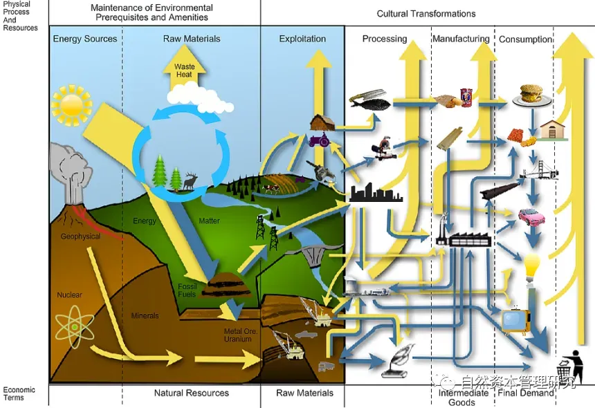
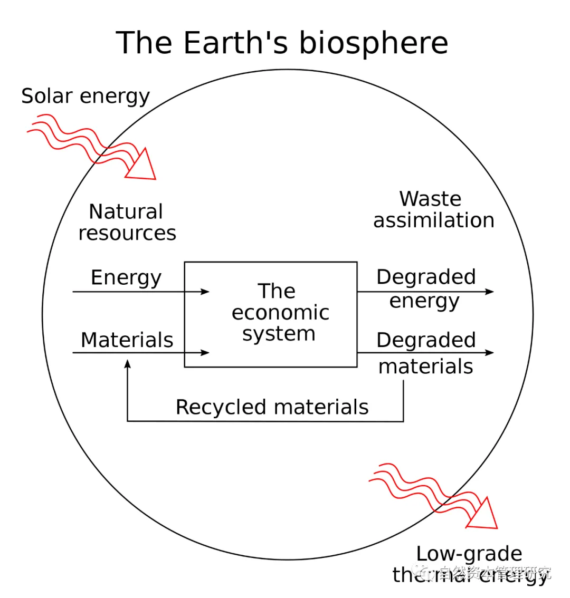
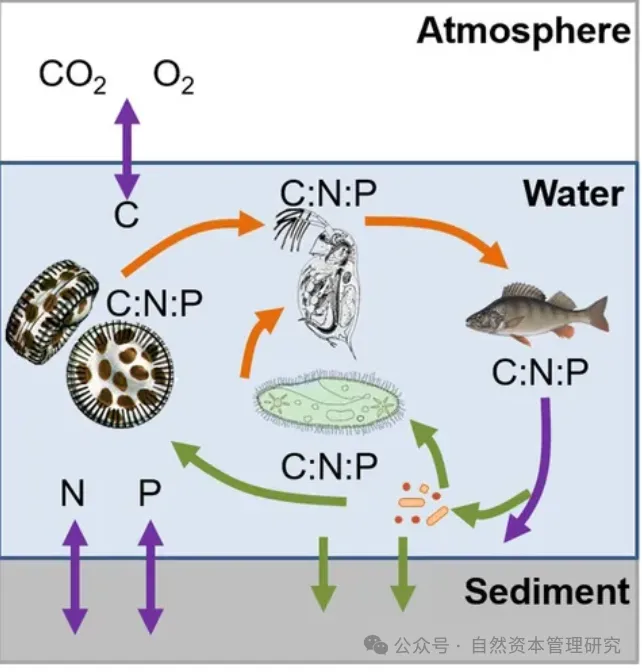

# 第六章 生态经济学

生态经济学是一门研究自然生态系统和经济系统相互关系及其对人类福祉影响的跨学科领域。它着重于如何在人类经济行为和地球的生物物理限制之间找到平衡点。生态经济学的核心目标是促进经济发展，同时保护和维持生态系统为后代提供生存所需的自然资本。

## 生态经济学的基本概念、理论和应用

生态经济学可以准确地定义为：
- **整体性视角的科学**：它将经济活动放在更广阔的生态和社会系统框架中进行分析，重视生态系统的完整性、人类福祉和可持续性。

- **可持续性的追求**：生态经济学强调可持续性原则，寻找经济活动和自然资源之间的平衡，以保护生态系统为长久利益着想。

- **价值和评估**：这个学科探讨如何对自然资本（如清洁的空气、水和土壤，生物多样性）进行量化和评价，这些往往在传统经济模型中被忽略或者低估。

- **政策制订**：生态经济学提供政策制定者以工具和方法，以制订可以减少环境退化、提升生态系统服务和改善人类福祉的政策。

- **跨学科方法**：生态经济学结合了经济学、生态学、政治学、哲学和其他社会科学，来理解和管理经济活动对环境的影响。

当前，生态经济学的研究关注诸如生态系统服务评估、自然资本账户、污染税、市场与非市场价值的整合、环境正义以及促进绿色技术和可持续消费模式等议题。



生态经济学的理论基础植根于它的多学科性质，融合了来自经济学、生态学、热力学、哲学和其他相关领域的概念。这些基础理论与原则包括：

- **系统思维**：理解经济系统是嵌套在更大的生态系统之内，二者相互依赖。生态经济学考虑系统的整体性和部分之间的相互作用。

- **热力学第一和第二定律**：系统的物理基础来自于热力学定律，指出能量守恒和增熵原则。这强调了能源效率和生态过程的熵增效应对经济系统的影响。

- **生态学原理**：借用生态学原理，如生物多样性的重要性、生态系统服务、自然资本的概念，以及物种与生态系统健康间的关系。

- **边际收益递减定律**：在经济中，额外的投入将产生越来越少的额外产出，而在生态经济学中，这一概念被应用于自然资源消耗。

- **持续性原则**：强调了长远角度的决策重要性，以确保地球上的资源可以为未来世代所用。

- **经济、环境与社会福利的整合**：不仅关注市场效率和经济增长，也强调社会公正和环境保护的重要性。

- **环境限制**：承认自然资源的有限性和环境容量，以及必须在这些限制下运作的经济系统。

- **价值多元性**：认识到价值不仅仅是市场价格能够反映的，还包括非市场价值，如生态系统服务、文化和生命的独特性。

- **经济不是封闭系统**：经济是开放的，依赖于能量和物质流入，同时也产生废物和污染。

- **不确定性和预防原则**：考虑到环境效应中的不确定性，主张采取预防措施，以防止可能的负面影响，尤其是当这些影响可能是不可逆的时候。

- **公平和分配正义**：着眼于资源分配问题，确保当前和未来世代人民能够享受健康和富有成效的生活。

生态经济学的跨学科特性确实为这门学科带来了一定的挑战。融合不同学科的观点和方法可能导致理论和实践上的复杂性，甚至可能存在观点上的自相矛盾和内在冲突。然而，这种跨学科的方法也正是生态经济学的一大特色和长处。从以下几点可以理解它的跨学科特性如何影响其理论发展：

- **理论的丰富性**：生态经济学以其独特的方式集合了多种学科的理论和实践，这有助于深化我们对经济-生态互动的理解。尽管这导致了一些理论上的复杂性，但它也使得生态经济学能够从多角度审视和解决问题。

- **现实世界的复杂性**：生态系统和经济系统本身就是复杂和多层次的；一个多学科的方法能够更接近地模拟现实世界的复杂性，并为决策提供更全面的信息和工具。

- **创新解决方案**：跨学科合作催生了创新，促进了传统边界之外的思考。生态经济学家常常能够发现新的方法和策略来处理持久的问题。

- **更广泛的应用领域**：跨学科的特色使得生态经济学能够应用于广泛的问题和背景，例如气候变化、生物多样性损失、资源管理、可持续发展等。

- **理论的完整性**：生态经济学试图建立一套包含环境和社会维度的经济分析框架，从而弥补传统经济学忽视环境限制和社会福祉的缺陷。




### 生态经济学的应用实例

**生态补偿机制**
让我们以“生态补偿机制”为例来说明生态经济学如何集合多种学科的理论和实践。

生态补偿机制（如碳交易市场或支付生态系统服务）是一个由生态经济学提出并支持的概念。这个机制旨在为生态系统提供的服务（如碳封存、水源涵养、土壤侵蚀控制和生物多样性保护）提供经济激励。这个机制包括经济学、生态学、政治学、法学、环境伦理学、社会学、管理学和哲学等多个学科的理论和实践：
- 经济学通过使用经济工具为生态服务定价，创建市场或支付机制，使得保护环境成为经济上有利的决定。在这一过程中，信号价格理论和需求管理策略被广泛应用，以确保资源的有效分配和环境保护的经济可行性。
- 生态学则为这一过程提供了科学基础。通过识别和量化生态系统服务，生态学家能够评估森林的碳汇能力或湿地的水净化功能等。这些评估不仅为生态补偿提供了数据支持，还指引着生物多样性的价值评估，确保生态保护措施的科学合理性。
- 政治学与法学在制定国家层面和国际协议的法律框架中发挥着重要作用，以确保生态补偿机制的有效性和公平性。这涉及治理、权利和政策实施的各个方面，确保各方利益得到平衡，并促进国际合作。
- 环境伦理学则从道德角度出发，强调自然环境和物种应被赋予内在价值，而不仅仅是其对人类的直接经济价值。这种观点影响了政策制定和公众参与的方式，推动社会在环境保护中考虑更广泛的伦理问题。
- 社会学研究如何最有效地设计和实施这些机制，以确保社区的广泛参与，并解决潜在的社会正义问题。特别是要确保弱势群体不会受到不公正的环境负担，从而实现社会的公平与和谐。
- 管理学在设计高效的操作系统、监测和报告机制方面至关重要，以确保市场或支付体系能够达到预期的环境和经济目标。通过有效的管理，资源可以得到更合理的分配，环境保护措施也能更好地落实。
- 哲学则探讨如何平等地对待当前世代和未来世代的需要，以及必须尊重的自然生物的权利。这种思考促使我们在制定政策时，不仅关注当下的利益，还要考虑长远的生态和社会影响，确保可持续发展的实现。

通过这个例子，我们可以看到，生态经济学汇集了来自不同学科的理论和思想，形成一个整合的框架来解决实际问题。这种多学科集成方法有助于我们全面地理解问题的性质，并且制定出更为有效和全面的解决方案。

**亚马逊雨林**
生态经济学直面现实世界中生态系统和经济系统的复杂、多层次的性质。以亚马逊雨林为例，可以看到生态经济学与传统经济学处理现实世界的极大差异：

亚马逊雨林，被称为地球之肺，是全球最大的热带雨林，对全球气候有着深远的影响。它的健康状况直接影响到地球的碳循环和生物多样性。雨林通过光合作用吸收大量的二氧化碳，有助于减缓全球变暖。同时，它的存在也对本地和全球的水循环起着关键作用，维持降水模式和天气系统的平衡。

然而，出于经济发展的考虑，如农业扩张（尤其是牛肉和大豆生产）、矿产开采、森林采伐和基础设施建设等活动，亚马逊雨林持续面临巨大压力。这样的经济系统发展模式给生态系统带来了严重破坏，导致森林面积减少、碳排放增加、生物多样性损失以及对土著社区的负面影响。

这个例子体现了以下几点复杂性和多层次性：
- **生态复杂性**：雨林是一个复杂的生态系统，具有自己内在的动态平衡，以及种群、栖息地和生态过程的复杂互作。
- **经济交互**：雨林地区的经济活动，诸如农业和采矿，与生态系统的健康紧密相连，这些活动的经济收益需要与生态成本进行权衡。
- **社会结构**：土著社区和当地居民依赖森林的资源生存，它们的生活方式和文化传统与雨林直接相关。
- **全球互联**：亚马逊雨林的状态对全球气候系统有重要影响，使得其保护成为国际社会关注的问题。
- **政策挑战**：制定对策涉及不同层次的决策—从当地与国家的法规，到国际协议，如巴黎气候协定。
- **科学不确定性**：预测森林退化的长期环境后果有困难，表现出对生态系统和气候影响的不确定性。

现实世界中，生态经济学必须解决这种复杂性，通过其独特的多学科工具和方法，来寻找平衡经济发展和生态系统保护之间的方法。这就需要不仅仅考虑短期经济利益，而且还要关注长期生态健康和社会福祉。

尽管生态经济学的跨学科性可能带来一定程度的理论与方法上的模糊性，但是多数学者和实践者认为这种整合是必要的，因为它反映了生态系统与人类经济行为的真实交互复杂性。当然，确保跨学科合作的有效性和为实际政策制定提供明确指导仍然是生态经济学需要继续关注和深化的领域。


**生态经济学策略和解决方案**
生态经济学通过多学科的视角来理解和解决现代资本主义发展对生态系统的影响，提供了方法和工具以应对环境问题，尤其是气候变化和生物多样性的丧失。生态经济学家建议以下几种策略和解决方案：

- **内部化环境成本**：改变传统经济学中对自然资源的“外部化”处理，通过税收、排放交易等手段，让污染者为环境破坏的成本负责。
- **可持续性评估**：对项目和政策进行全面的环境影响评估和生态风险评估，确保决策考虑长远的生态后果。
- **绿色会计和国民生产总值（GDP）的再定义**：推行绿色会计体系，将自然资本和生态系统服务纳入经济衡量指标中，以反映真实的经济健康状况。
- **促进绿色技术和经济转型**：鼓励研发和采用低碳和清洁技术，推动向可再生能源的转换，减少对化石燃料的依赖。
- **可持续消费和产品寿命周期管理**：推广生态设计、循环经济和产品寿命周期管理，减少资源消耗和废物产生。
- **生态补偿与生态服务支付**：通过支付生态系统服务（如碳汇、水源保护和生物多样性保护）来为保护环境的努力提供经济激励。
- **制定环境法规与政策**：建立并实施环保法律、政策和标准，保护环境免遭污染和破坏。
- **推行全球合作**：鉴于气候变化和生物多样性的问题具有全球性，促进国际合作和遵循国际环境协议是至关重要的。
- **教育与公众参与**：通过教育提高公众的环境意识，促进社会环保行动，并加强公众对环境政策的参与和监督。
- **综合政策设计**：制定政策时需要注意其多面性影响，确保经济、社会和环境目标之间的协同效应。

生态经济学强调解决问题必须从系统的角度来看待经济活动与环境之间的互动，而不是孤立地对待。面对气候变化和生物多样性的丧失等全球性挑战，解决方案需要集体行动、长远规划和政策创新，而生态经济学提供了关于这些问题的全面分析和实用框架。

**以自然资本为核心**
自然资本是生态经济学的一个核心概念，基本上是指地球上的所有自然资源和生态系统，它们为人类社会提供生命支持服务和物质资源。这些资源和服务包括空气质量、水资源、土壤肥力、食物生产、气候调节、洪水控制、疾病控制和休闲空间等。自然资本认识到自然环境不仅是经济活动的背景，而且是支撑所有人类和非人类生物生存的基础。

生态经济学与自然资本的关系可以从以下几个方面理解：

- **理论和方法**：生态经济学提供了一套框架和方法来评估自然资本的价值，并考虑这些资本在经济决策中的角色。
- **可持续发展**：生态经济学强调经济活动应在不削弱自然资本的前提下进行，以维持这些资本并传递给未来世代。
- **整合经济与环境衡量指标**：传统经济指标（如GDP）很少反映环境的损耗或改善。生态经济学提倡将自然资本保护和高效使用纳入到国家和企业的计量体系中。
- **政策设计**：生态经济学在公共政策制定中强调保护自然资本的重要性，鼓励采取生态税、补偿机制和可持续资源管理政策。
- **经济-生态系统管理**：通过辨识自然资本的直接和间接益处，生态经济学支持对资源的可持续管理和保护，减少生态足迹。
- **积极的人类干预**：生态经济学认为通过恢复和保护生态系统服务，人类不仅是自然资本的用户，也可以是其增强者。
- **环境正义**：自然资本的恢复和合理分配可以改善弱势群体的生活条件，生态经济学提倡社会和环境的权利应被公平对待。

生态经济学用于评估、保护和恢复自然资本，并确保其能够长期为社会提供必要服务。这种关系突出了环境和经济的紧密相连，并指导着社会如何以可持续的方式利用和管理自然资源。通过这种方法，生态经济学试图修复传统的经济范式，强调了经济健康与生态系统健康之间的联系。

**生态经济学的挑战**
生态经济学作为一门寻求在经济发展与环境保护之间实现平衡的学科，面临着多项挑战。这些挑战主要包括以下几方面：

- **多学科整合的困难**：生态经济学需要整合生态学、经济学、社会学等多个学科的理论与方法。这种整合在实践中可能相当复杂，不同学科之间的差异可能导致理论框架和方法论的混乱。
- **环境价值的量化**：如何量化和内部化环境服务和自然资本的价值是一个主要挑战，特别是对于那些不易于用货币衡量的生态系服务和生物多样性价值。
- **政策制定和执行难度**：推动政府制定并实施可持续的环境政策存在挑战，因为这涉及到与现行经济增长模式相抵触的决策，以及需要面对强大的政治和经济利益团体的反对。
- **社会-生态系统动态的理解**：生态经济学需要更好地理解社会-生态系统之间复杂的相互作用与反馈循环，而这些通常呈现出非线性特征，难以预测。
- **环境不确定性与风险管理**：由于生态系统的复杂性和过程的不确定性，制定有效的预防和适应措施来应对潜在的环境风险和后果是一项挑战。
- **经济结构转型**：传统的以工业化和经济增长为核心的发展模式根深蒂固，转向更为可持续的经济结构涉及广泛的社会经济变革，并可能触动现存权力结构。
- **全球和地方行动的协调**：如何协调全球尺度下的环境治理和地方层面上具体实践的行动是一大挑战，尤其是在缺乏全球共识或合作机制的情况下。
- **社会意识和行为改变**：公众意识提高和行为改变通常进展缓慢，促成这种转变需要时间和坚持不懈的教育努力。
- **跨代公平和环境正义**：确保当前和未来世代都能享有公平资源分配和环境质量，以及不同社会群体之间的公平问题，是持续存在的挑战。
- **技术创新与应用**：虽然技术创新被视为解决环境问题的关键途径，但技术的开发、普及和应用过程中可能会遇到技术、法律、经济和社会障碍。

生态经济学试图在这些挑战中找到创造性的解决方案，推动形成一个更加可持续和公正的全球经济体。


## 自然资本的价值形成

在经济学中，价值的形成是从生产的角度来解释价值的来源，即价值是由生产过程中的劳动、资本和其他要素共同创造的。因此，在经济学中对价值形成的几种主要理论是：

- **劳动价值论**：认为价值是由劳动创造的。劳动者在生产过程中消耗了劳动时间和劳动技能，从而创造了价值。劳动价值论是马克思主义经济学的基本理论之一。
- **边际效用价值论**：认为价值是由商品或服务的效用决定的。效用是指商品或服务满足人们需求的能力。边际效用价值论认为，商品或服务的价值取决于其对消费者所带来的边际效用。
- **生产要素价值论**：认为价值是由生产要素共同创造的。生产要素包括劳动、资本、土地和企业家才能。生产要素价值论认为，每个生产要素都对价值的创造做出贡献，其价值取决于其边际生产力。

价值的形成是多种因素共同作用的结果。例如，一件商品的价值可能取决于其生产过程中所使用的劳动、资本、土地和企业家才能，也可能取决于其对消费者所带来的效用。

上述几个理论在解释价值的形成方面的主要优缺点如下：

| 价值的形成解释理论 | 优点 | 缺点 |
| ------------------ | ---- | ---- |
| 劳动价值论         | 强调劳动在创造价值中的作用 | 难以解释资本和土地等其他要素的作用 |
| 边际效用价值论     | 强调消费者需求在决定价值中的作用 | 难以解释生产成本对价值的影响 |
| 生产要素价值论     | 综合考虑了劳动、资本等多种因素的作用 | 难以确定每个要素的具体贡献 |


自然资本扩展了资本概念的传统界限，为人们理解资本属性提供了新的维度。区别于物质资本、人造资本，自然资本的特殊性在于其提供的生态系统服务能够维持生命的基础生理和生态功能。自然资本提供的物质基础资源，如土地、水、空气和生物多样性，以及由生态系统循环（碳循环、氮循环等）、能量流动和物种相互作用产生的服务，是生物体生存和繁衍不可或缺的组成部分。

自然资本之所以能够支持生物体的生存和繁衍，根植于其囊括了生态系统内生物体的全部物理、化学和生物学过程 — 这些过程共同形成了一个动态自我调节的系统。在这些过程中，生态代谢（ecological metabolism）作为核心机制发挥着至关重要的作用。代谢过程涉及能量和物质的转化与循环，是生态系统功能正常运行的底层驱动力。因此，生态代谢是自然资本内在的、不可或缺的特征。

与经济学中强调生产要素贡献的价值形成传统理论相比，自然资本的价值形成机制呈现出截然不同的特点。自然资本之值不仅仅由传统生产过程中的劳动、资本和技术决定，而更多地体现在它为生态系统持续运行与人类福祉所提供的生态服务与功能。这些服务与功能是生态系统自发作用的结果，是自然资本固有的价值所在。

考虑到生态代谢的重要性，任何关于自然资本价值形成的分析都必须将其作为关键因素进行研究。生态代谢的过程和效率直接影响了自然资本提供的生态系统服务的量和质。例如，一个健康的森林生态系统的碳贮存能力，就取决于其中的光合作用和呼吸作用——生态代谢的两个重要环节。因此，生态代谢的状况是评估自然资本价值的基石，对于制定有关自然资源管理、保护和利用的政策决策至关重要。

### 生态代谢理论
生态代谢（Ecological Metabolism）一词源于对生态系统能量和物质循环的研究，其中“代谢”暗喻了生态系统以与生物体细胞相似的方式进行能量转换和物质流动。它是理解自然资本价值形成的重要框架之一，可以被描述为自然生态系统中所有的生产、消费和分解作用的总和。


生态代谢理论的核心是识别和评价生态系统内部和生态系统之间物质和能量转换和流动的模式及其规律。
该理论研究主要涵盖：
- **生产过程**：生态系统中的植物和其他光合生物通过光合作用将太阳能转化为化学能（生物量），从而推动整个生态系统的能量流和食物网的构建。
- **消费过程**：异养生物（包括人类）从事消费活动，通过进食植物或其他生物，转化生物量中的能量为活动能。
- **分解过程**：微生物和分解者将死亡的生物体分解为基本的化学物质，这些物质再次为生态系统的产生过程所用，完成一个周期。
这种代谢过程在维持生态系统结构、功能和生物多样性方面起着决定性作用，同时为生态系统的恢复力和适应性奠定基础。



生态代谢研究专注于以下内容：
- **能量平衡**：研究生态系统中的能量输入、存储和输出。
- **物质循环**：详细考察养分循环，如碳、氮、磷等元素在生态系统中的动态变化。
- **生态系统效率**：分析生态系统转换和利用输入物质和能量的效率。
- **人类活动影响**：探究人类活动如何改变自然生态代谢过程。

生态代谢研究和应用的实例：

- **森林生态系统碳汇功能研究**：通过测量森林吸收和储存碳的能力，可以评估其对抗击气候变化的贡献。例如，亚马逊雨林作为地球的重要“肺部”，其碳汇功能对于全球碳循环至关重要。
- **流域养分循环管理**：通过研究流域内的水循环和养分循环，可以制订有效的水资源管理政策和防止水体富营养化的措施。如美国密西西比河三角洲地区就进行了类似的研究，以减少流域导致的死区（低氧区域）。
- **城市代谢研究**：研究城市生态系统中资源和能量的流动，帮助制定更可持续的城市规划和管理政策。例如，城市绿地系统被证明能够提高城市的温湿度调节能力和空气质量。

生态代谢研究提供了理解和评价自然资本及其服务的科学基础，这些理论和方法可以应用到自然资本价值实现的分析中，从而指导可持续管理和决策过程。以下是这些理论和方法的应用途径以及示例数据显示基于生态代谢的自然资本的价值变化：

- **生态系统服务评估**：应用生态代谢的概念来评估生态系统如何提供关键的服务——例如光合作用产生的氧气、土壤肥力的维持和水的自然净化过程。通过量化这些服务的供给量和价值，可以为自然资本的价值决策提供数据支持。
- **生态系统健康监测**：利用生态代谢的指标来衡量生态系统的健康状态和功能完整性。例如，碳和氮循环的效率可以作为生态系统健康程度的指标。一个健康稳定的生态系统表明良好的自然资本价值。
- **生态代谢模型建立**：建立模型来模拟和预测生态系统在不同环境压力或人为干预下的代谢变化，评估人类活动对生态代谢的影响，并基于此评估自然资本的状况和可持续性。
- **生态足迹分析**：生态足迹提供了衡量人类活动对自然资本需求的量化方法，基于生态代谢理论评估资源消耗和废弃物排放与自然再生能力之间的平衡。


- **环境经济学评估**：加入生态代谢的概念，使用环境经济学的工具——如成本效益分析、愿意支付法等，为自然资本的非市场价值提供度量。这些方法评估生态产品在提供生态服务时的经济价值。
- **政策制定和规制**：草拟政策和法规时，将生态代谢的维持作为一个核心考量点，确保法律和政策能促进自然资本保护和持续性利用。
- **可持续发展工具**：设计具有生态模拟功能的可持续发展工具，确保在规划和开发过程中采取生态代谢的考虑，促进生态功能的保护和恢复。

通过结合生态代谢的理论与方法，可将自然资本的价值量化，从而为其保护和管理提供依据，并确保这些资本为目前和未来的人类社会提供持续的价值。这种综合性的分析为促进自然资本价值实现提供了强有力的科学和管理基础。


基于生态代谢的视角研究自然资本的价值形成，虽然赋予了自然资本理论更多的生态学基础和强化了生态过程的理解，但也存在一些缺陷和挑战：

- **复杂性和多样性**：生态系统的代谢过程异常复杂，涉及无数相互作用的物质循环和能量流动。这种多样性和复杂性使得准确量化自然资本的价值变得困难。

- **间接性和延时性**：生态代谢过程中产生的服务往往具有间接性和延时性——今天的某些生态行为可能需要很长时间才能显现其价值。例如，植树可能需要几十年后才能体现其完整的生态服务价值。

- **评估方法局限性**：现有的自然资本价值评估方法，如愿意支付法或成本效益分析，往往无法充分捕捉到生态代谢的所有方面，尤其是那些非市场化的生态服务价值。

- **数据获取难度**：关于生态系统过程的数据往往难以获取，尤其是在偏远或未受研究关注的地区。这些数据对于准确评估生态代谢和自然资本的价值至关重要。

- **尺度问题**：自然资本和生态代谢的研究往往需要在不同的时间和空间尺度上进行，而传统的经济分析框架可能不足以处理这种尺度上的转换。

- **人类干预的影响评估**：人类活动对于自然资本价值的影响是双刃剑，既有可能正面地增加价值，例如通过恢复生态系统，也可能负面地减少价值，例如通过污染和过度开发。明确评估人类干预的净影响可能非常挑战性。

- **伦理和价值观问题**：在自然资本的评估中需要考虑生物多样性保护和自然美学等方面的价值观问题，这些通常很难用货币来衡量。

自然资本价值形成的领域中的一些重要的理论研究进展正试图解决上述问题和挑战。部分突破性进展包括：

- **生态宏观经济模型**：最新的研究正在开发生态宏观经济模型，这类模型将环境限制因素与经济增长动力相结合，旨在达成社会经济系统和自然系统间的持续平衡。

- **内在价值的评估理论**：生态学家和环境哲学家尝试构建新的模型，使之能够考虑自然资本的内在价值——除了为人类提供的直接服务外，自然系统本身的生态完整性和生物多样性的价值也被考虑在内。

- **工具和技术的开发**：开发了一系列新工具和技术来评估生态代谢，比如生命循环评估（LCA）、生态足迹分析和生态效率分析等，这些工具提高了对自然资本价值形态和以生态代谢为导向的价值评估的精确度。

- **全球生物地球化学模型**：科学家正在发展全球尺度的生物地球化学循环模型，如全球碳循环和氮循环模型，来更好地理解和预测人类活动对地球生态系统的长期影响。

生态宏观经济模型是一种综合性模型，它结合了生态学和经济学的概念，以刻画人类经济活动与自然生态系统之间的复杂相互作用。这些模型通常包括对资源消耗、能源流动、环境污染、生态服务及其对社会经济福祉的影响等方面的考量。目的是在全局尺度上捕捉并理解经济增长、资源利用、环境影响和政策干预之间的动态关系。


### 生态代谢理论应用实例

- **低碳增长模型**：这类模型专注于分析如何实现经济增长，而同时减少对化石燃料的依赖和温室气体的排放。例如，“全球绿色增长模型”（G-GEM），专注于评估绿色技术、能效改进、碳定价和可再生能源策略对全球经济增长和温室气体排放的影响。

- **人地系统模型**：这类模型集成了人口、土地使用、能源和生态系统等方面的动态关联，旨在评估不同土地管理策略和人口变化对生态系统服务的长期影响。例如，CLUMondo模型是用于模拟全球土地使用变化及其对生态系统和社会经济因素的影响的工具。

- **环境投入产出表**：环境投入产出分析通过将经济活动与环境影响结合起来，追踪不同行业间的物资流和能量流，并评估经济增长与环境压力之间的关系。例如，在欧洲实施的多区域环境投入产出模型（MRIO），用于考察全球供应链中的环境影响。

- **系统动力学模型**：这种模型通过构建反映复杂经济和生态系统之间反馈关系的动态方程组，来分析政策变动如何影响经济和环境系统的行为。MIT的“世界3”模型是一个著名的案例，它被用来预测经济增长、人口增长与资源耗竭之间的相互关系。

### 内在价值理论
内在价值的评估理论认为自然环境和生态系统中的所有生物、生态过程及其组成部分，在不考虑任何外在的（例如经济的）因素下，本身就具有价值，这种价值被称为内在价值。这个理论是环境伦理学和生态经济学的一个重要分支，与人类中心主义的实用价值观相对立。通过认可生态系统的内在价值，我们能够超越其直接对人类的实用性，尊重和保护自然环境本身的完整性。

实际应用的例子：

- **生物多样性保护区**：创建生物多样性保护区，如国家公园或自然保护区，是基于自然生态系统及其生物多样性具有内在价值的观念。这些保护区的设立不仅仅是为了人类游憩或资源开发，而是出于对生物本身以及生物对生态系统健康所具有内在价值的承认和保护，如美国黄石国家公园的保护旨在维护其独特生态系统的内在价值，而非仅基于其为旅游或娱乐带来的经济效益。

- **生态修复项目**：河流、湿地和其它受损生态系统的修复和再生工程通常也以内在价值为基础。例如，恢复伊利湖周边湿地不仅能提高水质并为野生动植物提供栖息地，同时还被视作湿地本身恢复天然状态的一项努力，其价值并不完全依赖于它为人类社区带来的潜在利益。

- **气候变化相关法律**：诸如《巴黎协定》之类应对气候变化的国际法律，可以被看做是基于认识到地球系统——包括气候稳定——的内在价值。尽管这种稳定对于人类生存至关重要，但对气候本身稳定状态的维护也体现了一种超越人类利益的价值。

### 生命循环评估
生命循环评估（Life Cycle Assessment, LCA）、生态足迹分析和生态效率分析是三种不同的工具和方法，用于评估产品、活动或政策对环境的影响。

生命循环评估（LCA）：LCA 是一种系统工具，用来评估产品整个生命周期（从原材料提取、制造、运输、使用到处置）的环境影响。它提供了量化产品环境足迹的方式，考虑了能量消耗、温室气体排放、水使用和污染物排放等多个方面。

*实际应用的例子：*

*某公司想评估其生产的塑料瓶和玻璃瓶哪种包装材料的环境影响更低。通过LCA，他们能够量化每个瓶子类型的直接和间接能量使用、产生的废物、以及全球变暖潜能。分析结果显示，尽管玻璃瓶的制造过程中能量要求更高，但如果考虑到回收和重复使用的可能性，长期来看玻璃瓶可能更具环境优势。*


### 生态足迹
生态足迹是量化人类对地球自然资源使用的度量方法，尤其是人类活动对可再生资源使用的度量。它通常表达为所需地球数量，即支持当前生活方式所需要的地球的数量。

*实际应用的例子：*
*如果计算加拿大平均居民的生态足迹，研究人员可能会分析他们平均消耗的水资源、食物、住房和交通等方面的资源，并与地球自然生成这些资源的能力进行对比。结果可能表明，加拿大人均生态足迹远大于全球平均水平，暗示着如果所有人都以这种方式生活，需要超过一颗地球的资源。*

### 生态效率分析
生态效率分析主要关注用尽可能少的资源和环境影响创造尽可能多的价值。它通常涉及评估资源效率和污染密度，以找到提高生产和消费活动生态效率的途径。

*实际应用的例子：*
*对于一家汽车制造商，通过评估其生产过程中的材料和能量使用，以及产生的废弃物，可以确定哪些操作最不环保。该公司可以采用更有效的制造技术和材料再利用策略来减少废物，提高能效，从而在保持产量的同时减少环境影响。*


### 全球生物地球化学模型
全球生物地球化学模型是一系列的科学模型，用来模拟和理解全球尺度上生物、岩石、大气、水体等组成部分的化学物质如何在地球系统中转移和循环。这些模型涵盖了诸如碳循环、氮循环、磷循环和硫循环等关键的生物地球化学过程，提供了洞悉地球如何响应自然变化和人为影响的能力，特别是在气候变化研究领域。

实际应用的例子：
- **全球碳循环模型**：全球碳循环模型被用来预测和估计地球大气、海洋、陆地生态系统和地壳中碳的存储和流动途径，这些模型关键地支持了国际政策制定，如《联合国气候变化框架公约》和《巴黎协定》。其中，IPCC（政府间气候变化专门委员会）使用的全球气候模型，通常包含综合碳循环组分，以评估不同温室气体排放情景对全球气候的潜在影响。*

- **氮循环模型**：全球氮循环模型用于研究氮在各种生态系统中的输入、输出、存储和转换，以及氮循环对生态系统健康、生物多样性和气候变化的长期影响。例如，围绕气溶胶形成和海洋藻类生长的研究依赖于对全球氮循环的理解，因为氮是制约藻类生长的重要营养素。

- **模拟海洋酸化**：利用生物地球化学模型更好地理解海洋碳酸盐化学的变化，并预测由于二氧化碳溶解引起的海洋酸化趋势，这对海洋生物的钙化过程（如珊瑚礁的建造和贝类的壳体形成）具有重要影响。

- **预测气候变化的影响**：生物地球化学模型还被用来预测未来气候变化对地球系统不同部分的影响，如冻土融化释放的甲烷、热带雨林对碳的固存以及海洋中营养盐的循环。


从非人类中心的禀赋视角来看，自然资本的价值暗含着其在维系生态系统中的所有生物——包括人类——的生存基础上所发挥的关键作用。这种视角认识到自然系统的内在价值，同时也强调了自然系统的复杂性和相互依存性，以及人类活动对其可能产生的影响。

### 能值理论
能值理论（Emergy Theory）提供了一种以生态系统能量为核心的方法来评估和分析自然资本价值的形成，其基础在于识别和度量自然中的能量流和转化过程，而非单纯基于人类的需求和利用价值。该理论强调自然界的每一个组分，无论是生物还是非生物，都在其生态过程中扮演特定的角色，各自以能量的形式贡献给整个生态系统的功能和服务。


以下是一些能值理论与人类中心主义的对比：

|层次   |能值理论       |人类中心主义
|视角	|禀赋	|人类中心
|价值观	 |尊重自然、与自然和谐共处	|人类至上、可以随意利用自然
|方法	 |能值分析	|成本效益分析等
|应用	 |生态系统管理、环境保护等	|资源开发、经济发展等


能值分析是一种对自然和人工系统中能量和物质的流动和转换进行量化的方法。它通过测定进入系统的能量和物质流的太阳能当量——即需要多少太阳能来产生这些流——来实现此目的。在这种分析中，所有输入（如太阳辐射、风、雨水）和转化（如生物生产、地质构造）都统一转换成一个通用度量——能值，表明生态系统内部以及与其外部的能量消耗对比。

能值理论提倡的自然资本的价值形成视角跳出了传统的经济评估框架，转而建立在对自然系统现有能量存量和流量的理解上。此外，该理论还考虑了生态系统在地球生物地球化学循环中的作用，强调维持生态过程平衡对于人类社会的长期生存与发展的重要性。

能值分析可以与其他自然价值形成分析理论和方法相结合，从而提供更为全面的评估和决策依据。以下是一些结合的途径：

- **与生命循环评估（LCA）结合**：能值分析关注系统内部的能量投入，包括太阳能、风和水力等自然能源的投入，而LCA考虑产品从摇篮到坟墓的所有环境影响。将能值分析与LCA结合，可以同时评估产品生命周期中的能源与物质流动以及相应的环境影响。

- **与生态足迹分析结合**：生态足迹分析用于量化人类对地球生态系统的需求，而能值分析强调自然系统中的能量贡献。将两者结合，可以帮助我们评估不同生活方式和消费模式的可持续性，并考虑自然系统的承载能力和支持能力。

- **与生态效率分析结合**：生态效率分析关注如何减少资源利用和环境影响，同时最大化经济效益。能值分析可以帮助确定不同生态过程和活动中的能量最高效用，两者结合可以指导提高整体系统的能效和环境性能。

- **与系统动力学模型结合**：系统动力学模型用于分析复杂系统中变量之间的动态关系。能值分析提供系统组成部分的能量价值视图，结合系统动力学模型，可以帮助模拟环境管理决策对系统整体能量流动的长期影响。

- **与环境投入产出表结合**：环境投入产出表捕捉经济活动与环境影响间的联系。结合能值分析，可进一步纳入自然生态系统的能量贡献，从而评估经济与环境系统间更为全面的相互依存性。

- **与生态宏观经济模型结合**：生态宏观经济模型努力在宏观层面平衡经济增长与生态系统完整性。能值分析提供关于自然资本的能量基础的深入洞见，两者结合可以创造出更为准确地反映经济-生态系统相互作用的模型。

自然资本价值形成的研究和实践是一个复杂而持续发展中的过程。这项工作对于构建生态文明框架以及实现生态产品价值起着根本和支持性的作用。理解自然资本的价值有助于我们制定更为有效的策略和行动计划，以确保自然环境的长期健康和服务功能，从而支撑社会经济的可持续发展。

作为一个跨学科的领域，自然资本价值的研究需要生态学、经济学、环境科学和社会学等多个学科的知识和方法。这个领域不断吸收和融入新的理论框架和实践工具，如能值分析、系统动力学等，来更准确地描述和评估自然资本的价值。

例如，通过生态代谢研究揭示生态系统内部及其与经济系统相互依存的能量和物质循环机制，我们能够更深入地把握自然资本价值的内涵。而通过生命循环评估（LCA）、生态足迹分析等方法，可以量化人类活动对自然环境的压力，并评价各种保护和维护自然资本措施的有效性。

将这些研究转化为实践，则可以通过生态保护项目、低碳发展战略以及可持续的资源管理政策来实现。自然资本价值的形成研究为决策者提供了量化生态系统服务价值的依据，从而在经济发展和环境保护之间找到平衡点，推动生态文明建设和生态产品价值实现。这些努力在维护地球健康，实现人与自然和谐共生方面发挥了不可或缺的作用。


## 生态经济模型

生态经济模型是一种工具，它结合了生态学和经济学的原理，用于理解和分析自然生态系统与经济系统之间的相互作用与依赖关系。这些模型通过模拟人类活动对生态系统的影响，以及生态系统对经济活动和社会福祉的反馈，旨在支持决策过程以促进环境的可持续利用和保护。

生态经济模型通常考虑以下几个方面：

- **生态系统结构和功能**，包括物种多样性、能量流动、物质循环等。
- **资源的提取和消费**，如森林砍伐、渔业捕捞、淡水使用等。
- **生态系统服务的评估**，如碳储存、水净化、食物供给、休闲和旅游等价值。
- **自然资源管理策略的影响评估**，比如各种保护政策、资源使用限制等。

生态经济模型可以帮助决策者在经济发展与环境保护之间寻找平衡，确保资源的有效使用，并评估不同环境管理方案的长期影响。这种模型有助于提高社会对自然环境价值的认识，并支持构建可持续的经济体系。

举个生态经济模型的例子，我们可以考虑一个简化的渔业管理模型。这个模型主要用于分析渔业资源的可持续利用和经济活动之间的关系，以及制定恰当的管理政策。

**模型背景假设：**

- 渔业资源（鱼群）有自然生长和死亡率；
- 渔业收入依赖于捕捞量；
- 过度捕捞可能导致资源枯竭；
- 政府可以通过设立配额制度、禁捕季节或征税来管理渔业。

**模型框架如下：**

- **生态组分**：建立一个捕鱼群体生长的生物学模型，如Logistic生长模型：
  \[
  N_{t+1} = N_t + r N_t \left(1 - \frac{N_t}{K}\right) - H_t
  \]
  其中：\( N_t \) 是时刻 \( t \) 的鱼群数量，\( r \) 是内在增长率，\( K \) 是环境承载力，\( H_t \) 是时刻 \( t \) 的捕捞量。

- **经济组分**：定量描述捕捞活动的成本和收益，假设总收益 \( TR \) 是捕捞量 \( H \) 的函数 \( TR = p \cdot H \)，其中 \( p \) 是每单位鱼的市场价格；总成本 \( TC \) 是捕捞量的函数，可以表现为 \( TC = c \cdot H + F \)，其中 \( c \) 是每单位捕捞成本，\( F \) 是固定成本。

- **政策组分**：政策决策模拟，如设立捕捞配额 \( Q \) 以限制捕捞量，或者征收税 \( \tau \) 来减少捕捞的总体盈利性。

- **决策与评估**：政策制定者可以使用此模型评估不同政策下资源的可持续性和经济效果。通过比较长期的资源量 \( N_t \)、总收益 \( TR \) 和总成本 \( TC \)，以及野生鱼群数量的动态变化来评估政策的有效性。

**使用步骤：**

1. **参数估计**：使用历史数据估计 \( r \)、\( K \)、\( p \) 和 \( c \) 的值。

2. **模拟**：根据不同的捕捞量 \( H_t \)、配额 \( Q \) 或税率 \( \tau \) 运行模型，模拟未来资源数量和经济效益。

3. **优化与政策分析**：找到收益最大化同时维持鱼群可持续水平的捕捞量、配额或税率。

4. **政策建议**：根据模型结果给出政策建议，例如适当的捕捞量或税率，以实现资源的可持续利用。

这个模型是一个基础的生态经济模型，真实的模型可能需要考虑更多的生态、经济和社会因素，如市场需求的变化、气候变化对渔业资源的影响、不同渔民群体的行为和偏好等。通过与各方协商和持续收集数据改进模型，政策制定者可以更好地管理渔业资源，确保其长期的健康和可持续性。

使用上面提到的渔业管理生态经济模型为例，该模型可以帮助人们做出更好的生态决策，这体现在以下方面：

- **资源保护与持续利用**：
模型帮助决策者明白若要达到资源保护与持续利用的目标，捕捞量应该控制在一定水平，以免导致渔业资源枯竭。

- **最优捕捞政策**：
通过模拟不同捕捞量的长期影响，决策者可以确定最优捕捞量或配额制度，既能保持鱼群数量，又能获得可持续的经济收益。

- **经济与环境权衡分析**：
模型通过分析经济收益和生态系统损害之间的关系，帮助人们进行权衡，找到经济开发与生态保护之间的平衡点。

- **风险管理**：
对于可能的环境变化和过度捕捞的风险，模型可以提供预警，使得可以提前进行风险管理和制定应对措施。

- **政策制定的支持**：
定量的模型结果提供了政策制定的科学依据，使政策更加符合生态可持续性的要求，减少基于直觉或经验的决策风险。

- **社会经济影响估计**：
模型可以考虑不同社会经济背景下渔民的收入和福祉，确保政策的社会公正性，并考虑渔业社区的生计。

- **调整与适应**：
模型可以随着时间和条件的变化而调整，适应气候变化、市场动态或生态系统变化的长期影响。

生态经济模型能够在复杂的现实情境中提供一个框架和工具，帮助人们系统地分析问题，使得决策过程更加透明和有根据，并能够预见未来发展的可能趋势，从而作出更明智的生态决策。

在自然资本管理中，生态经济模型扮演着关键的角色，其作用和意义可以总结如下：

- **协助资源管理决策**：生态经济模型可以分析自然资源的利用对生态系统的影响，帮助管理者制定科学合理的资源利用策略和管理计划，以实现资源的可持续利用。

- **衡量经济和生态的价值**：这些模型能够将自然资本的生态价值（如生物多样性、水源涵养）和其潜在的经济价值（如旅游、渔业）相结合，为自然资本的价值提供更全面的估量。

- **增进跨学科的沟通**：生态经济模型的建立和应用需要生态学、经济学、环境科学等多学科知识的合作，有助于不同领域之间的理解和沟通。

- **实现长远目标导向的管理**：通过模拟各种管理策略在长期内对生态系统和经济的影响，生态经济模型有助于识别那些能够支持生态和经济可持续性的管理措施。

- **支撑环境政策的制定**：模型的分析结果能够为环境政策提供量化的依据和论证，支持制定更加有效的环保法规、税收政策和激励措施。

- **风险评估与减缓**：模型可以预测不同管理选择下的风险情景，助力于减缓由于环境变化或非可持续活动导致的自然资本退化风险。

- **提供教育与意识提升的平台**：生态经济模型的建立和使用过程本身就是一个教育和意识提升的机会，它向公众和决策者展示了生态系统服务、资源管理和经济发展之间的复杂联系。

综上所述，生态经济模型在自然资本管理方面提供了一种系统性的工具，有助于追求人类社会的经济发展和自然环境的可持续共存。通过它们，我们可以更好地评估和管理自然资源，确保这些宝贵的资产能够持续地支持人类社会的需要。

## 支付生态系统服务

支付生态系统服务（Payment for Ecosystem Services, PES）是一种经济机制，它提供了从生态系统服务的受益者到服务的提供者的直接经济激励或补偿。

PES可以被表述为：“一个条件性交易体系，其中至少一个受益者（买家）为生态系统服务的持续提供直接向至少一个服务提供者（卖家）支付金钱或其他形式的补偿，基于服务流量的量化和监测。”


### PES的关键要素

- **自愿性交易**：PES通常是基于自愿原则的交易，服务的提供者和受益者双方都同意按照约定条件进行服务和支付。
- **条件性支付**：服务提供者接收支付是基于他们确实提供或增加了服务流量（例如，通过改变土地使用管理实践以减少水源地污染），并且这些服务要能够通过一定的方式来监测和验证。
- **补偿性质**：支付通常被看作是对生态服务提供者因遵循特定生态保护策略而放弃的经济利益的补偿.

PES解决了一个主要问题——许多生态系统服务不在市场机制中交易，因而它们经常被低估或被忽视。PES旨在补正这个“市场失效”，通过为生态服务的提供支付适当的补偿，来鼓励保护和可持续管理的实践，从而保护生态系统健康和生物多样性。

```html
PES实例1: 哥斯达黎加国家林业融资基金（FONAFIFO）

哥斯达黎加是世界上第一个将 PES 作为国家政策的国家。该国于 1996 年启动了国家 PES 计划，旨在保护森林并为森林所有者提供补偿。该计划取得了显著成功，帮助哥斯达黎加将森林覆盖率从 1996 年的 26% 提高到 2022 年的 52%。*

- 目标和背景： 哥斯达黎加自1996年起实施了以PES为中心的环保政策，其目的是通过提供经济激励，鼓励土地所有者保护和恢复森林资源。该国拥有丰富的生物多样性，并且面临着严重的森林砍伐问题。FONAFIFO的设立即是为了保护森林、应对气候变化并促进可持续发展。

- 机制和实施方式：FONAFIFO通过支付给那些在其土地上实行可持续森林管理的农场主和其他土地所有者。支付旨在补偿这些土地所有者所放弃的潜在开发利益，如转为牧场或农地。资金来源于国家税收、碳税、国际捐助和绿色信贷。

- 成果和影响：该项目已成为全球PES实践的典范，并且有效地逆转了哥斯达黎加的森林砍伐趋势。支付有助于维持和恢复森林覆盖，提升了碳储存、生物多样性的保护和水源的保护。程序还带动了生态旅游业的发展，促进了经济增长和就业。

哥斯达黎加 PES 计划的核心是“水质保护协议”。该协议由政府与森林所有者签订，规定森林所有者将保护森林，以换取政府的补偿。补偿金额根据森林的大小、位置和生态价值等因素确定。

哥斯达黎加 PES 计划的成功得益于以下因素：

政府的强有力支持。哥斯达黎加政府为 PES 计划提供了大量的资金和政策支持，这为该计划的实施提供了保障。森林所有者的积极参与。哥斯达黎加的森林所有者普遍支持 PES 计划，他们认为 PES 计划可以为他们带来经济利益和生态效益。有效的监督和管理。哥斯达黎加政府建立了有效的监督和管理机制，确保 PES 计划的实施得到有效落实。

以下是哥斯达黎加 PES 计划的一些具体数据：

2022 年，哥斯达黎加 PES 计划的补偿金额为 1.5 亿美元，约占该国 GDP 的 0.2%。
该计划已为 1.2 万名森林所有者提供了补偿，覆盖了约 110 万公顷的森林。
该计划帮助哥斯达黎加将森林覆盖率提高了 26%。
```


```html
PES实例2: 中国新安江流域的PES（支付生态系统服务）项目

新安江流域位于安徽省，该地区不仅具有生态上的重要性，还对下游区域的供水具有关键影响。因此，保护该流域的水源和森林生态系统是非常重要的。

- 项目背景与目标
新安江流域在20世纪70年代经历了大规模的治理与开发，包括水坝建设和水力发电。然而，上游地区的森林砍伐和过度土地利用引起了生态退化和水源涵养功能下降，影响了流域和下游区域的水质和水量。为了改善这一状况，中国政府和地方政府采取了生态补偿措施，支付给上游地区以奖励保护和改善森林和水域环境。

- 实施方式
新安江流域的PES项目主要由中央政府和上游地方政府合作实施。它涉及对上游地区的农户和土地所有者进行现金支付，以补偿他们放弃某些经济活动从而实现森林保护和水源涵养服务的提供。


- 关键措施
  - 生态补偿：给予上游地区的居民和土地使用者经济激励，以保护森林、减少水土流失和维护水库生态功能。
  - 退耕还林：鼓励农民放弃部分农耕活动，恢复或重新植树增加森林面积。
  - 水质保护：开展流域水质保护项目，规范污染物排放，保护饮用水安全。
  - 政策支持：中央和地方政府提供政策、金融和技术支持，以确保项目的有效实施。

- 成果
新安江的PES项目取得了以下主要成果：
- 上游流域的森林覆盖率得到提高，生态环境质量改善。
- 水源涵养能力增强，保障了下游城市居民和工农业用水的质量和数量。
- 创建了一种可复制的流域生态补偿机制，为中国其他地区的生态补偿工作提供经验。

```

### PES的分类
PES 通常分为两大类，分别称为**市场驱动型PES**和**政府驱动型PES**。上述两个案例是典型的政府驱动型PES。

政府驱动型PES的理论依据主要来自以下几个方面：

- **公共物品属性**：生态系统服务往往具有公共物品的特性，它们可能不能通过市场机制被有效分配和管理。政府驱动型PES通过公共投资来维护这些自然资本，保障公共利益。
- **事务管理与交易成本**：由于ES的非排他性和空间溢出特点，使得相关交易成本过高。政府介入可以降低管理和协调上的事务成本，增强程序的效率。
- **产权不明确**：在自然资源管理中常见产权不明确，导致资源的过度使用和恶化。政府通过立法和规制可以界定产权和使用权，从而更好地管理这些资源。
- **规模经济**：政府驱动型PES可以搭建较大规模的支付系统，通过集中管理和资源配置，达到规模经济，提升环保效益。
- **政策一致性**：政府可以保证环境治理和生态补偿政策的一致性，避免市场机制中短期利益驱动下的恶性竞争和资源误用。
- **社会公平与包容性**：政府可以确保PES的实施不会造成特定群体利益受损，促进社会公平，并鼓励广泛的公众参与。

当生态系统服务（ES）在空间上存在溢出效应时，即一个地区的环境管理行为对其他地区的环境服务有正面或负面的外部影响。ES的产权难以清晰界定，且随着受益者的增多，谈判成本上升，使得市场驱动型PES难以有效执行。相比之下，政府驱动型 PES 可以修复这些缺陷。政府作为 PES 利益相关者的代理，不仅可以促进 ES 提供者和使用者之间的交易，而且增加了 PES 在现实中的实施的可行性。


市场驱动型PES的理论基础是环境产权理论。这一理论基于科斯定理。环境产权理论主要关注如何通过界定和分配环境资源的所有权、使用权和管理权以实现环境资源的有效管理和保护。

环境产权的核心要素
- 确权：对环境资源（如水资源、森林、大气等）的所有权和使用权进行明确界定。
- 可交易性：环境资源的使用权可以通过市场机制被交易，最终由价值评估高和愿意支付的使用者获得。
- 保护性：产权安排应确保资源的长期可持续性，鼓励资源的保护和合理利用。


#### 市场驱动型PES的应用
在市场驱动型PES中，环境产权理论提出了通过明确界定环境资源使用权和产权的方式来解决环境问题。在PES模型中，环境资源的所有者或管理者有责任保护相应的生态系统服务，并根据他们提供服务的程度获得经济补偿。这种模式基于以下几个假设：

- **信息的完备性**：生态系统服务的使用者通常对服务拥有更多信息，包括它的提供情况、价值和维持所需成本。他们也可以直接观察到服务的使用和提供情况，从而进行更加准确的价值评估。
- **成本和收益的直接关系**：由于生态系统服务使用者直接从服务中获益，他们更有动机去支付以保证这些服务的持续供应。通过与提供者的直接交易，一方面可以激励提供者提供更好的服务，另一方面可以确保使用者得到所需的服务。
- **市场效率**：市场机制根据供给和需求决定资源的最优配置，从而在不受干预的情况下达到高效利用。当环境产权明确确定并受到尊重时，资源利用的效率会变得更高。

科斯定理表明，在没有交易成本、产权明确的情况下，不论产权的初始分配如何，参与者通过谈判可以达到资源的高效配置。在市场驱动型PES中，如果环境产权明确且保护得当，市场机制可以有效地促进生态系统服务的保护，实现最佳的环境和经济效果。

市场驱动型 PES 遵循科斯定理，并基于环境产权。因为生态系统服务的使用者对生态系统服务拥有更多信息，并且他们可以直接观察到服务是否提供的事实。因此，市场驱动型 PES 被认为具有更高的环境效率。

下面的实例是市场驱动型PES案例。


```html
PES实例3:Vittel支付水资源保护计划（法国）

背景：Vittel是法国一个知名的瓶装水公司，它的产品来源于Vosges高地下的矿泉水。20世纪90年代，Vittel发现其泉水受到农业活动，特别是氮肥和农药的使用的污染。

项目：

Vittel公司意识到要保障水质，必须改变上游农业活动。因此，他们与当地农民建立了PES项目，通过为农民提供技术和财政支持，让他们采取更加可持续的耕作方法。Vittel与450多个农场主签订长期合约，付款以支持他们转向有机耕作或至少减少化肥和农药的使用。

成效：

这项长期协议不仅成功保护了Vittel的水源，也改善了当地的环境质量，并对农民的经济生存提供了稳定的渠道。Vittel的案例展示了当生态服务受益者清楚其需求，能够明确支付意愿，并识别服务提供者时，市场驱动型PES是如何直接作用于环境保护的。
```

市场驱动型PES的特点：

市场驱动型PES基于私人谈判，由受益者直接向服务提供者支付，依赖于明确的环境产权和市场机制。它通常在环境服务有直接、明确商业利益时更为有效，像Vittel案例中的清洁水源对瓶装水企业极为重要。市场驱动型PES认为受益者对服务的价值和成本有更多的信息，因此可以达到更高的环境效率。

关于市场驱动PES和政府驱动PES的争议主要集中在各自的优势、局限以及哪一种方法在特定环境下更为有效的问题上。

**市场驱动PES的主要观点**
优势：强调效率和激励，市场驱动的PES认为私人交易可以更直接地反映ES（Ecosystem Services）的真实价值，且通过利益相关者之间的谈判能促成高效的资源分配。

局限：市场驱动PES可能面临信息不对称、交易成本高昂以及环境产权界定不清晰的问题，且在一些生态服务具有公共物品特性的情况下难以实现。

**政府驱动PES的主要观点**
优势：强调公共利益和公平性，认为政府驱动的PES能够解决市场失效的问题，尤其在跨区域协调与处理生态系统服务的公共物品和外部性问题时更为有效。

局限：可能存在政府效率低下、审慎度不足、政治干预和监管捕获等风险，且有时缺乏对具体地区特定需求的敏感性。

#### 主要争议点
- **公平性与效率的权衡**：理论界对于保护生态系统服务是否应依赖市场机制的效率，还是政府政策的公平性与普遍性的优先级存在争议。

- **环境产权的界定和执行**：如何在市场中明确和执行环境产权对PES的成功至关重要。但在许多情况下，产权无法明确界定，使得市场机制难以实施。

- **服务的可测量与监测**：市场和政府驱动型PES都依赖对ES的有效测量和监测。有争议的是，哪种模式能更有效地确保服务的持续提供和质量。

- **资源分配的透明度**：涉及到能否确保资源公正有效分配，避免资源由于不透明的决策过程而被不公平地分配。

- **跨区域问题和合作**：在处理跨区域生态系统服务时，哪种PES模式更有效，尤其是当资源使用和保护涉及多个政治和社会实体时。

- **长效性与适应性**：讨论了市场和政府驱动的PES模式在长效性和适应全球变化方面的能力。

总的来说，争议并非简单的哪一种模式更优，而是在特定情况下哪一种模式更能有效地鼓励生态系统服务的保护与可持续利用。同时，许多专家和决策者认识到综合运用市场和政府的力量可能是提升PES效果的最佳途径。因此，综合模型也得到了一定程度的支持和探索，它试图整合市场效率和政府干预的优点，以解决各自单独存在的缺陷。


世界各国对于PES（支付生态系统服务）的实施情况不一，但许多国家已经认识到PES对于促进生态保护、生物多样性维护和可持续利用自然资源的重要性。以下是一些具体的例子，反映了不同国家PES的实施情况：

```html
美国

美国有多个PES项目，尤其是在农业领域，比如联邦政府的保护储备计（CRP），该计划通过支付给土地所有者，鼓励他们将农田改为自然生境。

美国联邦政府的保护储备计划（Conservation Reserve Program, CRP）是一项由美国农业部（US Department of Agriculture, USDA）管理的土地保护项目。CRP旨在鼓励农场主将农田转换成环境有益的植被，提高土地质量，帮助控制土壤侵蚀，优化水质，保护生物多样性，并促进土地可持续利用。

CRP的基本运作模式涉及以下几个关键步骤：

激励措施：政府向申请加入CRP计划的农场主提供年度租赁支付，以补偿他们将农田从生产状态改造为符合CRP目标的用途（如草地、湿地、防风林带等）的收入减少。

合约期限：参与CRP的土地所有者通常需要与联邦政府签订10至15年的合约，期间土地必须维持环保状态。

环境效益：CRP重点关注土地的环保价值，如改善水质、减少水土流失、提高野生动植物栖息地质量和多样性。

管理措施：农场主在CRP期间需进行合适的土地管理，包括播种本地植物、建立湿地、维护植被覆盖等。

CRP自1985年设立以来，已成为美国最大的私有土地环境保护项目之一。通过CRP，政府投资保护了数百万英亩的农田，取得了显著的生态系统恢复和维护成效。这个项目为支付生态系统服务（PES）提供了一个成功的政府驱动的范例，演示了政策激励如何有效地促进生态保护和可持续的土地管理。
```


```html
欧洲
在欧洲，各国和欧盟有一系列的政策框架支持PES项目。例如，欧洲联盟的共同农业政策（CAP）鼓励农民提供环境服务，通过绿色直接支付和农村发展计划进行资助。

欧洲联盟的共同农业政策（Common Agricultural Policy, CAP）是一套规模庞大的农业政策体系，始于1962年，目的在于提高农业生产率，确保欧洲居民的食品供应稳定，并确保农业活动对环境的长期可持续性。

CAP的主要组成部分包括直接支付给农民的补贴、市场干预措施以及农村发展计划。近年来，CAP越来越注重环境保护和促进可持续农业实践，其中一部分是通过PES项目实现的。

PES相关政策
在CAP框架下，农民可以通过参与名为"绿色付款"或"环境公益条件"的计划，获得额外的直接支付。这些计划要求农民采取特定的环境友好型农业实践，如保护常绿草地、保留生态集中区、维护永久性草地，以及使用环境敏感的耕作方法。此外，还有一些针对生物多样性、生态系统服务和风景保护的特定项目。

主要成果
CAP作为PES实现的成果主要体现在：

生态绩效：增强了欧盟农业的生态绩效，鼓励并奖励了农民对生态系统服务的积极贡献。

多功能农业：促进了农业的多功能性，包括食品生产、生态保护、景观和文化价值的保持。

生物多样性保护：通过特定项目支持了生物多样性的保护，特别是在保护地和生态敏感区域。

水源保护：改善了农业对地表水和地下水质量的影响，特别是关于农业氮肥和农药使用的最佳实践。

气候变化减缓：提高了农业在碳固存和减少温室气体排放方面的贡献。

CAP的PES机制依然在不断演进中，它争取通过结合传统的农业支持与现代的生态要求，实现更加可持续和环境友好的农业体系。然而，该政策也受到批评，有声音认为其环境措施不足，存在不合理的资源分配，以及监管不足等问题。欧盟持续在改革CAP，以寻求在食品生产、农民收入保障及环境保护方面取得更平衡的成果。
```

世界各国的PES项目通常结合了本地的文化、经济和社会条件，采取针对性措施保护生态系统，同时提供经济激励以促进当地人的积极参与。这些项目的成功依赖于有效的监管、充足的资金、权益相关方的广泛参与以及持续的政治承诺。尽管PES在全球范围内得到了越来越多的认可和应用，但此类项目的设计和实施仍需适应各个地区的具体需求和挑战。


值得一提的是，基于PES核心理念的创新在中国尤为突出。尽管国际上知之甚少，但中国在利用财政转移支付强化环境管理方面已经走在了世界前列。

中国创造性的提出的“生态环境保护转移支付”（Eco-Compensation）。自2001年以来中国通过生态环境保护转移支付施行了逾2350亿美元的财政转移支付，目前每年该方面的财政支出超过300亿美元。

中国的生态环境保护转移支付工具采取创新多样的补偿形式，包括基于环境维护成果的农民补贴、对受限制开发区域居民的补偿、以及对省级和地方政府达成环境目标的财政奖励等，这些措施在尺寸和性质上在过去二十年里发生了巨大的变化，展现了中国在这一领域的创造性实践。


例如直接付款给农民或者向省和地方政府提供赠款，鼓励在陡坡上重新造林，采用保土措施，并对面临荒漠化风险的土地进行植被复原等。资金支付需要与激励措施保持一致，以确保那些符合全国利益的措施也符合地方政府的财务动机。

生态环境保护转移支付（Eco-Compensation）是指政府为了实现特定的生态保护目标，向生态保护区域的地方政府或相关主体支付的经济补偿。这种机制通常是以政府的资金为基础，用来调动各地在生态环境保护工作上的积极性，减缓经济发展不均带来的环境保护压力，实现区域发展均衡。

虽然生态环境保护转移支付类似于支付生态系统服务（PES），但两者存在一些差异：

- **源头不同**：PES通常涉及自愿的交易，受益者直接支付给生态服务的提供者。而生态环境保护转移支付通常是政府之间的财政转移，以弥补某些地区因实施环境保护政策而造成的经济损失或成本。

- **目标和动机**：PES的目标在于为生态服务的保持与增加提供直接的经济激励，而生态环境保护转移支付的目的通常是实现区域发展均衡，减少因生态保护造成的地方经济不平衡。

- **管理程序**：PES强调市场化的机制和受益支付原则，而生态环境保护转移支付则更多依赖于政府的规划和管理。

中国的生态环境保护转移支付在某种程度上是包含了PES的理念的，尤其是在促进保持和恢复生态环境方面。但是，它在操作机制和实施原理上有所区别，体现了国家层面对生态保护重要性的认识与行政手段的结合使用。在实施上，这种转移支付可能包括针对提升空气和水质、保护森林和草地、提升生态建设等各方面的经济补偿。通过这些措施，中国在促进区域经济平衡发展的同时，也提升了生态环境保护的效果。

尽管生态补偿项目旨在提供保护和改善环境行为的激励，但仍在存在许多项目的支付依据是基于所投入的资源（如资金、劳力或材料）而非实际获得的生态改善结果。这种“基于投入的支付条件”可能在以下几个方面削弱激励的效果：

- **缺乏绩效导向**：当支付与投入相关联而非实际的环境改善成果时，参与者可能更关注于满足投入要求而非达到环保目标。这阻碍了项目向基于绩效和结果的模式转变，降低了资源的使用效率。

- **影响参与积极性**：支付机制如果没有明确奖励实际的环境效果，可能会降低参与者追求真实环境效益的动机。这可能导致环境改善不如预期，或者无法维持长期的生态效果。

- **资源分配效率**：基于投入的项目可能不会促使资金流向最能带来生态改善的领域。这会导致生态补偿资源分配效率低下，而非最大化环境效益。

- **结果验证难度**：在基于投入的项目中，验证投资是否有效达到预期的环境改善结果可能较为困难，因为投入并不总能直接转化为明确的环境服务提升。

为了解决这些问题，中国的研究者们提出要为生态补偿项目设立明确的绩效指标和监测机制，例如采用卫星遥感数据、无人机以及AI技术对项目进行实施监测，以确保参与者的努力能够转化为可量化的环境改善结果。这要求生态补偿项目设计时就要将支付标准与项目的环境目标紧密对接，并着重于结果的测量和评估。通过这种方式，可以提高生态补偿的环境绩效，实现持续的生态服务保护与提升。


